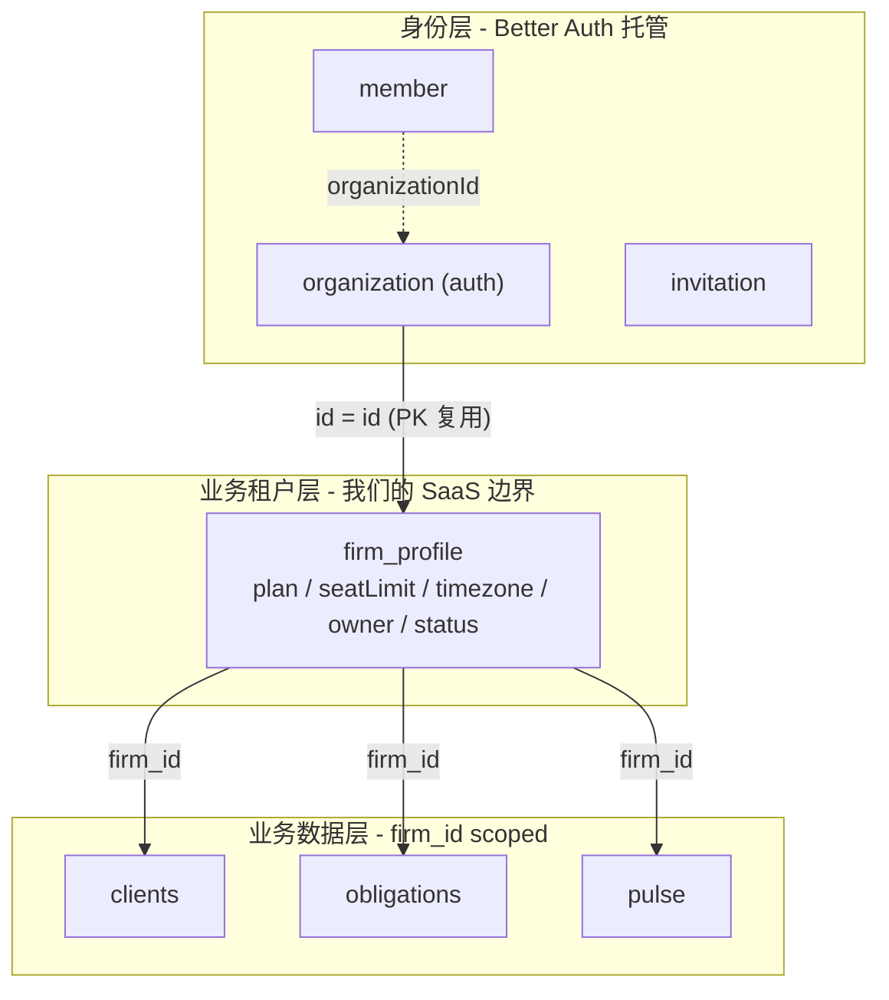

# 首次登录 Practice onboarding + 业务租户层（P0 SaaS 初始化闭环）

## 目标与非目标

- **目标**：
  1. 闭环 SaaS 初始化路径：每个已登录 session 在进入业务 RPC 前都已有 `firmId` + `firm_profile`
  2. 用户感知：一步业务化 onboarding（"确认你的执业资料"），不是工程腔的 "setup workspace"
  3. 建立"身份层 / 业务租户层 / 业务数据层"三层架构边界，**根除当前 plan/seatLimit 被塞 organization.metadata 的反模式**
  4. 产品命名层落地 Practice/Firm 双层语义，工程层不引入翻译层
- **非目标**（明确划出去，独立立项）：
  - Migration Copilot 4 步向导（PRD §6A · P0-2）—— dashboard 空态保留给它
  - Onboarding AI Agent（PRD §6A.11 · P1-27）
  - billing 接入：`billingCustomerId / subscriptionId` 字段、Stripe 集成、`plan_entitlement` / `usage_event` 表（P0-23 Pay-intent 单独立项；本期 schema 不预占字段）
  - Settings 内 practice 改名/写库（要等 wire `organization.update`，下一个 plan）
  - 成员邀请、角色矩阵、Owner 转让（P1）
  - 多 firm picker、Cmd+Shift+O（P1）
  - 业务表（clients/obligations/...）真正落地（P0 单独立项）

## 三层架构（核心决定）




**关键不变量**：`firmId == organization.id == firm_profile.id`。三个 id 是同一个值的三个名字 —— 所有现有的 `firm_id`、`scoped(db, firmId)`、`session.activeOrganizationId` 心智不动。

**为什么必须现在加 firm_profile**（不能先 ship 再补）：

1. PRD §3.6.2 把 `plan / seat_limit / timezone / owner_user_id / deleted_at` 定义为 first-class 字段（不是 metadata blob）
2. PRD §3.6.4 邀请席位灰化、§3.6.8 plan 降级 suspend、§3.6.4 默认 assignee = owner —— 这些 P1 逻辑都要按 plan / seat_limit 查询，metadata TEXT JSON 不可索引
3. 现在写 `beforeCreateOrganization → metadata` 是反模式上线；下次要拆，得 backfill + 兼容期双写 + 改 hook，三件套
4. `afterCreateOrganization → INSERT firm_profile` 的成本是同一行 hook，比较起来等价

## 命名规范

> **原则一**：工程层（代码标识、DB 列、Better Auth 字段、PRD/dev-file 行文）不变 —— 继续用 `firmId / organization / tenant`。
>
> **原则二**：业务租户层有自己的表名 `firm_profile`，区别于 Better Auth 的 `organization` —— 一个是身份容器，一个是 SaaS 业务实体。
>
> **原则三**：用户可见层 EN 按"语境分两层"：默认 **Practice**（onboarding/错误/空态/营销），管理类 **Firm**（Settings/权限/计费/SSO policy）。中文统一**事务所**。


| 层                    | 标识                                                                     | 备注                              |
| -------------------- | ---------------------------------------------------------------------- | ------------------------------- |
| Better Auth DB / SDK | `organization / member / invitation / activeOrganizationId`            | 不动                              |
| 业务租户表                | `firm_profile`                                                         | 新建，PK = organization.id         |
| 业务表 tenant 列         | `firm_id`                                                              | 沿用既有约定，FK → `firm_profile.id`   |
| 代码标识                 | `firmId / tenant / scoped(db, firmId)`                                 | 不动                              |
| Hono context         | `c.var.tenantContext`（新增）/ `c.var.firmId`（保留）                          | 见 §tenant middleware            |
| PRD / dev-file 行文    | `Firm`                                                                 | 与代码对齐，不替换历史 134 处               |
| 用户可见 EN 默认           | `Practice`                                                             | onboarding 标题/字段、错误信息、空态、营销     |
| 用户可见 EN 管理类          | `Firm`                                                                 | Settings 顶层 H1、权限、计费、SSO policy |
| 用户可见 ZH 统一           | 事务所                                                                    | 不区分 Practice/Firm               |
| 不动的专名                | `Google Workspace` / `pnpm "workspace:*"` / PRD "类 Slack workspace" 类比 | 保持原样                            |


## 文件级改动

### 1. 业务租户表 schema

新建 [packages/db/src/schema/firm.ts](packages/db/src/schema/firm.ts)：

```ts
import { sqliteTable, text, integer } from 'drizzle-orm/sqlite-core'
import { organization, user } from './auth'

export const firmProfile = sqliteTable('firm_profile', {
  // PK 复用 organization.id —— 让 firmId 语义在所有层都不变
  id: text('id')
    .primaryKey()
    .references(() => organization.id, { onDelete: 'cascade' }),
  name: text('name').notNull(),                    // 镜像 org.name；P1 可分离 legal/display
  plan: text('plan', { enum: ['solo', 'firm', 'pro'] }).notNull().default('solo'),
  seatLimit: integer('seat_limit').notNull().default(1),
  // 默认时区是 P0 ICP 假设（PRD §2.1 主 ICP = US CPA）；P1 onboarding 步骤会让用户选，决策记入 dev-log
  timezone: text('timezone').notNull().default('America/New_York'),
  // onDelete:'restrict' —— 删 user 前必须先转 owner（或软删 firm），由应用层保证
  ownerUserId: text('owner_user_id')
    .notNull()
    .references(() => user.id, { onDelete: 'restrict' }),
  status: text('status', { enum: ['active', 'suspended', 'deleted'] })
    .notNull().default('active'),
  createdAt: integer('created_at', { mode: 'timestamp_ms' }).notNull(),
  updatedAt: integer('updated_at', { mode: 'timestamp_ms' })
    .notNull()
    .$onUpdate(() => new Date()),
  deletedAt: integer('deleted_at', { mode: 'timestamp_ms' }),  // PRD §3.6.8 软删 30d grace
})

export type FirmProfile = typeof firmProfile.$inferSelect
```

**故意不放**（YAGNI，等真用到再加列；D1 加列无痛）：

- `billingCustomerId` / `billingSubscriptionId` —— P0-23 Pay-intent 立项时再加
- `coordinatorCanSeeDollars` —— PRD §3.6 RBAC 字段，P1
- `defaultAssigneeUserId` —— PRD §3.6.8 默认 assignee，P1

[packages/db/src/schema/index.ts](packages/db/src/schema/index.ts) 加 `export * from './firm'`。

执行：

```bash
pnpm db:generate              # drizzle-kit 生成 0001_<name>.sql
pnpm db:migrate:local         # 本地 D1 应用
```

### 2. TenantContext 类型新增（不动 scoped 签名）

[packages/db/src/types.ts](packages/db/src/types.ts) 仅新增类型导出，**不**改 `ScopedRepo`、**不**改 [packages/db/src/scoped.ts](packages/db/src/scoped.ts) 的 `scoped(db, firmId)` 签名：

```ts
import type { FirmProfile } from './schema/firm'

export interface TenantContext {
  readonly firmId: string                 // = organization.id = firm_profile.id
  readonly plan: FirmProfile['plan']
  readonly seatLimit: number
  readonly timezone: string
  readonly status: FirmProfile['status']
  readonly ownerUserId: string
}
```

**为什么不顺手改 `scoped(db, tenant)`**：当前 [packages/db/src/scoped.ts](packages/db/src/scoped.ts) L34–L44 所有 repo 都是 `unimplementedRepo` Proxy，没有任何业务消费 `tenant.plan` / `tenant.seatLimit`。提前改签名 = 改类型 + 改测试 mock + 改 Proxy 出口，纯类型工作零业务收益（违反 YAGNI）。

**真正消费 `tenant` 的入口**：本期由 `tenantMiddleware` `c.set('tenantContext', tenant)` + `c.set('scoped', scoped(db, firmId))` 双注入。Procedures 用 `c.var.tenantContext` 读 plan/seatLimit，用 `c.var.scoped` 拿 repo —— 二者解耦。等到第一个真实 repo（clients / obligations）落地时，连同 `ScopedRepo.tenant` 一次性合并改造。

### 3. 收紧 Better Auth + 写 firm_profile

> **[skill] 落地此节前先读** [.claude/skills/better-auth-best-practices/SKILL.md](.claude/skills/better-auth-best-practices/SKILL.md) 与 [.claude/skills/organization-best-practices/SKILL.md](.claude/skills/organization-best-practices/SKILL.md)，按里面的 hook / limit / RBAC 配置最佳实践对账后再编码。

**层级铁律**：[scripts/check-dep-direction.mjs](scripts/check-dep-direction.mjs) L23 显式约束 `packages/auth → @duedatehq/core only`。**`packages/auth` 严禁 import `@duedatehq/db/schema/*`**，否则 `pnpm check:deps` 直接拒。

因此 hook 闭包的实现搬到 [apps/server/src/auth.ts](apps/server/src/auth.ts) 组装；`packages/auth` 只暴露"接受 organizationHooks 入参"的纯插件工厂。

#### 3.1 `packages/auth/src/index.ts`：暴露 hook 注入口，不引入 db

```ts
import type { OrganizationOptions } from 'better-auth/plugins/organization'

export interface CreateAuthPluginsOptions {
  email?: AuthEmailSender
  // hook 闭包由 server 层组装并注入；packages/auth 永远不知道 firm_profile 表的存在
  organizationHooks?: OrganizationOptions['organizationHooks']
}

export function createAuthPlugins(opts: CreateAuthPluginsOptions = {}) {
  return [
    organization({
      ac: accessControl,
      roles,
      creatorRole: 'owner',
      allowUserToCreateOrganization: true,
      organizationLimit: 1,           // PRD §3.6.1：一邮箱一 Firm
      // P0: 软上限 = PRD §3.6.1 Firm Plan seat_limit；真正"P0 单 Owner"语义靠
      // invitationLimit:0 + organizationHooks.beforeAddMember 双层兜底。
      // P1 接邀请流时改成函数式 (user, org) => planSeatLimit(org.plan)。
      membershipLimit: 5,
      invitationLimit: 0,             // P0 不开放邀请
      disableOrganizationDeletion: true,
      organizationHooks: opts.organizationHooks,
      schema: { /* 既有 member.additionalFields.status 不变 */ },
      sendInvitationEmail: async (data) => {
        await opts.email?.sendInvitationEmail({ /* 既有实现 */ })
      },
    }),
  ] as const
}
```

#### 3.2 `apps/server/src/auth.ts`：组装 hook 闭包，注入 firm_profile 写入

```ts
import { APIError } from 'better-auth/api'
import { firmProfile } from '@duedatehq/db/schema/firm'   // server 层允许跨包 import
import { createAuth, createAuthPlugins } from '@duedatehq/auth'

export function createWorkerAuth(runtimeEnv: Env, ctx?: ExecutionContext) {
  const env = validateServerEnv(runtimeEnv)
  const db = createDb(runtimeEnv.DB)

  const organizationHooks = {
    // hook 不在 better-auth 的 org 创建事务里 —— 失败会导致 org 已建但 firm_profile 缺；
    // 由 tenantMiddleware lazy create 自愈兜底（见 §4）。
    // 选择 throw 还是 swallow 的语义决定记入 dev-log（self-review checklist 第 1 步）。
    afterCreateOrganization: async ({ organization, user }) => {
      const now = new Date()
      await db.insert(firmProfile).values({
        id: organization.id,
        name: organization.name,
        plan: 'solo',
        seatLimit: 1,
        // 默认 tz 是 P0 ICP 假设（PRD §2.1），决策记入 dev-log；P1 onboarding 让用户选
        timezone: 'America/New_York',
        ownerUserId: user.id,
        status: 'active',
        createdAt: now,
        updatedAt: now,
      })
    },
    beforeAddMember: async ({ member }) => {
      if (member.role !== 'owner') {
        throw new APIError('FORBIDDEN', { message: 'P0 only allows the creator owner.' })
      }
    },
  } satisfies NonNullable<Parameters<typeof createAuthPlugins>[0]>['organizationHooks']

  const deps = {
    db,
    schema: authSchema,
    env,
    email: createEmailSender(env),
  }

  return createAuth({
    ...deps,
    plugins: createAuthPlugins({ email: deps.email, organizationHooks }),
    waitUntil: ctx ? (p) => ctx.waitUntil(p) : undefined,
  })
}
```

**注意**：`createAuth` 内部不再硬编码 `createAuthPlugins(deps.email)`，要把 plugin 数组开放为入参（[packages/auth/src/index.ts](packages/auth/src/index.ts) 同步小改）。

API 名已对照 1.6.7 真实类型在 [node_modules/.pnpm/better-auth@1.6.7.../dist/plugins/organization/types.d.mts](node_modules/.pnpm/better-auth@1.6.7_@cloudflare+workers-types@4.20260423.1_@opentelemetry+api@1.9.1_@void_4f0587405f4c67faca7da3766288ab94/node_modules/better-auth/dist/plugins/organization/types.d.mts) 验证：`afterCreateOrganization(data: { organization, member, user })` (L321)、`beforeAddMember(data: { member, user, organization })` (L410)、`membershipLimit?: number | fn` (L53)、`invitationLimit?: number | fn` (L156)、`disableOrganizationDeletion?: boolean` (L275) 全部对得上。

### 4. tenantMiddleware 升级 + lazy create 自愈

[apps/server/src/middleware/tenant.ts](apps/server/src/middleware/tenant.ts) 改造：

```ts
export const tenantMiddleware = createMiddleware<{...}>(async (c, next) => {
  const firmId = c.get('firmId')
  if (!firmId) return c.json({ error: ErrorCodes.TENANT_MISSING }, 401)

  const userId = c.get('userId')
  if (!userId) return c.json({ error: 'UNAUTHORIZED' }, 401)

  const db = createDb(c.env.DB)

  // 1) membership active 校验（既有逻辑）
  const [membership] = await db
    .select({ status: authSchema.member.status })
    .from(authSchema.member)
    .where(and(eq(authSchema.member.organizationId, firmId), eq(authSchema.member.userId, userId)))
    .limit(1)
  if (!membership) return c.json({ error: ErrorCodes.TENANT_MISMATCH }, 403)
  if (membership.status !== 'active') return c.json({ error: 'FORBIDDEN' }, 403)

  // 2) 加载 firm_profile（新）
  let [profile] = await db
    .select().from(firmProfile).where(eq(firmProfile.id, firmId)).limit(1)

  // 3) Lazy create 自愈：org 存在但 firm_profile 缺（hook 失败 / migration 历史孤儿）
  if (!profile) {
    const [org] = await db
      .select().from(authSchema.organization).where(eq(authSchema.organization.id, firmId)).limit(1)
    if (!org) return c.json({ error: ErrorCodes.TENANT_MISSING }, 401)

    // ownerUserId 取值：lazy 触发的场景包括"hook 失败 / migration 历史孤儿"，
    // 当前请求人不一定是当年的 creator —— 优先查 member 表里 role='owner' 的最早一条；
    // 缺失（理论上不应发生）才回退当前 userId 并 log warn。
    const [ownerMember] = await db
      .select({ userId: authSchema.member.userId })
      .from(authSchema.member)
      .where(and(
        eq(authSchema.member.organizationId, firmId),
        eq(authSchema.member.role, 'owner'),
      ))
      .orderBy(authSchema.member.createdAt)
      .limit(1)
    const ownerUserId = ownerMember?.userId ?? userId
    if (!ownerMember) {
      console.warn('[tenant] lazy_create_no_owner_member', { firmId, fallbackUserId: userId })
    }

    const now = new Date()
    await db.insert(firmProfile).values({
      id: firmId, name: org.name, plan: 'solo', seatLimit: 1,
      timezone: 'America/New_York', ownerUserId, status: 'active',
      createdAt: now, updatedAt: now,
    })
    profile = (await db.select().from(firmProfile).where(eq(firmProfile.id, firmId)).limit(1))[0]
  }

  // 4) 业务状态门
  if (profile.status !== 'active') return c.json({ error: 'TENANT_SUSPENDED' }, 403)

  // 5) 注入 tenantContext + scoped
  const tenant: TenantContext = {
    firmId, plan: profile.plan, seatLimit: profile.seatLimit,
    timezone: profile.timezone, status: profile.status, ownerUserId: profile.ownerUserId,
  }
  c.set('tenantContext', tenant)
  c.set('scoped', scoped(db, tenant))
  return next()
})
```

[apps/server/src/env.ts](apps/server/src/env.ts) 的 `ContextVars` 增加 `tenantContext?: TenantContext`。`ErrorCodes` 在 [packages/contracts/src/errors.ts](packages/contracts/src/errors.ts) 加 `TENANT_SUSPENDED`。

### 5. 默认名派生工具

新建 [packages/core/src/practice-name.ts](packages/core/src/practice-name.ts)：

```ts
const PUBLIC_EMAIL_DOMAINS = new Set([
  'gmail.com', 'googlemail.com', 'yahoo.com', 'outlook.com', 'hotmail.com',
  'live.com', 'msn.com', 'icloud.com', 'me.com', 'mac.com', 'aol.com',
  'protonmail.com', 'proton.me', 'qq.com', '163.com', '126.com',
  'foxmail.com', 'sina.com', 'sina.cn',
])
const ACRONYM_UPPERCASE = new Set(['cpa', 'ea', 'llp', 'llc', 'pllc', 'inc', 'pc', 'pa', 'sc'])

/**
 * 给 onboarding 表单当 defaultValue 用；返回的字符串是用户可见 name。
 *
 * 关键：永远返回非空可提交字符串。公共邮箱 + 缺 display name 时返回 i18n 占位串
 * （'My Practice' / '我的事务所'），用户不改也能 submit（organization.name notNull 不会被 hit）。
 */
export function derivePracticeName(
  input: { name?: string | null; email?: string | null },
  fallback: string,                                // i18n 占位串，由 caller 通过 t`My Practice` 注入
): string {
  const domain = input.email?.split('@')[1]?.toLowerCase().trim()
  if (domain && !PUBLIC_EMAIL_DOMAINS.has(domain)) {
    const root = domain.replace(/\.(com|net|org|io|co|us|cn)(\.[a-z]{2})?$/, '')
    if (root.length >= 3) return titleCase(root)   // "bright-cpa.com" → "Bright CPA"
  }
  const display = input.name?.trim()
  if (display) return display                        // "Alex Chen"，不再加 "'s Firm/Practice"
  return fallback                                    // 注入的 i18n 占位串
}

/**
 * Slugify with collision strategy:
 *   1. kebab-case 主体（lowercase + 仅 a-z0-9-）
 *   2. 末尾追加 6-char base32 子集（去掉 0/O/1/l 视觉混淆字符）后缀
 *      用 crypto.getRandomValues 生成；2^30 空间，碰撞概率忽略不计
 *   3. 不做提交前 pre-check unique —— 依赖 organization.slug 的 DB unique 约束
 *   4. onboarding 提交侧 catch 一次 unique violation → 重新 slugify 重试 1 次
 *      仍失败则 toast 让用户改 name（极罕见，记入日志）
 */
export function slugifyPracticeName(name: string): string { /* impl 见 single-file 实现 */ }
```

去掉 `'s Firm/Practice` 后缀，避免 solo 用户读到 "Alex Chen's Firm" 的系统硬凑感；i18n 占位串比空字符串更友好且永远是合法默认。

[apps/web/src/routes/onboarding.tsx](apps/web/src/routes/onboarding.tsx) 表单 input 同步加 `required` + 提交前 `name.trim().length >= 2` 客户端校验，呼应 `organization.name notNull`。

单测 `packages/core/src/practice-name.test.ts` 表驱动覆盖：自定义邮箱 / gmail / 缩写词 / 缺名兜底（断言注入的 fallback 被使用）；slugify 测"同一 name 两次提交得到不同 slug"。

### 6. 前端 SDK 注册 organizationClient

[apps/web/src/lib/auth.ts](apps/web/src/lib/auth.ts)：

```ts
import { organizationClient } from 'better-auth/client/plugins'

export const authClient = createAuthClient({
  baseURL: `${window.location.origin}/api/auth`,
  plugins: [organizationClient()],
  fetchOptions: { onRequest: (ctx) => attachLocaleHeader(ctx.headers) },
})
```

### 7. Router gate

[apps/web/src/router.tsx](apps/web/src/router.tsx) `protectedLoader` 扩展：

```ts
async function protectedLoader(args: LoaderFunctionArgs) {
  const session = await fetchSession(args)
  if (!session) { /* 既有 /login 重定向 */ }
  if (!session.session.activeOrganizationId) {
    const url = new URL(args.request.url)
    const pathAndQuery = `${url.pathname}${url.search}`
    const param = pathAndQuery && pathAndQuery !== '/onboarding'
      ? `?redirectTo=${encodeURIComponent(pathAndQuery)}` : ''
    throw redirect(`/onboarding${param}`)
  }
  return { user: session.user }
}
```

新增 `/onboarding` 顶层路由 + `onboardingLoader`（对称 `guestLoader`）：

```ts
async function onboardingLoader(args: LoaderFunctionArgs) {
  const session = await fetchSession(args)
  if (!session) throw redirect('/login?redirectTo=/onboarding')
  if (session.session.activeOrganizationId) {
    throw redirect(pickSafeRedirect(new URL(args.request.url).searchParams.get('redirectTo')))
  }
  // fallback 不在 loader 注入（loader 跑在 React 树外，没有 i18n context）；
  // 把空 fallback 留给 onboarding 组件用 t`My Practice` 重新算一次 default
  return { user: session.user }
}
```

`pickSafeRedirect` 复用 `guestLoader` 的 `startsWith('/')` 防 open redirect 规则。

**注意 fallback 注入时机**：`derivePracticeName(input, fallback)` 第二参在组件层调用（`const fallback = t\`My Practice\``），不在 loader 调用 —— loader 跑在 React 树外，拿不到 i18n context；如果硬要在 loader 注入，得把 i18n instance import 到 loader，得不偿失。

### 8. Onboarding 页面

新建 [apps/web/src/routes/onboarding.tsx](apps/web/src/routes/onboarding.tsx)：

- 居中单 Card，视觉沿用 [apps/web/src/routes/login.tsx](apps/web/src/routes/login.tsx) 右栏调性
- **EN copy**：
  - 标题：`Confirm your practice profile`
  - 帮助：`We pre-filled this from your Google profile. You can change it anytime in Firm settings.`
  - Label：`Practice name`
  - Placeholder：`e.g. Bright CPA Practice`
  - 主按钮：`Continue`
- **ZH copy**：
  - 标题：`确认你的事务所资料`
  - 帮助：`我们从你的 Google 资料预填了一个名字，可以现在改，也可以稍后在事务所设置里改。`
  - Label：`事务所名称`
  - Placeholder：`例如：Bright CPA Practice`
  - 主按钮：`继续`
- 提交：`organization.create({ name, slug })` → `setActive({ organizationId })` → `navigate(redirectTo)`
- `useTransition` 包异步提交（与 `_layout.tsx` sign-out 同款）；错误走 `sonner` toast，表单不卸载方便重试

### 9. UI 文案清理（按双层命名落地）


| 文件                                                                       | 当前                                             | 改为                                              | 语境                               |
| ------------------------------------------------------------------------ | ---------------------------------------------- | ----------------------------------------------- | -------------------------------- |
| [apps/web/src/routes/settings.tsx](apps/web/src/routes/settings.tsx) L35 | `Workspace defaults`                           | `Firm settings`                                 | 管理类 → Firm                       |
| [apps/web/src/routes/settings.tsx](apps/web/src/routes/settings.tsx) L48 | `Firm profile`（card）                           | `Practice profile`                              | section 是日常感知 → Practice         |
| [apps/web/src/routes/settings.tsx](apps/web/src/routes/settings.tsx) L58 | `Firm name`                                    | `Practice name`                                 | label 跟 onboarding 对齐 → Practice |
| [apps/web/src/routes/settings.tsx](apps/web/src/routes/settings.tsx) L60 | `defaultValue="FileInTime Demo LLP"`           | 暂留 + TODO 注释                                    | 等 organization.update 接活，下个 plan |
| [apps/web/src/lib/i18n-error.ts](apps/web/src/lib/i18n-error.ts) L13     | `... linked to a workspace yet.`               | `... linked to a practice yet.`                 | 错误日常感知 → Practice                |
| [apps/web/src/lib/i18n-error.ts](apps/web/src/lib/i18n-error.ts) L14     | `... different workspace.`                     | `... different practice.`                       | 同上 → Practice                    |
| [apps/web/src/routes/_layout.tsx](apps/web/src/routes/_layout.tsx) L344  | `Phase 0 demo workspace`                       | `Phase 0 demo practice`                         | 品牌副标 → Practice                  |
| [apps/web/src/routes/login.tsx](apps/web/src/routes/login.tsx) L120      | `Phase 0 · Demo workspace`                     | `Phase 0 · Demo practice`                       | 同上 → Practice                    |
| [apps/web/src/routes/login.tsx](apps/web/src/routes/login.tsx) L128      | `your firm's filing pipeline`                  | `your practice's filing pipeline`               | 营销 → Practice                    |
| [apps/web/src/routes/login.tsx](apps/web/src/routes/login.tsx) L183      | `Use your Google workspace account...`         | `Sign in with your Google account to access...` | 去工程腔                             |
| [apps/web/src/routes/login.tsx](apps/web/src/routes/login.tsx) L219-220  | `... your workspace ... the firm's SSO policy` | `... your practice ... your firm's SSO policy`  | 前 Practice 后 Firm                |


中文 catalog：跑 `pnpm --filter @duedatehq/web i18n:extract`，编辑 [apps/web/src/i18n/locales/zh-CN/messages.po](apps/web/src/i18n/locales/zh-CN/messages.po) 把 firm/practice 字样统一翻成"事务所"，再 `pnpm --filter @duedatehq/web i18n:compile`。

### 10. 文档同步更新

**只增不删，不替换 PRD/dev-file 134 处历史 `Firm` 行文**（行文跟代码对齐没问题）。

> **路径更正**：仓库实际 PRD 文件名是 `Part1A.md` / `Part1B.md`（§3.6 在 Part1A），不是 `Part1.md`。
> **ADR 编号更正**：[docs/adr/README.md](docs/adr/README.md) L23–L34 已把 0001–0008 预留、0009 是 lingui，下一个安全号是 **0010**。

#### 10.1 PRD（`docs-prd` todo）

- [docs/PRD/DueDateHQ-PRD-v2.0-Part1A.md](docs/PRD/DueDateHQ-PRD-v2.0-Part1A.md) §3.6.1 顶部插入新小节 **"3.6.1.0 命名规范（Naming）"**，搬运上文"命名规范"表格
- 同文件 §3.6.1 标注 `User.firm_id` shortcut **deprecated**：当前实现走 `member` 多对多，shortcut 字段从未启用，P1 也不启用，PRD 文本保留为历史记录但加显眼 `⚠ deprecated as of 2026-04-24` 标注

#### 10.2 dev-file（`docs-dev-file` todo）

- [docs/dev-file/00-Overview.md](docs/dev-file/00-Overview.md) §9 术语简表追加：
  - `firm_profile`：业务租户表，PK = `organization.id`，承载 plan/seatLimit/timezone/owner/status
  - `tenantContext`：Hono middleware 注入；procedures 通过 `c.var.tenantContext` 读 plan/seatLimit
  - `Practice / Firm / 事务所`：用户可见层方言，工程层永远 firmId
- [docs/dev-file/03-Data-Model.md](docs/dev-file/03-Data-Model.md) §2 在 auth 7 表说明后插入 **"§2.1 firm_profile（业务租户）"** 小节，写明：
  - 表结构（同 §1 schema 块）
  - 与 `organization` 的关系（PK 复用）
  - 写入时机（Better Auth `afterCreateOrganization` hook + tenantMiddleware lazy create 兜底）
  - 加列原则（D1 加列零成本，billing/quota 等 P0-23 立项时再加，不预占）

#### 10.3 ADR + dev-log + ADR README（`docs-adr-and-log` todo）

- 新写 ADR [docs/adr/0010-firm-profile-vs-organization.md](docs/adr/0010-firm-profile-vs-organization.md)：
  - Context：当前 plan/seat 被塞 `organization.metadata` 的反模式
  - Decision：拆 firm_profile 独立表，PK 复用，业务字段 first-class
  - Rationale：metadata TEXT 不可索引、不能 FK；PRD 第一性把 plan 等当 first-class；P0-23 billing 接入时刚需
  - Alternatives：(a) 继续 metadata（拒绝）(b) 完全独立 id + org_id FK（拒绝，破坏 firmId 单一语义）
  - **Consequences > Follow-ups**（必填）：列出本期推迟到 P1 的决策点，至少包含：
    - `membershipLimit` 收紧到按 plan 函数式设置
    - `scoped(db, tenant)` 签名合并改造（等首个真实 repo 落地）
    - timezone P1 onboarding 让用户选
- 同步追加到 [docs/adr/README.md](docs/adr/README.md) "## Accepted" 列表：
  - `0010-firm-profile-vs-organization.md — Firm profile as first-class business tenant table, PK reuses organization.id`
- 新写 dev-log [docs/dev-log/2026-04-24-first-login-practice-onboarding.md](docs/dev-log/2026-04-24-first-login-practice-onboarding.md)：记录决策链（onboarding 形态 B、Practice/Firm 双层、firm_profile 三层架构、为什么不引入翻译层、hook 失败语义选择），沿用 [docs/dev-log/2026-04-23-auth-gate-loader-refactor.md](docs/dev-log/2026-04-23-auth-gate-loader-refactor.md) 体例。dev-log 必含 `## 偏离 plan 的地方` 小节（即便为空也保留占位，self-review 时回填）

### 11. 测试（按文件拆分，对应 5 条 todo）

- `test-practice-name` — 新增 `packages/core/src/practice-name.test.ts`：
  - 表驱动覆盖派生函数（自定义邮箱 / gmail / 缩写词 / 缺名兜底 → 注入的 fallback 被使用）
  - `slugifyPracticeName('Bright CPA')` 调两次，断言两个 slug 主体相同 / 后缀不同
- `test-firm-schema` — 新增 `packages/db/src/schema/firm.test.ts`：
  - firm_profile 基础 INSERT / SELECT 在内存 D1（@cloudflare/vitest-pool-workers 既有套件）
  - 验证 enum 约束（plan / status 越界值被拒）、PK FK（删 organization → cascade、删 user 被 restrict）、`$onUpdate` updatedAt 触发
- `test-tenant-middleware-extend` — 扩展 [apps/server/src/middleware/tenant.test.ts](apps/server/src/middleware/tenant.test.ts)：
  - firm_profile 缺失但 org/member 存在 → lazy create 成功，下游拿到 `c.var.tenantContext` 字段齐全
  - lazy create 时 ownerUserId 从 member.role='owner' 最早一条派生（注入两条 member 验证 ORDER BY createdAt）
  - firm_profile.status='suspended' → 403 TENANT_SUSPENDED
  - 既有路径回归（status='active'）—— `c.var.scoped.firmId` + `c.var.tenantContext.firmId` 都正确
- `test-router-loader` — 新增 `apps/web/src/router.test.ts`：
  - mock `authClient.getSession`，断言 `protectedLoader` 三态跳转（无 session → /login？redirectTo / 有 session 无 activeOrg → /onboarding?redirectTo / 有 session 有 activeOrg → 透传）
  - `onboardingLoader` 三态对称（无 session → /login / 有 session + activeOrg → 跳 redirectTo / 有 session 无 activeOrg → 渲染）
  - `pickSafeRedirect` 防 open redirect（外站 url 被 fallback 为 `/`）
- `test-auth-hook` — 扩展 [packages/auth/src/auth.test.ts](packages/auth/src/auth.test.ts) 但**降级为 hook 函数纯单测**：
  - 把 `apps/server/src/auth.ts` 里组装的 `organizationHooks.afterCreateOrganization` 抽成可独立 import 的 factory `buildOrganizationHooks(db)`，单测 mock `db.insert(firmProfile).values(...)` 断言入参形状（id / name / plan='solo' / seatLimit=1 / ownerUserId / status='active'）
  - `beforeAddMember` 断言 role!=='owner' 抛 `APIError('FORBIDDEN', ...)`
  - **不**做端到端 better-auth 集成测试（成本/收益不成比例；实际写入路径已被 `test-tenant-middleware-extend` 的 lazy create 间接覆盖）
- E2E（Playwright）：本期不做（OAuth e2e 太重，单测已能覆盖 gate）

## 验证命令

```bash
pnpm db:generate && pnpm db:migrate:local
pnpm --filter @duedatehq/core test
pnpm --filter @duedatehq/db test
pnpm --filter @duedatehq/auth test
pnpm --filter @duedatehq/server test
pnpm --filter @duedatehq/web test
pnpm --filter @duedatehq/web i18n:extract && pnpm --filter @duedatehq/web i18n:compile
pnpm check
pnpm check:deps      # 防 packages/auth 误引入 db 依赖（本次修订核心 invariant）
pnpm secrets:scan    # AGENTS.md 安全规范要求
pnpm ready           # = vp check && vp run -r test && vp run build；AGENTS.md 规定的 PR 前 handoff
```

手工验证（本地起 wrangler + vite 后）：

1. 全新用户 Google 登录 → `/onboarding`，name 预填
2. 提交 → `/`，dashboard 渲染；`/api/auth/get-session` 返回 `activeOrganizationId`；D1 看 `firm_profile` 已 INSERT
3. Sign out 再 sign in → 跳过 onboarding 直达 `/`
4. **故障注入**：手动 `DELETE FROM firm_profile WHERE id=?` 后再发 RPC → tenantMiddleware lazy create，业务请求成功；D1 看新 firm_profile 的 ownerUserId 与 member.role='owner' 最早一条匹配
5. **故障注入**：`UPDATE firm_profile SET status='suspended'` 后 RPC → 403 TENANT_SUSPENDED
6. 已 active 的用户访问 `/onboarding` → 重定向回 `/`
7. 未登录访问任意保护路径 → `/login?redirectTo=...`（既有行为不回归）
8. `pnpm ready` 全绿（PR 前 handoff 必跑）

## 明确不在本期范围

- Migration Copilot 4 步向导（PRD §6A · P0-2）
- Settings 写库改名（接 `organization.update` + 反查 firm_profile）
- 成员邀请 / 角色 / Owner 转让（P1）
- 多 firm picker、Cmd+Shift+O（P1）
- Onboarding AI Agent（PRD §6A.11 · P1-27）
- 业务表（clients/obligations/...）schema 与 repo 实现（P0 单独立项）
- billing 接入：Stripe customer/subscription、`plan_entitlement`、`usage_event`（P0-23 Pay-intent，本期 firm_profile 不预占字段）
- Pricing tier 名（Solo / Firm / Pro）是否改 —— 跟 P0-23 一起决定
- ADR backlog 0001–0008（[docs/adr/README.md](docs/adr/README.md) 已预留）—— 由其他 plan 单独立项，本期只新写 0010
- `scoped(db, tenant)` 签名合并改造 —— 等首个真实 repo（clients / obligations）落地时一并做（见 §2 决策）

---

## 开发完成后（self-review + 文档回写闭环）

> 项目文档分层（[docs/dev-log/README.md](docs/dev-log/README.md)）：
> - `docs/dev-file/` = **是什么**：当前生效的架构 / 接口 / 约束（最新事实）
> - `docs/adr/` = **为什么不那样**：正式决策 + 后果 + Follow-ups
> - `docs/dev-log/` = **怎么走到这里**：本次迭代做了什么 / 为什么 / 遇到了什么 / 怎么验证
>
> 实现过程中决策会漂移（默认值改了 / enum 多了一项 / hook 失败语义换了）—— 必须在 ship 前把 dev-file / ADR / dev-log 三处与代码对齐，否则下一个开发者读到的是过期事实。

### A · `self-review` todo（在 `validation` 全绿后、commit 之前执行）

按顺序执行，每步留下证据（命令输出 / 文件 diff / subagent 报告）：

1. **代码自检**（手工 checklist）：
   - [ ] 受影响文件每处都有理由（无"顺手改"）；与 plan §"文件级改动" 1:1 对得上
   - [ ] 新增/修改 SQL 字段都进了 [packages/db/migrations/](packages/db/migrations/) 且 `pnpm db:generate` 二次跑 diff 为空（无悬空 schema）
   - [ ] 新增 i18n 文案都跑过 `i18n:extract`/`i18n:compile`，[apps/web/src/i18n/locales/zh-CN/messages.po](apps/web/src/i18n/locales/zh-CN/messages.po) 无 `#, fuzzy` 标记
   - [ ] hook 里 `db.insert(firmProfile)` 的 try/catch 行为已经做了二选一并写进 dev-log：
     - 选项 A：`throw` → 让 better-auth 把 org 创建本身视为失败（要确认 1.6.7 是否会回滚 org 行；不回滚则同 B）
     - 选项 B：`swallow + log` → 让 lazy create 兜底（默认推荐，行为最确定）
2. **跨层依赖自检**：再跑一次 `pnpm check:deps`，确认 `packages/auth` 仍然只依赖 `@duedatehq/core`（本次修订的核心 invariant）
3. **subagent 复核**（推荐）：以 `Task(subagent_type=code-reviewer)` 跑一次，prompt 限定在本次 diff，重点检查：
   - tenant 隔离不变量（`firmId` 永远来自 session.activeOrganizationId，非 user input）没有被破坏
   - hook / lazy create 的并发场景（同一 user 并发两次首次 RPC，会不会双 INSERT 触发 PK 冲突）
   - i18n 占位串注入路径（onboarding 组件里 ``derivePracticeName(input, t`My Practice`)`` 是否真的在组件层调用，没有 fallback 漏网到 loader 里硬塞）
4. **PRD / dev-file 与代码对账**：打开 PRD §3.6.2、dev-file/03 §2.1，逐项确认表列、enum、默认值、FK 与 [packages/db/src/schema/firm.ts](packages/db/src/schema/firm.ts) 一致。**任何差异都以代码为准更新 dev-file**

### B · `post-impl-doc-drift` todo（在 self-review 之后、PR 描述定稿之前）

- 实现过程中如果偏离了 plan §1 schema / §3 hook / §4 lazy create / §7 router loader 中的任何细节（默认 tz 改了、enum 多了一项、redirect 行为微调、hook 失败语义换了选项），**必须**在 [docs/dev-log/2026-04-24-first-login-practice-onboarding.md](docs/dev-log/2026-04-24-first-login-practice-onboarding.md) 的 `## 偏离 plan 的地方` 小节追记（即便没偏离也保留 "（无）" 占位，证明已审过）。每条偏离含：
  - 偏离前 plan 写法（引计划行号）
  - 实际实现写法（引代码行号 / commit hash）
  - 原因（一两句话，重点是"为什么这样更好/不得不这样"）
- 如果决策影响"将来要做的事"（比如 hook 失败语义最终选了 swallow，那么"P1 加 invitation 流时要重新评估是否切 throw"），追加到 ADR 0010 `## Consequences > Follow-ups` 列表，避免下次接 P1 邀请流时再考古
- dev-file/03 §2.1 firm_profile 小节如果与最终代码不一致（列名 / 默认值 / FK 行为），**以代码为准更新 dev-file**，绝不反向去改代码迁就文档
- PR 描述里贴 dev-log 的 `## 偏离 plan 的地方` 小节链接，让 reviewer 一眼看到偏离面

### C · 触发条件

只有以下三件事都为真，才算"开发完成"：

1. `pnpm ready` 全绿
2. `self-review` checklist 全部勾选 + subagent 复核报告附 PR
3. dev-log 的 `## 偏离 plan 的地方` 小节已填充（含 "（无）" 占位）+ ADR 0010 Follow-ups 已对齐

