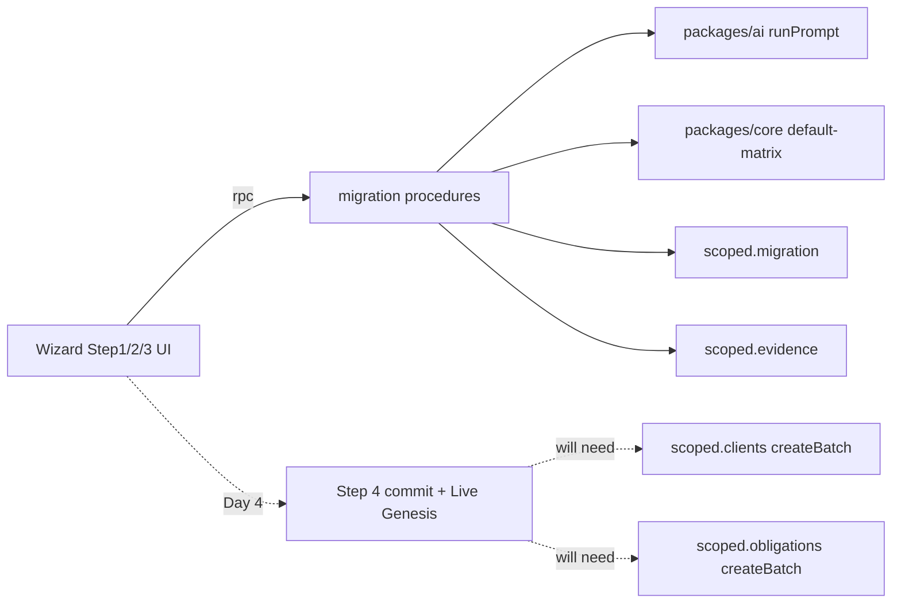

# JHX Day 3 Plan · Migration Copilot 前半段

## 范围与边界

依据 [10 §3 Day 3](docs/dev-file/10-Demo-Sprint-7Day-Rhythm.md)（"CSV intake + AI 字段映射 + 反向确定性校验 + Default Matrix 触发；happy path；坏行不阻塞好行；消费 LYZ client facade"）：

- **做**：Step 1 / 2 / 3 全链路 + Step 4 dry-run preview UI；按 [02-ux-4step-wizard](docs/product-design/migration-copilot/02-ux-4step-wizard.md) 像素级实现 Step 1 / 2 / 3。
- **做（解 LYZ 阻塞）**：`clients.{create, createBatch, get, listByFirm}` + `obligations.{createBatch, listByClient}` 真实 handler，让 Day 4 Step 4 commit 不再阻塞。
- **不做**（留给 Day 4）：`migration.apply` 真实事务、`revert` / `singleUndo`、Live Genesis 粒子动画、`obligations.updateDueDate`（LYZ workboard 路径）、Step 4 Toast 24h `[Undo all]` 真按钮。

边界图：



## 已就位的基建（不动）

- Schema：`migration_*` / `client` / `obligation_instance` / `audit_event` / `evidence_link`，迁移 `0003_clear_star_brand.sql`。
- Scoped repo：[`packages/db/src/scoped.ts`](packages/db/src/scoped.ts) 已暴露 `clients / obligations / migration / audit / evidence`。
- AI facade：[`packages/ai/src/index.ts`](packages/ai/src/index.ts) `createAI(env).runPrompt(name, input, schema)` 已含 ZDR redact / EIN guard / trace / structured refusal；prompts `mapper@v1` / `normalizer-entity@v1` / `normalizer-tax-types@v1` 都在 [`packages/ai/src/prompter.ts`](packages/ai/src/prompter.ts)。
- Tenant：[`apps/server/src/middleware/tenant.ts`](apps/server/src/middleware/tenant.ts) 注入 `c.var.scoped`。
- Contract：[`packages/contracts/src/migration.ts`](packages/contracts/src/migration.ts) / [`clients.ts`](packages/contracts/src/clients.ts) / [`obligations.ts`](packages/contracts/src/obligations.ts) 全部已 freeze（不动）。

## A. 核心算子（packages/core）

### A1. Default Matrix v1.0

`packages/core/src/default-matrix/index.ts`（当前是空注释）落地纯函数 `inferTaxTypes(entityType, state) → { taxTypes: string[]; needsReview: boolean; reason?: string; matrixVersion: 'v1.0' }`，YAML 数据内联为 const（24 cell + 8 federal overlay，按 [05-default-matrix.md §2](docs/product-design/migration-copilot/05-default-matrix.md)），附 vitest 覆盖：

- LLC×CA / S-Corp×NY happy path
- 未覆盖州（MA）→ federal-only + needsReview
- entity_type=other → federal + needsReview

零 IO，零三方依赖。

### A2. CSV / TSV / XLSX 解析器

新建 `packages/core/src/csv-parser/index.ts`：导出 `parseTabular(input: string | ArrayBuffer, opts: { contentType }) → { headers: string[]; rows: string[][]; truncated: boolean; rowCount: number }`。

- CSV / TSV：自实现轻量解析（无依赖；处理引号 / 转义 / CRLF / 空行；≤ 1000 行截断）。
- XLSX：用 `xlsx`（SheetJS）—— 仅在 worker bundle 加载，确认 `wrangler.toml` 不超 size 限。
- 单元测试覆盖：含引号字段、空行、行宽不齐、超 1000 行截断。

### A3. SSN / EIN 校验工具

新建 `packages/core/src/pii/index.ts`：

- `detectSsnColumns(headers, sampleRows) → number[]`（命中列 index）
- `validateEin(value) → boolean`（`^\d{2}-\d{7}$`）

复用：mapper 的 EIN 识别率反向校验已在 [`packages/ai/src/guard.ts`](packages/ai/src/guard.ts)，本次不动。

## B. 后端 Migration Procedures（apps/server/src/procedures/migration/）

按"前半段 + dry-run preview"实现 7 个 handler，剩余 5 个保持 `notImplemented`（Day 4 / Step 4 范围）。每个 handler 一个文件，主入口 `index.ts` 聚合，[`apps/server/src/procedures/index.ts`](apps/server/src/procedures/index.ts) 替换对应 stub。

设计模式：每个 procedure handler = 薄壳，业务逻辑封装到 `apps/server/src/procedures/migration/_service.ts` 的纯函数（`MigrationService`），便于单测与 Day 4 复用。

### B1. `migration.createBatch`

- 校验 active draft：`scoped.migration.getActiveDraftBatch()` 已存在；如已存在且 source 不同 → `ORPCError('CONFLICT', { message })`，UI Step 1 引导 resume。
- 写 `migration_batch` `status='draft'`；返回 batch row。
- audit `migration.batch.created`（工程 log，对齐 [01 §4.3](docs/product-design/migration-copilot/01-mvp-and-journeys.md)）。

### B2. `migration.uploadRaw`

Day 3 简化：`source='paste'` 时直接把 inline JSON 写入 `migration_batch.mappingJson` 的 `raw_input` 子字段；`source='csv|xlsx'` 也走 inline base64 → 写入 KV / 内存（不接 R2 签名 URL，留给 Day 4 / Day 7 部署期）。

返回 `{ rawInputR2Key }` 用 `inline://<batchId>` 占位，Day 4 真接 R2 时改实现不改契约。

### B3. `migration.runMapper`

1. 从 `migration_batch.mappingJson.raw_input` 取 headers + 前 5 行。
2. 调 `createAI(env).runPrompt('mapper@v1', { header, sample_rows, preset, firm_id_hash }, MapperOutputSchema)`。
3. `runPrompt` 已经做 EIN 80% guard / ZDR redact / structured refusal。
4. 成功 → `scoped.migration.createMappings(batchId, ...)`；同时为每条 mapping 写 `evidence_link source_type='ai_mapper'`（`scoped.evidence.write`）。
5. refusal `AI_UNAVAILABLE` → 走 fallback：若 `presetUsed` 命中 [04-ai-prompts §2](docs/product-design/migration-copilot/04-ai-prompts.md) 的 5 个 preset，使用 preset 模板默认映射；否则全部 `IGNORE`。返回时携带 `meta: { fallbackUsed: 'preset' | 'all_ignore' | null }`（在 contract output 上扩 optional 字段——属于 `[contract]` PR）。
6. PostHog 埋点 `migration.mapper.run.completed` 字段对齐 [02-ux §5.9](docs/product-design/migration-copilot/02-ux-4step-wizard.md)。

> Contract 扩展点：`MapperRunOutput` 需要追加 `meta: { fallback?: 'preset' | 'all_ignore' | null }`。这是 Day 3 唯一一处 `[contract]` PR；provider（JHX）+ consumer（自己 + LYZ Dashboard 的 evidence drawer 间接消费）都签字。

### B4. `migration.confirmMapping`

- 接受用户 override 后的 `MappingRow[]`。
- 写回 `migration_mapping` 时设 `userOverridden=true` 的行；保留 confidence / model / promptVersion 不变。
- `migration_batch.status='mapping' → 'reviewing'`。

### B5. `migration.runNormalizer`

- 取 confirmed mapping 中 `entity_type` / `state` 字段的所有 raw value（去重）。
- 分两次调 `runPrompt('normalizer-entity@v1', ...)` 与 `runPrompt('normalizer-tax-types@v1', ...)`（`tax_types` 仅当 mapping 命中 `client.tax_types` 列时调）。
- 写 `migration_normalization` + 每条 `evidence_link source_type='ai_normalizer'`。
- 失败降级：本地字典 fallback（`packages/core/src/normalize-dict/index.ts` 新建一个 minimal 字典：`{ "L.L.C.": "llc", "Calif": "CA", … }`，覆盖 02-ux §6.2 线框给的样例）。

### B6. `migration.applyDefaultMatrix`

- 对每个**潜在 client**（即按 mapping + normalizer 结果在内存里组装的客户记录），如果 `tax_types` 列缺失或归一为空 → 调 `inferTaxTypes(entityType, state)`。
- 把推断结果暂存到 `migration_batch.mappingJson.matrix_applied`（JSON 字段）。
- 写 `evidence_link source_type='default_inference_by_entity_state' matrix_version='v1.0'`。
- audit `migration.matrix.applied`。
- 返回 `DryRunSummary`（注意：本 procedure 与 dryRun 的差异是它**专门触发** Matrix 计算并写 evidence，dryRun 只读取最近一次结果）。

### B7. `migration.dryRun`

- 纯读：把 confirmed mapping + normalizations + matrix 结果汇总成 `DryRunSummary`（clientsToCreate / obligationsToCreate / skippedRows / errors[]）。
- 不写库、不调 AI。
- 用于 Step 4 preview UI。

### B8. `migration.getBatch`

- 已有 `scoped.migration.getBatch`；薄包装直接转。

### B9. 反向确定性校验

集中在 `MigrationService.applyDeterministicChecks(rawHeaders, sampleRows, mappings)`：

- EIN 命中率（[guard.ts](packages/ai/src/guard.ts) 已实现，复用）。
- state 二字母校验（找出违反的 raw value 计入 `migration_error` `errorCode='STATE_FORMAT'`）。
- entity_type enum 校验（违反 → `errorCode='ENTITY_ENUM'`）。
- SSN 拦截（mapping 中 `target='IGNORE'` 强制保留，违规取消并 `errorCode='SSN_DETECTED'`）。
- 输出 `MigrationError[]`，`scoped.migration.createErrors` 持久化。**坏行不阻塞好行**：good row 走 happy path，bad row 单独 surface 到 Step 1 / Step 2 顶部 banner。

## C. LYZ 阻塞 facade（apps/server/src/procedures/clients|obligations/）

为不阻塞 JHX Day 4 Step 4 commit，最小落地：

### C1. clients

- `clients.create` → `scoped.clients.create` + audit `client.created`。
- `clients.createBatch` → `scoped.clients.createBatch`（已存在，含 D1 100-param 分批）+ audit `client.batch_created`（一条聚合 audit + N 条 evidence_link 由 caller 在 Step 4 commit 时按需追加）。
- `clients.get` → `scoped.clients.findById`。
- `clients.listByFirm` → `scoped.clients.listByFirm`。

### C2. obligations

- `obligations.createBatch` → `scoped.obligations.createBatch`（**新增**到 `packages/db/src/repo/obligations.ts`，参考 clients repo 的分批写入；100 param / 16 columns ≈ 6 / batch）+ audit `obligation.batch_created`。
- `obligations.listByClient` → `scoped.obligations.listByClient`。
- **不做** `obligations.updateDueDate`（LYZ workboard status workflow 范围）。

## D. 前端 Wizard（apps/app/src/）

### D1. 路由 + 状态

- 新增 `/migration/new` 路由 + `/settings/imports` 列表（最小）。
- Wizard state 用 `useReducer` 单一 reducer，state shape：

```ts
type WizardState = {
  step: 1 | 2 | 3 | 4
  batchId: string | null
  intake: { mode: 'paste' | 'upload' | null; rawInput: string | ArrayBuffer | null; preset: PresetId | null; ssnBlockedCols: number[]; rowCount: number; truncated: boolean }
  mapping: { rows: MappingRow[]; loading: boolean; fallback: 'preset' | 'all_ignore' | null; errorBanner: string | null }
  normalize: { entries: NormalizationRow[]; conflicts: Conflict[]; matrixApplied: boolean }
  dryRun: { clients: number; obligations: number; topRisks: RiskRow[]; safety: boolean[] } | null
}
```

- 一个 `oRPC` client（已就位）+ TanStack Query mutation 跑各步 procedure。

### D2. Wizard shell（[02-ux §2](docs/product-design/migration-copilot/02-ux-4step-wizard.md)）

`apps/app/src/features/migration/Wizard.tsx`：

- 全屏 modal `role="dialog"` + `aria-modal=true` + focus trap（用 `@radix-ui/react-dialog`，已在 ui 包）。
- 顶栏 / Stepper / 底栏（按 §2.1 / §2.2 像素规格）。
- 关闭确认（§3.2）。
- Stepper 5 态（active/done/upcoming/error/disabled）。

### D3. Step 1 Intake（[§4](docs/product-design/migration-copilot/02-ux-4step-wizard.md)）

- Paste textarea `{typography.numeric}` + Drop zone + 5 preset chips（含 File In Time tooltip）。
- 前端 SSN 正则 `\d{3}-\d{2}-\d{4}` 拦截 + 红 banner。
- 行 > 1000 截断 banner。
- bad rows / parse error 展示（先用 `migration_error` 数据）。
- Continue → `migration.createBatch` + `migration.uploadRaw`，进 Step 2。
- 文案 EN + zh-CN 全部走 Lingui `<Trans>` / `t\`...\``，按 §4.4 表。

### D4. Step 2 AI Mapping（[§5](docs/product-design/migration-copilot/02-ux-4step-wizard.md)）

- Loading / success / fallback_preset / error 四态。
- 表格行 36px Comfortable，confidence badge 三档（H/M/L），EIN ★ 徽章。
- 行内 Edit popover（9 target + IGNORE）。
- Why-this-mapping reasoning popover（hover 0.5s）。
- `[Re-run AI]` / `[Re-run AI with my overrides]` / `[Export mapping ▼]`。
- low-confidence banner（pluralized）。
- 进入即触发 `migration.runMapper`；`Continue` 调 `migration.confirmMapping`。

### D5. Step 3 Normalize（[§6](docs/product-design/migration-copilot/02-ux-4step-wizard.md)）

- Entity types / States / Suggested tax types / Conflicts 四区块。
- needs_review pill + Evidence chip（`{typography.numeric}`，复用 [DESIGN.md](DESIGN.md) `evidence-chip` token）。
- `Apply to all` 默认勾选 + `A` 键快捷键。
- 进入触发 `migration.runNormalizer` → `migration.applyDefaultMatrix`；Continue 调 `migration.confirmNormalization` → `migration.dryRun`。

### D6. Step 4 preview-only（Day 4 commit 占位）

- 按 [§7.2](docs/product-design/migration-copilot/02-ux-4step-wizard.md) preview 线框完整渲染（counts / Top risk / Safety），文案到位。
- `[Import & Generate deadlines ▶]` 按钮 **disabled** + tooltip `Coming in Day 4 — preview only`（不进 Lingui，工程注释；Day 4 启用时直接挂 `migration.apply`）。
- 不实现 Live Genesis、Toast 24h、import_failed banner（Day 4）。

### D7. Token 回灌

按 [09-design-system-deltas.md](docs/product-design/migration-copilot/09-design-system-deltas.md) 已经设计的 token：

- `stepper` / `confidence-badge` / `risk-row-high` 三组 token 在 `packages/ui/src/preset.ts` 落地（如已落地则跳过）；其他 token（`toast` / `genesis-odometer` / `email-shell`）Day 4 / Day 6 再补。
- 表面值优先用现有 `colors.*` / `typography.*`；新增 token 走 [DESIGN.md](DESIGN.md) 流程的最小子集。

## E. i18n（apps/app/src/i18n/locales/{en,zh-Hans}/messages.po）

按 [02-ux](docs/product-design/migration-copilot/02-ux-4step-wizard.md) §4.4 / §5.6 / §6.6 / §7.6 全部文案走 Lingui；`pnpm --filter @duedatehq/app i18n:extract && i18n:compile` 不留漂移。

## F. 测试

- `packages/core/default-matrix.test.ts`：24 cell + 兜底矩阵。
- `packages/core/csv-parser.test.ts`：含引号、CRLF、超行截断。
- `apps/server/src/procedures/migration/_service.test.ts`：用 in-memory D1 + mocked AI port，覆盖：
  - happy path：CSV → mapper → normalizer → matrix → dryRun
  - AI 不可用 → preset fallback；preset 缺失 → all_ignore
  - SSN 列强制 IGNORE
  - 行宽不齐 → migration_error 写入但 happy 行不阻塞
  - 跨 firm 隔离（提交另一 firm 的 batchId 抛错）—— 兑现 [10 第 176 行](docs/dev-file/10-Demo-Sprint-7Day-Rhythm.md) "跨 firm 数据不可见 acceptance 挪到 Day 3 首个真实 domain repo 落地时验证" 的承诺。

## G. 合并纪律 + 验收

- 分支：`feat/migration/csv-intake-and-mapping`（JHX）+ `feat/clients-obligations/lyz-facade-bootstrap`（标 `[contract-consumer]`，与 LYZ 双签）。
- Conventional commits + squash merge。
- Mapper output `meta.fallback` 字段是 `[contract]` PR，单独一次。
- 验收：[10 §8 Day 3](docs/dev-file/10-Demo-Sprint-7Day-Rhythm.md) 第 184 行"CSV 上传后能看到 AI 字段映射结果，坏行单独列出" → 通过 Step 1 → Step 2 串通 demo + bad rows 顶部 banner 演示。
- 跑 `pnpm ready` 全绿。

## H. 不做（明确推后）

| 项 | 推到哪里 | 理由 |
|---|---|---|
| `migration.apply` 真实事务 commit | Day 4 JHX | Step 4 真实写 client+obligation+evidence+audit 同事务 |
| `migration.revert` / `singleUndo` | Day 4 JHX | 24h Owner-only Undo，依赖 Step 4 commit 路径 |
| Live Genesis 粒子动画 + Penalty Radar odometer | Day 4 LYZ Dashboard 模块 | UI 入口在前端 Step 4 但触发是 Dashboard slot |
| Toast 24h `[Undo all]` 真按钮 | Day 4 JHX | 与 revert 同步落地 |
| `obligations.updateDueDate` | LYZ Day 3 workboard status workflow | 不阻塞 JHX |
| R2 raw_input 真上传（90 天保留） | Day 7 deploy / Phase 0 | Day 3 走 inline path 占位 |
| Onboarding AI Agent / coverage transparency / first-week loop | Phase 0 | 不在 Demo Sprint MVP（[01 §1](docs/product-design/migration-copilot/01-mvp-and-journeys.md)）|