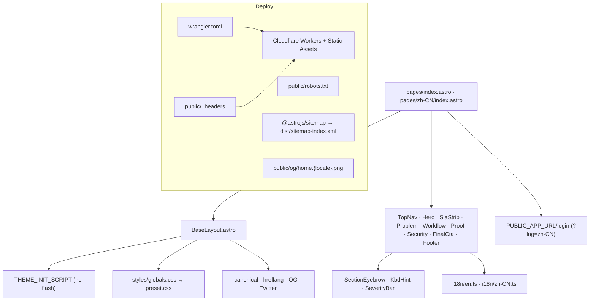

# Landing Page 实现计划（含完整部署 + SEO）

## 1. Catalog 钉版

按架构文档 §10 step 1，在 [pnpm-workspace.yaml](pnpm-workspace.yaml) 的 `catalog:` 段加入 Astro 四件套。版本以发布时最新稳定为准；`saveExact` 自动锁定。

```yaml
astro: <pinned-stable>
'@astrojs/react': <pinned-stable>
'@astrojs/sitemap': <pinned-stable>
'@astrojs/check': <pinned-stable>
```

## 2. 新增 `apps/marketing` 工程骨架

```text
apps/marketing/
├── astro.config.mjs            # site / trailingSlash / vite.tailwindcss / i18n / sitemap
├── package.json                # name: @duedatehq/marketing；deps 全部 catalog:
├── tsconfig.json               # extends @duedatehq/typescript-config
├── wrangler.toml               # Cloudflare Workers + Static Assets
├── public/
│   ├── favicon.svg
│   ├── _headers                # CSP / HSTS / Referrer-Policy / Permissions-Policy / X-Content-Type-Options
│   ├── robots.txt
│   └── og/
│       ├── home.en.png         # 占位：1200×630，纯色 + 文字（后续替换）
│       └── home.zh-CN.png
└── src/
    ├── env.d.ts                # 声明 PUBLIC_APP_URL 等 import.meta.env 类型
    ├── layouts/
    │   └── BaseLayout.astro    # html lang / head meta / hreflang / OG / 主题脚本 / 全局 CSS
    ├── pages/
    │   ├── index.astro         # 默认 en
    │   └── zh-CN/
    │       └── index.astro
    ├── components/
    │   ├── TopNav.astro
    │   ├── Hero.astro
    │   ├── HeroSurface.astro    # 右侧产品复刻
    │   ├── SlaStrip.astro
    │   ├── Problem.astro
    │   ├── Workflow.astro
    │   ├── WorkflowStep.astro   # 三步共享布局（左文案+右 surface）
    │   ├── Proof.astro
    │   ├── Security.astro
    │   ├── FinalCta.astro
    │   ├── Footer.astro
    │   └── primitives/
    │       ├── SectionEyebrow.astro
    │       ├── KbdHint.astro
    │       └── SeverityBar.astro
    ├── i18n/
    │   ├── locales.ts           # 复用 @duedatehq/i18n/locales（如已暴露常量）
    │   ├── en.ts                # landing copy 字典 + meta + og
    │   └── zh-CN.ts
    └── styles/
        └── globals.css          # @import 'tailwindcss' + @import preset
```

`astro.config.mjs` 关键字段（与 §4 完全对齐 + sitemap）：

```js
import { defineConfig } from 'astro/config'
import react from '@astrojs/react'
import sitemap from '@astrojs/sitemap'
import tailwindcss from '@tailwindcss/vite'

export default defineConfig({
  site: 'https://duedatehq.com',
  trailingSlash: 'never',
  build: { format: 'file' },
  integrations: [react(), sitemap()],
  vite: { plugins: [tailwindcss()] },
  i18n: {
    locales: ['en', 'zh-CN'],
    defaultLocale: 'en',
    fallback: { 'zh-CN': 'en' },
    routing: { prefixDefaultLocale: false, fallbackType: 'redirect' },
  },
})
```

`@astrojs/sitemap` 依赖 `site` + `i18n` 自动输出 hreflang alternates，并产出 `sitemap-index.xml`（被 `robots.txt` 引用）。

`src/styles/globals.css`：

```css
@import 'tailwindcss';
@import 'tw-animate-css';
@import '@duedatehq/ui/styles/preset.css';

@source '../../../packages/ui/src';
@source '../components';
@source '../layouts';
@source '../pages';
```

## 3. BaseLayout 与主题 + SEO 头

[apps/marketing/src/layouts/BaseLayout.astro](apps/marketing/src/layouts/BaseLayout.astro) 接收 `lang`、`title`、`description`、`pathname`、`ogImage`，集中输出全部 SEO/社交头：

- `<html lang>` / `<meta charset>` / `<meta viewport>` / `<meta name="theme-color" content="#0A2540">`
- `<title>` / `<meta name="description">`
- `<link rel="canonical" href="https://duedatehq.com{pathname}">`
- 三个 hreflang link（同一页 props 计算）：
  - `<link rel="alternate" hreflang="en" href="https://duedatehq.com/">`
  - `<link rel="alternate" hreflang="zh-CN" href="https://duedatehq.com/zh-CN">`
  - `<link rel="alternate" hreflang="x-default" href="https://duedatehq.com/">`
- Open Graph：`og:type=website`、`og:title`、`og:description`、`og:url`、`og:image`（指向 `/og/home.{locale}.png`，1200×630）、`og:locale=en_US` / `zh_CN`、`og:locale:alternate`
- Twitter Card：`twitter:card=summary_large_image` + 同套 title/description/image
- `<link rel="icon" href="/favicon.svg" type="image/svg+xml">`
- `<script is:inline>` 注入 `THEME_INIT_SCRIPT`（来自 `@duedatehq/ui/theme/no-flash-script`），消除主题 FOUC
- 全局 CSS 通过 `import '../styles/globals.css'` 在最早处导入

零 JS 默认；不使用任何 React island（满足 §5.1 的 JS 预算硬约束）。

## 4. i18n 文案字典

按 §6.2 marketing 用静态 dictionary，不接 Lingui catalog。`src/i18n/en.ts` / `src/i18n/zh-CN.ts` 导出同形 `LandingCopy` 类型（含 `meta.title` / `meta.description` / `og.image` / `nav` / `hero` / `sla` / `problem` / `workflow` / `proof` / `security` / `finalCta` / `footer`）。

页面入口形态：

```astro
---
import en from '../i18n/en'
import BaseLayout from '../layouts/BaseLayout.astro'
// ...
const t = en
const APP = import.meta.env.PUBLIC_APP_URL ?? 'https://app.duedatehq.com'
const ctaHref = `${APP}/login`
---
<BaseLayout
  lang="en"
  pathname="/"
  title={t.meta.title}
  description={t.meta.description}
  ogImage={t.meta.ogImage}
>
  <TopNav t={t.nav} ctaHref={ctaHref} />
  ...
</BaseLayout>
```

`zh-CN/index.astro` 同形态：`pathname="/zh-CN"`、`ctaHref` 追加 `?lng=zh-CN`（§6.3 跨子域 locale 透传契约）。

## 5. 模块拆分（按 Figma frame 1:1 复刻）

每个组件只接受 `t`（局部 copy 子树）+ 必要的链接 prop，零业务逻辑：

- **TopNav**：左侧 brand + 导航文本（Product / Workflow / Evidence / Security / Pricing / Docs）；右侧 StatusPill (`Live in CA · NY · TX · FL · IL`) + Sign in 链接 + 主 CTA `Open app →`。
- **Hero**：左 560px 文案区（Eyebrow `GLASS-BOX DEADLINE INTELLIGENCE` / H1 / 描述 / 主+次 CTA / Trust 行）+ 右 640px **HeroSurface**：Chrome（红黄绿 dots + 面包屑 + ⌘K）+ PulseBanner（`PULSE` tag + 单行文案 + source chip + Review →）+ HeroMetric（`$187,420` 大数字 + Δ + 4 列统计）+ 客户表（5 行，severity 左色条，mono 字段）+ KbdHints。
- **SlaStrip**：3 列规则卡（`RULE 00 — 01 TRIAGE / 30 sec`、`02 MIGRATE / 30 min`、`03 PULSE / 24 hrs`），中间 1px 竖线分隔。
- **Problem**：section eyebrow `01 — THE PROBLEM WITH TODAY'S STACK` + 大标题 + 段落 + IRS § 6651 引用脚注；下方 3 个 mini surface（State Watch / Notice Triage / Migration Drag），每个含一个本地 mock 列表。
- **Workflow**：section eyebrow `02 — THE WORKFLOW` + 大标题 + 段落；3 个 **WorkflowStep**（左 440px 文案 + 右 800px surface mock）：
  1. `01 TRIAGE · 30 SECONDS` — Dashboard 复刻（与 Hero 表同构，简化版）
  2. `02 MIGRATE · 30 MINUTES` — Migration Copilot Step 2/4 + 5 行字段映射 + HIGH/MED/LOW chip
  3. `03 VERIFY · EVERY CLAIM` — Evidence drawer（左侧字段栈 + 右侧 verbatim quote + verified-by 行）
- **Proof**：section eyebrow `03 — THE GLASS-BOX GUARANTEE` + 标题 + 4 列大数字 stat（`100%` / `48+` / `24h` / `0`）。
- **Security**：单行 `WHY CPAs TRUST IT` + 4 列 inline 标签（Per-firm / Evidence / Audit log / Email-first）。
- **FinalCTA**：深色 navy 大卡片，左侧 eyebrow chip + H2 + 副文 + 右侧两个白色 CTA（Open the workbench / Talk to the founders）。
- **Footer**：左 brand + tagline + 行业声明；右三列链接（PRODUCT / RESOURCES / COMPANY）；底部 © + 语言切换（English / 中文 纯 anchor 链接）+ 状态绿点。

## 6. 设计 token 映射

只用 `@duedatehq/ui/styles/preset.css` 暴露的语义 token：

- 文本主色 → `text-text-primary`（hero H1 / 大数字）；次级 → `text-text-secondary`；弱化 → `text-text-muted`。
- 卡片/分割线 → `border-border-default`、`border-border-subtle`、`bg-bg-elevated`、`bg-bg-subtle`。
- CTA 主按钮 → `bg-accent-default text-primary-foreground hover:bg-accent-hover`；次按钮 → `border-border-default text-text-primary`。
- Severity 行左色条：critical → `bg-severity-critical`，high → `bg-severity-high`，medium → `bg-severity-medium`。
- Pulse 提示带 → `bg-accent-tint text-accent-text` + `border-accent-default/30`。
- FinalCTA 深底 → `bg-text-primary text-white`（navy `#0A2540`，与 §5 边界一致）。
- mono/tabular 数字 → `font-mono tabular`。

## 7. CTA 链接策略

- `PUBLIC_APP_URL`：从 `import.meta.env.PUBLIC_APP_URL` 读取，默认 `https://app.duedatehq.com`。Astro 唯一允许暴露给客户端的前缀是 `PUBLIC_*`（§7）。
- en 页 CTA：`{PUBLIC_APP_URL}/login`
- zh-CN 页 CTA：`{PUBLIC_APP_URL}/login?lng=zh-CN`
- "See the workflow" 次 CTA：页面内锚点 `#workflow`。

## 8. 部署基础设施（§7 完整对齐）

### 8.1 `apps/marketing/wrangler.toml`

```toml
name = "duedatehq-marketing"
compatibility_date = "2025-04-01"

[assets]
directory = "./dist"
binding = "ASSETS"
not_found_handling = "404-page"

[vars]
PUBLIC_APP_URL = "https://app.duedatehq.com"
```

> 不引入 `@astrojs/cloudflare` adapter（首版无 SSR）；走 Workers + Static Assets 模型，与 `apps/server/wrangler.toml` 工具链一致。

### 8.2 `apps/marketing/public/_headers`

逐字采用文档 §7 给出的安全头集合（含首版收紧策略：`connect-src 'self'`，因为 marketing 首屏不发请求）：

```text
/*
  Strict-Transport-Security: max-age=31536000; includeSubDomains; preload
  X-Content-Type-Options: nosniff
  Referrer-Policy: strict-origin-when-cross-origin
  Permissions-Policy: camera=(), microphone=(), geolocation=()
  Content-Security-Policy: default-src 'self'; img-src 'self' data: https:; style-src 'self' 'unsafe-inline'; script-src 'self'; connect-src 'self'; frame-ancestors 'none'
```

### 8.3 `apps/marketing/public/robots.txt`

```text
User-agent: *
Allow: /

Sitemap: https://duedatehq.com/sitemap-index.xml
```

### 8.4 OG 占位图

`public/og/home.en.png` / `public/og/home.zh-CN.png`：1200×630 PNG，纯 navy 底 + 白字（产品名 + tagline）。本轮只交付占位以满足 §8 "OG 图存在" 门槛；视觉团队后续替换。

## 9. 根 Vite Task 接入（§7 严格部署顺序）

阅读根 [vite.config.ts](vite.config.ts) 现有 `workspace-build` / `workspace-deploy` task 实现后，在保持最小修改的前提下：

- `workspace-build`：追加 `pnpm --filter @duedatehq/marketing build` 一步。
- `workspace-deploy`：在原本 `D1 migrate → app deploy` 之后串行追加 `pnpm --filter @duedatehq/marketing deploy`（`apps/marketing/package.json` 提供 `"deploy": "wrangler deploy"`），任一步失败立即中止。
- 顺序锁死为：**D1 migrate → app deploy → marketing deploy**（marketing 最后发布，避免 CTA 指向坏版本）。

> 若根 task 实现与设想偏差较大（例如非串行编排），实施时停下并提交一个仅追加 marketing build/deploy 步骤的最小 patch，再单独评估部署编排。

## 10. 验收命令

```bash
pnpm install
pnpm --filter @duedatehq/marketing build
pnpm --filter @duedatehq/marketing astro check

# 头与产物 smoke（§9 测试与验收）
ls apps/marketing/dist/sitemap-index.xml apps/marketing/dist/sitemap-0.xml
ls apps/marketing/dist/robots.txt apps/marketing/dist/_headers
ls apps/marketing/dist/og/home.en.png apps/marketing/dist/og/home.zh-CN.png
grep -c 'rel="canonical"' apps/marketing/dist/index.html
grep -c 'hreflang="zh-CN"' apps/marketing/dist/index.html

# 部署后（手动一次性）：
# curl -sI https://duedatehq.com | grep -iE 'strict-transport|content-security|x-content-type|referrer-policy|permissions-policy'
```

页面架构图：



## 11. 本轮非目标

- 不改写 `apps/app` / `apps/server` / `packages/*` 任何业务代码；`apps/marketing` 完全独立，仅引用 `@duedatehq/ui` 与 `@duedatehq/i18n`（如需 locale 常量）。
- 不接入 PostHog 真实 SDK：CTA 上保留 `data-event` data attribute 占位（满足 §2.5 事件契约），等 PostHog 注入阶段统一接 `posthog.identify(ph_did)`。
- 不写 Playwright + axe 全套验收脚本（§9 列出的 a11y/visual/bundle smoke）：本轮交付 build + astro check + 文件存在性 grep 即门槛；CI size-limit 后续单独 PR。
- 不引入 `@astrojs/cloudflare` SSR adapter；首版纯静态产物。

## 12. 实施顺序

1. 加 catalog 四个 pin（astro / @astrojs/react / @astrojs/sitemap / @astrojs/check）。
2. 创建 `apps/marketing` package + `astro.config.mjs` + `tsconfig.json` + `BaseLayout` + `globals.css`，先跑通空白英文页 build。
3. 写 i18n 字典（en / zh-CN），把 Figma 文案全部抄入。
4. 实现 9 个 section 组件（Hero 与 Workflow 的右侧 surface 是工作量主集中区）。
5. 接 zh-CN 页面，复用所有组件；BaseLayout 输出全套 SEO/OG/hreflang。
6. 添加 `wrangler.toml` / `public/_headers` / `public/robots.txt` / `public/og/*.png` 占位。
7. 改根 `workspace-build` / `workspace-deploy` task 把 marketing 串入末尾。
8. 跑 `pnpm install` + `pnpm --filter @duedatehq/marketing build` + `astro check`，对照 1440px 截图人工 review，并 grep dist 产物确认 SEO 输出。
