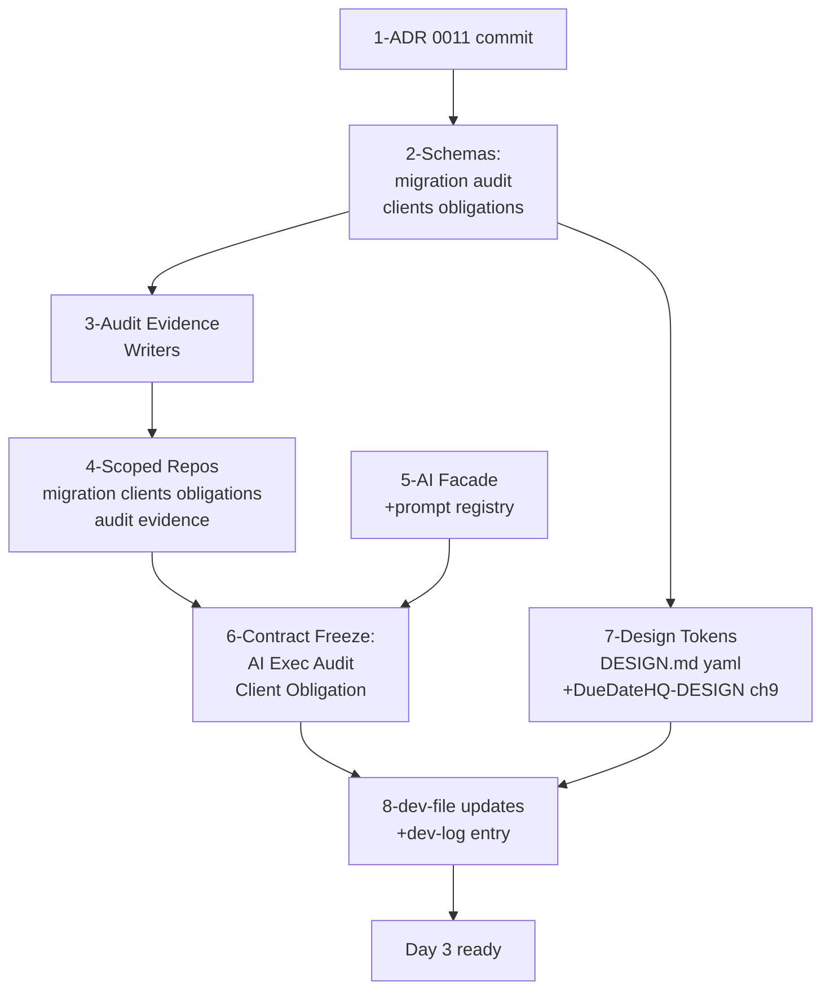

# Migration Copilot 前置工作 · Demo Sprint 口径

> 上游权威：[docs/product-design/migration-copilot/README.md](docs/product-design/migration-copilot/README.md) §3 前置阻塞门 · [docs/dev-file/09-Demo-Sprint-Module-Playbook.md](docs/dev-file/09-Demo-Sprint-Module-Playbook.md) §6 Shared Contract Surface · [docs/adr/0011-migration-copilot-demo-sprint-scope.md](docs/adr/0011-migration-copilot-demo-sprint-scope.md)
> 范围：A（只做 Migration Copilot 直接前置）+ demo_only 深度（Phase 0 全量字段走 "ALTER later"）

## 1. 现状 Diff（不做重复功）

- `apps/server/src/middleware/tenant.ts` + `scoped(db, firmId)` factory 已就位（Tenant Context Contract 已冻结，ADR 0010）
- `packages/db/src/audit-writer.ts` / `evidence-writer.ts` 是 no-op 占位，需要真实实现
- `packages/ai/src/` 骨架就绪（`budget / gateway / guard / pii / ports / prompter / trace`）但全部是头部注释；`packages/ai/src/prompts/` 空目录
- `packages/db/src/schema/` 除 `auth.ts` / `firm.ts` 外全部 `__placeholder__`
- `packages/contracts/src/migration.ts` / `clients.ts` / `obligations.ts` 是空 router
- `packages/db/src/repo/` 空目录；`scoped()` 返回 6 个 Proxy，方法被调用时抛 "not implemented yet"
- `docs/adr/0011-migration-copilot-demo-sprint-scope.md` 文件已存在但未跟踪进 git
- `DESIGN.md` 的 `components:` 段末尾未追加 8 个 Migration Copilot YAML token；`docs/Design/DueDateHQ-DESIGN.md` §14 未新增（§9 已被既有 Do's and Don'ts 占用）

## 2. 依赖图与落地顺序

## 3. 具体交付清单

### Step 1 · ADR 0011 入库
- [docs/adr/0011-migration-copilot-demo-sprint-scope.md](docs/adr/0011-migration-copilot-demo-sprint-scope.md) 内容已完整，只需在本轮 commit 范围内纳入；FU-1 ~ FU-7 作为后续触发点登记
- 同步在 [docs/adr/README.md](docs/adr/README.md)（若存在）增加索引行

### Step 2 · D1 Schemas（Demo Sprint 子集）
遵循 [.claude/skills/d1-drizzle-schema/SKILL.md](.claude/skills/d1-drizzle-schema/SKILL.md)：`integer({mode:'timestamp'})` 时间、`text({enum:[...]})` 枚举、100 bound param 批次上限、FK `ON DELETE` 显式、index 命名 `idx_<table>_<cols>`。

**[packages/db/src/schema/clients.ts](packages/db/src/schema/clients.ts)**（解决 FU-1）
- 核心字段：`id / firm_id / name / ein / state / county / entity_type / email / notes / assignee_name / migration_batch_id / created_at / updated_at / deleted_at`
- `entity_type` enum = 8 项（含 `individual`，解决 [10-conflict-resolutions.md FU-1](docs/product-design/migration-copilot/10-conflict-resolutions.md)）
- Demo Sprint 延后字段（ALTER later）：`assignee_id` / `estimated_tax_liability_cents` / RBAC 派生字段
- Index：`idx_client_firm_time(firm_id, created_at DESC)` / `idx_client_firm_entity(firm_id, entity_type)` / `idx_client_batch(migration_batch_id)`

**[packages/db/src/schema/obligations.ts](packages/db/src/schema/obligations.ts)**
- `obligation_instance`：`id / firm_id / client_id / tax_type / base_due_date / current_due_date / status / migration_batch_id / created_at / updated_at`
- Demo Sprint 延后：`rule_id` 外键（Demo 直接用 `tax_type` 字符串 + Default Matrix loader 生成 `base_due_date`；Phase 1 补 rule_id + exception overlay）
- Demo 不建 `obligation_rule` / `rule_source` / `rule_chunk`（Pulse owner 负责）
- Index：`idx_oi_firm_status_due(firm_id, status, current_due_date)` / `idx_oi_batch(migration_batch_id)` / `idx_oi_client(client_id)`

**[packages/db/src/schema/migration.ts](packages/db/src/schema/migration.ts)** 替换 `__placeholder__`
- 4 张表对齐 [docs/dev-file/03-Data-Model.md §2.4](docs/dev-file/03-Data-Model.md)：
  - `migration_batch`：`id / firm_id / user_id / source / raw_input_r2_key / mapping_json(JSON) / preset_used / row_count / success_count / skipped_count / ai_global_confidence / status / applied_at / revert_expires_at`
  - `migration_mapping`：`id / batch_id / source_header / target_field / confidence / reasoning / user_overridden / model`
  - `migration_normalization`：`id / batch_id / field / raw_value / normalized_value / confidence / model / reasoning`
  - `migration_error`：`id / batch_id / row_index / raw_row_json / error_code / error_message`
- `status` enum = `(draft, mapping, reviewing, applied, reverted, failed)`
- FK：`batch_id → migration_batch.id ON DELETE CASCADE`；`firm_id → firm_profile.id ON DELETE RESTRICT`
- 关键约束：`uniqueIndex('uq_mb_firm_draft', ['firm_id'], where: 'status=draft')` 保障同 firm 最多 1 draft（PRD §3.6.6 并发规则）

**[packages/db/src/schema/audit.ts](packages/db/src/schema/audit.ts)** 替换 `__placeholder__`
- `audit_event`：`id / firm_id / actor_id / entity_type / entity_id / action / before_json(JSON) / after_json(JSON) / reason / ip_hash / user_agent_hash / created_at`
- `action` 用 `text('action')` 字符串列（不用 TS enum 硬约束——audit 永不变更约束），但导出 TS 常量联合类型 `MIGRATION_ACTIONS = 'migration.imported' | 'migration.reverted' | 'migration.single_undo' | 'migration.mapper.confirmed' | 'migration.normalizer.confirmed' | 'migration.matrix.applied'`
- **硬约束**：不加 `deleted_at`，不加软删标志（[dev-file/03 §2.5](docs/dev-file/03-Data-Model.md) · PRD §13）
- `evidence_link`（同文件或 `evidence.ts` 单独）：`id / firm_id / obligation_instance_id | ai_output_id / source_type / source_id / source_url / verbatim_quote / raw_value / normalized_value / confidence / model / matrix_version / verified_at / verified_by / applied_at / applied_by`
- `source_type` 导出 TS 常量联合：`'default_inference_by_entity_state' | 'migration_revert' | 'ai_mapper' | 'ai_normalizer' | 'user_override'`（Pulse 相关留 hook）
- Index：`idx_audit_firm_time` / `idx_audit_firm_actor_time` / `idx_audit_firm_action_time` / `idx_evidence_firm_time` / `idx_evidence_oi` / `idx_evidence_source`

**Drizzle migration**：`pnpm --filter @duedatehq/db db:generate` 生成 `packages/db/migrations/0003_clear_star_brand.sql`，本地 apply 通过；remote apply 需部署前另行执行

### Step 3 · Writer 真实实现
替换 [packages/db/src/audit-writer.ts](packages/db/src/audit-writer.ts) / [packages/db/src/evidence-writer.ts](packages/db/src/evidence-writer.ts) 的 no-op：

- `createAuditWriter(db)` → `{ write(event), writeBatch(events[]) }`：
  - 接受 `{firmId, actorId, entityType, entityId, action, before?, after?, reason?, ipHash?, uaHash?}`
  - 自动填 `id = crypto.randomUUID()` + `createdAt = new Date()`
  - `writeBatch` 切 100-param 批次
  - 只 INSERT，从不 UPDATE / DELETE
- `createEvidenceWriter(db)` → `{ write(link), writeBatch(links[]) }`：
  - 接受 `{firmId, obligationInstanceId|aiOutputId, sourceType, sourceId?, sourceUrl?, verbatimQuote?, rawValue?, normalizedValue?, confidence?, model?, matrixVersion?, verifiedBy?, appliedBy?}`
  - `verifiedAt / appliedAt` 默认 `new Date()`（允许调用方覆盖）
  - `writeBatch` 同上
- 两者导出类型供 procedures 注入；符合 [dev-file/08 §4.6](docs/dev-file/08-Project-Structure.md)：procedures 不 import schema，只通过 scoped repo 调用

### Step 4 · Scoped Repos
新建 [packages/db/src/repo/](packages/db/src/repo/) 下 5 个文件替换 `scoped.ts` 的 Proxy：
- `clients.ts`：`create / createBatch / findById / listByFirm / listByBatch / softDelete`（全部内置 `WHERE firm_id = :firmId`）
- `obligations.ts`：`createBatch / listByClient / listByBatch / updateDueDate`
- `migration.ts`：`createBatch / updateBatch / getBatch / listMappings / createMappings / createNormalizations / createErrors / getActiveDraftBatch`
- `audit.ts`：wrap `createAuditWriter`，补 `listByFirm` read method
- `evidence.ts`：wrap `createEvidenceWriter`，补 `listByObligation` read method

更新 [packages/db/src/scoped.ts](packages/db/src/scoped.ts) 把 `unimplementedRepo` 换成真实 repo factory。

### Step 5 · AI Orchestrator Facade
填充 [packages/ai/src/index.ts](packages/ai/src/index.ts)：

- 导出 `createAI(env)` → `{ runPrompt<TOut>(name, input, schema), runStreaming(name, input, schema) }`
- `runPrompt` 内部流水线：`prompter.load(name)` → `pii.redact(input)` → `gateway.call(promptText, model, routing)` → Zod schema 校验 → `guard.verify(output)` → `trace.emit(payload)` → 返回 `{ result: TOut, trace, model, confidence, cost }`
- **无 API key 降级**：返回 `{ result: null, refusal: { code: 'AI_UNAVAILABLE', message } }`，不抛异常（Day 2 DoD）
- 注册 2 个 prompt：
  - [packages/ai/src/prompts/mapper@v1.md](packages/ai/src/prompts/mapper@v1.md)：录入 [04-ai-prompts.md §2.3](docs/product-design/migration-copilot/04-ai-prompts.md) 的 `mapper@v1` 原文
  - [packages/ai/src/prompts/normalizer-entity@v1.md](packages/ai/src/prompts/normalizer-entity@v1.md)：录入 `04-ai-prompts.md §3.3.1` 的 `normalizer-entity@v1` 原文
  - [packages/ai/src/prompts/normalizer-tax-types@v1.md](packages/ai/src/prompts/normalizer-tax-types@v1.md)：录入 `04-ai-prompts.md §3.3.2` 的 `normalizer-tax-types@v1` 原文
- [packages/ai/src/prompter.ts](packages/ai/src/prompter.ts)：实现 `load(name)` → 读对应 `.md` 文件 + 解析 front-matter (model / fallback / temperature)
- [packages/ai/src/guard.ts](packages/ai/src/guard.ts)：Field Mapper 后处理——EIN 正则二次验证（`^\d{2}-\d{7}$` 命中率 ≥ 80% 才接受 mapping，对齐 [10-conflict-resolutions §3](docs/product-design/migration-copilot/10-conflict-resolutions.md)）
- **裁定 5 落地**：Mapper/Normalizer 调用路径 `pii.redact` 只做 SSN 正则拦截 + 列标红，**不**走 `{{client_N}}` 占位符替换（对齐 [10-conflict-resolutions §5](docs/product-design/migration-copilot/10-conflict-resolutions.md) + [04-ai-prompts §1](docs/product-design/migration-copilot/04-ai-prompts.md)）

### Step 6 · oRPC Contract 冻结
Provider / Consumer 方向按 [dev-file/09 §6](docs/dev-file/09-Demo-Sprint-Module-Playbook.md)：

**[packages/contracts/src/clients.ts](packages/contracts/src/clients.ts)**（Provider = Client+Workboard，Consumer 之一 = Migration）
- 导出 Zod schemas：`ClientIdentity`、`ClientCreateInput`（Demo Sprint 子集 8-field）、`ClientPublic`
- oRPC router：`clients.create / createBatch / get / listByFirm`（签名冻结；procedure 实现可 NYI）

**[packages/contracts/src/obligations.ts](packages/contracts/src/obligations.ts)**
- Zod：`ObligationInstancePublic`、`ObligationCreateInput`、`DueDateUpdateInput`
- Router：`obligations.createBatch / updateDueDate / listByClient`

**[packages/contracts/src/migration.ts](packages/contracts/src/migration.ts)**（Provider = Migration，Consumer = UI）
- Zod：`MigrationBatch`、`MappingRow`、`NormalizationRow`、`MigrationError`、`DryRunSummary`、`ApplyResult(含 revertible_until)`
- Router：`migration.createBatch / uploadRaw / runMapper / confirmMapping / runNormalizer / confirmNormalization / applyDefaultMatrix / dryRun / apply / revert / singleUndo / getBatch`

**`shared/`**：audit.action 字符串常量联合类型 + evidence.source_type 常量联合类型从 `packages/contracts/src/shared/` 导出，供前后端共享（[dev-file/09 §6](docs/dev-file/09-Demo-Sprint-Module-Playbook.md) Audit/Evidence Contract）

**`apps/server/src/procedures/` 下空 router 实现就位**：`os.migration = os.migration.router({ createBatch: os.migration.createBatch.handler(() => { throw ORPC_NOT_IMPLEMENTED }) , … })`——让前端可 typed client 调用，Day 3/4 再填真实逻辑。

### Step 7 · 设计系统 Token 双文件回灌
严格按 [09-design-system-deltas.md §10 回灌清单](docs/product-design/migration-copilot/09-design-system-deltas.md)：

**[DESIGN.md](DESIGN.md) `components:` 段追加**（按 §10 顺序）：
- `genesis-odometer` / `genesis-particle` / `email-shell`（插 `sidebar:` 后）
- `stepper` / `confidence-badge` / `toast`（续接）
- `risk-row-high` / `risk-row-upcoming`（补在 `risk-row-critical:` 之后）

YAML 字面按 [09-design-system-deltas §2.3 / §3.3 / §4.4 / §5.2 / §6.3 / §7.2 / §8.2](docs/product-design/migration-copilot/09-design-system-deltas.md) 给出的建议稿粘贴；所有颜色走 `{colors.*}` token，不落 hex。

`DESIGN.md` 正文 `## Components` 末追加 `### Migration Copilot 向导扩展 token` 索引 bullets。

**[docs/Design/DueDateHQ-DESIGN.md](docs/Design/DueDateHQ-DESIGN.md) 新增顶层 §14 "Migration Copilot 向导（Demo Sprint）"**：
- §14.1 Stepper · §14.2 Confidence Badge · §14.3 Toast · §14.4 Genesis Odometer & Particles · §14.5 Email Shell · §14.6 Keyboard（`A`/`Enter` 裁定）· §14.7 needs_review 色语义（severity-medium 黄 vs status-review 紫绝不混用）
- 每节含：使用说明 + 可达性（aria / focus / `prefers-reduced-motion` 降级）+ 关联组件路径

### Step 8 · Dev 文档更新
- [docs/dev-file/03-Data-Model.md](docs/dev-file/03-Data-Model.md) §2.2：`clients.entity_type` enum 从 7 项扩到 8 项（追加 `individual`），记录 FU-1 已兑现
- [docs/dev-file/03-Data-Model.md](docs/dev-file/03-Data-Model.md) §2.4：Migration 表字段表补 `applied_at`、并在标题下加一行 "Drizzle schema: `packages/db/src/schema/migration.ts`"
- [docs/dev-file/04-AI-Architecture.md](docs/dev-file/04-AI-Architecture.md) §2：prompt registry 段追加 `mapper@v1` / `normalizer@v1` 两条（模型档位 + ZDR 路由 + fallback 策略）；§8 Budget 段加 Migration 专属配额（20 req/firm/day，FU-2 hook）
- [docs/dev-file/08-Project-Structure.md](docs/dev-file/08-Project-Structure.md)：`packages/ai/src/prompts/` 目录结构、`packages/db/src/repo/` 目录结构、oxlint 对 procedures 禁止 import `@duedatehq/db` 的规则位置
- [docs/dev-file/09-Demo-Sprint-Module-Playbook.md](docs/dev-file/09-Demo-Sprint-Module-Playbook.md) §6 Shared Contract Surface：在 `AI Execution` / `Audit/Evidence` / `Client Domain` / `Obligation Domain` 行追加 "Frozen: ✓ 2026-04-24 via PR #XXX" 占位
- [docs/dev-file/10-Demo-Sprint-7Day-Rhythm.md](docs/dev-file/10-Demo-Sprint-7Day-Rhythm.md) Day 2 / Day 3 检查表：把对应 checkbox 打 ✓（AI facade returns structured refusal / audit·evidence writer / 两个 domain 契约冻结）
- **新建 [docs/dev-log/2026-04-24-migration-copilot-pre-work.md](docs/dev-log/2026-04-24-migration-copilot-pre-work.md)**：按 dev-log/README 惯例，记录本轮契约冻结的背景 / 做了什么 / 裁定决策 / Follow-ups（FU-1 兑现、FU-2~7 留位）

## 4. 最佳实践对齐点（显式内化）

- **D1 特殊性**（d1-drizzle-schema）：`integer({mode:'timestamp'})` 存储 Date；`text({enum:[...]})` 存储枚举；bulk insert 切 `Math.floor(100/cols)` 批次；json 字段用 `text({mode:'json'}).$type<T>()`
- **oRPC**（hono/react-router-data-mode skills）：contracts 包 = Zod + oRPC `oc.router()`；procedures 实现在 apps/server；前端通过 typed client 调用
- **Better Auth**（better-auth-best-practices）：`firmId === organization.id === firm_profile.id`，永不分家（ADR 0010）
- **审计不可变**（dev-file/06 §6.1）：audit_event 无软删、无 UPDATE 路径；action 用 text 列 + TS 联合类型（便于往后 append 不破坏旧行）
- **AI facade 纪律**（dev-file/04 §10）：业务模块**绝不** import LLM SDK；所有 prompt 版本化（`@v1` suffix）；output 必走 Zod + guard
- **Lingui 分层**（[10-conflict-resolutions §6](docs/product-design/migration-copilot/10-conflict-resolutions.md)）：`migration.*` audit action 字符串**不进**消息目录；UI/邮件文案另起 Lingui key

## 5. 验收 DoD（对照 [dev-file/10 §8 每日产出检查表](docs/dev-file/10-Demo-Sprint-7Day-Rhythm.md)）

- [x] `pnpm --filter @duedatehq/db db:generate` 产出一份 `0003_clear_star_brand.sql`，local apply 成功；remote apply 留部署前执行
- [ ] `scoped(db, firmId).migration.createBatch({...})` 单测：同 firm 第 2 条 draft 被唯一约束拒绝
- [ ] `scoped(db, firmId).audit.write({action:'migration.imported', ...})` 单测：行写入，无法 UPDATE / DELETE（触发器或 repo 层守卫）
- [ ] `createAI(env).runPrompt('mapper@v1', {...}, schema)` 无 API key 时返回 `{ refusal: { code: 'AI_UNAVAILABLE' }}`，不抛裸异常
- [ ] `createAI(env).runPrompt('mapper@v1', {...}, schema)` 有 key 时 EIN 列 `^\d{2}-\d{7}$` 命中率 < 80% 时 guard 拒答
- [ ] `DESIGN.md components:` 包含 8 个新 token；`grep '{colors.*}'` 全部引用 token 不落 hex
- [x] `docs/Design/DueDateHQ-DESIGN.md` §14 存在且覆盖 7 小节
- [ ] `[contract] freeze AI Execution / Audit+Evidence / Client Domain / Obligation Domain` 4 条标题的 PR 全部 merge（或本地 1 个 PR 4 commit 亦可，但 commit message 加 `[contract]` tag）
- [ ] `docs/dev-log/2026-04-24-migration-copilot-pre-work.md` 存在且链到 ADR 0011 + 本 plan

## 6. 不做（明确列出，避免作用域蔓延）

- Pulse / Brief / Dashboard / Workboard / Notifications 相关 schema 与契约（另 2 位 owner 负责）
- `obligation_rule` / `rule_source` / `rule_chunk` 全局规则资产表（Pulse owner Day 5 做）
- Procedure 内真实业务逻辑实现（Day 3 / Day 4 各 owner 按本轮冻结的契约并行实现）
- 前端 Migration 向导页面（Day 3-4 实装）
- Default Matrix runtime loader（Day 3 Migration owner 自己做，产品 YAML 已就绪）
- Fixtures 搬码（Day 3 前把 [06-fixtures/](docs/product-design/migration-copilot/06-fixtures/) 的 6 份 CSV 软链到 `apps/server/src/jobs/fixtures/` 即可）

## 7. Follow-ups（明确记录到 ADR 0011）

- FU-1：本轮兑现（entity_type 8 项）
- FU-2 ~ FU-7：本轮不动，登记到 dev-log + ADR Follow-ups 表
