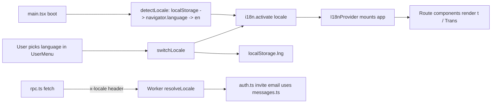

# 给 DueDateHQ 增加中/英文多语言计划（Lingui 方案）

## 1. 选型与总体架构

- 库：Lingui v5（`@lingui/core` 运行时约 2KB，`@lingui/react` 绑定，`@lingui/cli` 提取/编译，`@lingui/vite-plugin` 自动热更新）。
- 宏方案：走 `@lingui/babel-plugin-lingui-macro`（因为本项目 `apps/app` 用的是 `@vitejs/plugin-react` 即 Babel，非 SWC）。
- 语种：`en`（默认/兜底）、`zh-CN`。消息 id 用英文源文案自动生成（`lingui extract` 的默认 hash/original 模式）。
- 作用域（已确认）：`apps/app` 全量 + `apps/server` 邮件文案；错误码保持稳定合约由前端翻译；`packages/*` 不引入 i18n（保持 infra-free）。

## 2. 目录与文件骨架（新增）

- `apps/app/src/i18n/`
  - `i18n.ts`：创建并导出全局 `i18n` 实例（封装 `setupI18n`、`dynamicActivate(locale)`）。
  - `provider.tsx`：`<AppI18nProvider>` 包 `I18nProvider`，首次挂载时读取 `localStorage.lng → navigator.language → 'en'` 并 `dynamicActivate`。
  - `locales.ts`：`export const locales = { en: 'English', 'zh-CN': '简体中文' } as const` + 工具 `detectLocale()` / `persistLocale()`。
  - `locales/en.po`、`locales/zh-CN.po`：由 `lingui extract` 生成，`lingui compile` 输出 `.ts`（Vite 插件自动编译）。
- `apps/app/lingui.config.ts`：locales、`catalogs` 指向 `src/i18n/locales/{locale}`、format 用 `po`。
- `apps/server/src/i18n/`
  - `messages.ts`：极简字典 `{ 'invitation.subject': { en, 'zh-CN' }, 'invitation.body': {...} }`。
  - `resolve.ts`：`resolveLocale(request: Request | string | undefined)` → 解析 `Accept-Language` / 显式 header（`x-locale`），返回受支持语言。
- （可选）`.lingui/` 缓存目录加入 `.gitignore`（若有）。

## 3. 依赖清单（编辑 `pnpm-workspace.yaml` catalog + 各 `package.json`）

在 [pnpm-workspace.yaml](pnpm-workspace.yaml) `catalog:` 中新增（保持 `saveExact` 规则，使用固定版本）：

- `@lingui/core`、`@lingui/react`、`@lingui/detect-locale`（runtime, dependencies）
- `@lingui/cli`、`@lingui/macro`、`@lingui/vite-plugin`、`@lingui/babel-plugin-lingui-macro`（devDependencies）
- Babel 接入：`@lingui/babel-plugin-lingui-macro` 作为 `@vitejs/plugin-react` 的 `babel.plugins`。

对应修改：
- [apps/app/package.json](apps/app/package.json)：`dependencies` 加 `@lingui/core/react/detect-locale`；`devDependencies` 加 `cli/macro/vite-plugin/babel-plugin-lingui-macro`；`scripts` 新增 `"i18n:extract": "lingui extract"`、`"i18n:compile": "lingui compile"`。
- [apps/server/package.json](apps/server/package.json)：不引入任何 Lingui 依赖（邮件使用纯字典）。

## 4. Vite 与 Lingui 接入（apps/app）

- [apps/app/vite.config.ts](apps/app/vite.config.ts)：
  - 导入 `lingui` from `@lingui/vite-plugin`。
  - `react()` 配置加入 `{ babel: { plugins: ['@lingui/babel-plugin-lingui-macro'] } }`。
  - `plugins` 数组追加 `lingui()`（该插件会把 `.po` 编译进依赖图）。
- `lingui.config.ts`（根据官方 v5 格式）：

```ts
import { defineConfig } from '@lingui/cli'
export default defineConfig({
  sourceLocale: 'en',
  locales: ['en', 'zh-CN'],
  catalogs: [
    { path: 'src/i18n/locales/{locale}', include: ['src'] },
  ],
  format: 'po',
})
```

## 5. 全量替换清单（apps/app）

下述文件的硬编码英文字符串全部用 `t\`…\`` 或 `<Trans>…</Trans>` 包裹；动态插值用 `<Trans>Hello {name}</Trans>` 或 `t\`Hello ${name}\``；`aria-label`、`placeholder`、`title` 等属性用 `t\`\`` 函数返回字符串。

- [apps/app/index.html](apps/app/index.html)：`<title>` 保持 `DueDateHQ`（品牌名不译），但 `<html lang="en">` 改由 `provider.tsx` 在激活 locale 后 `document.documentElement.lang = locale` 同步。
- [apps/app/src/main.tsx](apps/app/src/main.tsx)：外层加 `<AppI18nProvider>`，包住 `QueryClientProvider`。
- [apps/app/src/routes/_layout.tsx](apps/app/src/routes/_layout.tsx)：
  - `navItems` 的 `label`（Dashboard/Workboard/Settings）、`shellMeta`（Queue SLA/Local Time）改为 `t` 调用在组件内构造（原来放在模块顶部的常量要改成 hook 内数组 + `useLingui()`）。
  - `header` 文案：`Phase 0 demo workspace`、`Compliance risk operations`、按钮 `Pulse`/`New obligation`。
  - `aside` 品牌描述 `CPA deadline console`。
  - `UserMenu` 的 `Signed in`、`Sign out`、`Signing out…`、`aria-label` 动态拼接。
  - 顶部 `Sign out failed` toast。
- [apps/app/src/routes/login.tsx](apps/app/src/routes/login.tsx)：`highlights` 数组改成 hook 内常量；`Phase 0 · Demo workspace`、`Verified risk, one deadline at a time.`、`Sign in`、卡片描述、`Continue with Google`、`Redirecting to Google…`、`Secure sign-in`、`Terms of Service`/`Privacy Policy`/`support@…`、footer 的 `SOC 2 ready · SSO available`。
- [apps/app/src/routes/dashboard.tsx](apps/app/src/routes/dashboard.tsx)：`pulseItems`、`queueStats`、卡片标题/描述、所有 Tabs/Table 表头、Alert 文案。注意 mock 业务数据（客户名、城市名）保留不翻译，仅翻译 UI 标签与骨架文案；`pulseItems` 的 `title/detail` 因是演示用 UI 文案故纳入翻译。
- [apps/app/src/routes/workboard.tsx](apps/app/src/routes/workboard.tsx)：标题、描述、按钮、`aria-label="Search obligations"`、`placeholder`、筛选徽章 `all/blocked/in review/waiting`、表头、`{n} rows`（用 `<Plural>`）。
- [apps/app/src/routes/settings.tsx](apps/app/src/routes/settings.tsx)：标题、字段 label/description、Select 选项（`New York` 等地区名保留英文，不翻译；但 `Multi-state` 可译）。
- [apps/app/src/routes/error.tsx](apps/app/src/routes/error.tsx)：`Route failed`、`Return to dashboard`、`Unexpected route error`。
- [apps/app/src/routes/fallback.tsx](apps/app/src/routes/fallback.tsx)：纯骨架，无文案，跳过。

## 6. 日期 / 货币本地化

改 [apps/app/src/lib/utils.ts](apps/app/src/lib/utils.ts) 的 `formatCents` / `formatDate`：
- 从参数接收 `locale: string`，或者读取 `i18n.locale`。推荐后者（避免每个调用点改签名），新增内部 `getLocale()` 读取 `i18n.locale` 映射到 `Intl` locale：`en → en-US`、`zh-CN → zh-CN`。
- 货币保留 `USD`（业务数据），数字样式交给 `Intl` 根据 locale 决定分隔符。
- 对应 test [apps/app/src/lib/utils.test.ts](apps/app/src/lib/utils.test.ts) 追加 zh-CN 分支断言。

## 7. 语言切换器 UI

在 `_layout.tsx` 的 `UserMenu`（底部 panel 与顶部 compact 两处）的 `DropdownMenuContent` 中，在 `Sign out` 上方加 `DropdownMenuSub`（或简单两个 `DropdownMenuItem` 单选）：

- `<DropdownMenuItem onClick={() => switchLocale('en')}>English</DropdownMenuItem>`
- `<DropdownMenuItem onClick={() => switchLocale('zh-CN')}>简体中文</DropdownMenuItem>`

`switchLocale` 来自 `@/i18n/provider`：`persistLocale(code); i18n.activate(code); document.documentElement.lang = code`。不刷新页面，Lingui 会触发重新渲染。

## 8. 服务端（apps/server）本地化（轻量字典，不引 Lingui）

- [apps/server/src/i18n/resolve.ts](apps/server/src/i18n/resolve.ts)：
  

```ts
  export const SUPPORTED = ['en', 'zh-CN'] as const
  export type Locale = (typeof SUPPORTED)[number]
  export function resolveLocale(headers: Headers): Locale {
    const xLocale = headers.get('x-locale')
    if (xLocale && (SUPPORTED as readonly string[]).includes(xLocale)) return xLocale as Locale
    const accept = headers.get('accept-language') ?? ''
    if (/zh/i.test(accept)) return 'zh-CN'
    return 'en'
  }
  

```
- [apps/server/src/i18n/messages.ts](apps/server/src/i18n/messages.ts)：只放"邮件 subject + html 段"两份字典（en/zh-CN），通过 `t(locale, key, vars)` 返回字符串，`vars` 做最小插值（`{name}` 替换）。
- 改 [apps/server/src/auth.ts](apps/server/src/auth.ts) 第 55–60 行邀请邮件：`subject`、`html` 从 `messages.ts` 取，传入 `resolveLocale(ctx.req.raw.headers)`（或邀请人在 request 中显式带的 `x-locale`）。
- 错误码类（[apps/server/src/middleware/session.ts](apps/server/src/middleware/session.ts)、[apps/server/src/middleware/tenant.ts](apps/server/src/middleware/tenant.ts)、[apps/server/src/middleware/rate-limit.ts](apps/server/src/middleware/rate-limit.ts)）**不修改**，继续返回稳定 error code 字符串；由前端在捕获响应后查表翻译（前端在 `i18n/locales/*.po` 中对 `UNAUTHORIZED`/`TENANT_MISSING`/`TENANT_MISMATCH`/`FORBIDDEN`/`RATE_LIMITED` 这 5 个键做翻译条目）。

web 端向 server 发请求时，在 [apps/app/src/lib/rpc.ts](apps/app/src/lib/rpc.ts) 的 fetch 层给每个请求加 `x-locale: i18n.locale`，使 server 端可以按 locale 返回邮件等本地化文案。

## 9. 测试

- [apps/app/src/lib/utils.test.ts](apps/app/src/lib/utils.test.ts)：补 zh-CN 格式化断言（先 `i18n.activate('zh-CN')`）。
- 新增 `apps/app/src/i18n/provider.test.tsx`：断言首次检测回退到 en、设置后 `localStorage` 写入、`document.documentElement.lang` 同步。
- 新增 `apps/server/src/i18n/resolve.test.ts`：断言 `x-locale` 优先、`Accept-Language: zh-CN,zh;q=0.9` 返回 `zh-CN`、未知返回 `en`。

## 10. 脚本与工作流

- `pnpm --filter @duedatehq/app i18n:extract`：扫描源码并更新 `.po`。
- `pnpm --filter @duedatehq/app i18n:compile`：编译为运行时 JS（通常 Vite 插件会自动做，CI 仍跑一遍做校验）。
- CI 中 `pnpm ready` 不需要改动；可在 [AGENTS.md](AGENTS.md) "Build, Test, and Development Commands" 节追加这两条。

## 11. 数据流与渲染时序



## 12. 验收清单

- 首次访问浏览器语言为 zh-* 时 UI 直接是中文；english 浏览器保持英文。
- 切换后刷新页面保留上次选择。
- `document.documentElement.lang` 与当前 locale 同步，满足可访问性。
- 登录/Dashboard/Workboard/Settings/Error 五个路由无遗漏英文硬编码（grep `>[A-Z][a-zA-Z ]+<` 或人工审）。
- 邀请邮件在 `x-locale: zh-CN` 请求下主题/正文为中文，默认英文。
- `pnpm check`、`pnpm test`、`pnpm build` 全通过。
