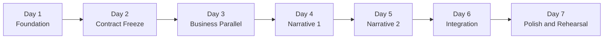

# 10 · Demo Sprint 7 天节奏方案（2 人 · 每天 4-6h）

> 适用场景：2 位开发者 · 自然日 7 天 · 每天 4-6h · AI 辅助开发。
> 本文是 [09 Demo Sprint Module Playbook](./09-Demo-Sprint-Module-Playbook.md) 的时间线落地，不重新定义模块边界。
> 若本文与 00 ~ 09 冲突，以 00 ~ 09 为准。

---

## 1. 重新平衡 Owner 分配

对比 [09 §4](./09-Demo-Sprint-Module-Playbook.md) 原配，做 2 处轻调整让关键路径拉平：

- **PWA + Push 从 JHX 移到 LYZ**：PWA 本质是 Web Shell 里的 manifest + service worker + 订阅 UI，LYZ 作为 Web Shell/UI Owner 承接更顺，Day 5 能无缝挂进自己已搭好的 shell。Pulse 事件依赖解耦：PWA 先消费 fake event（参见 09 §7 第 4 条并行规则）。
- **DevOps + Quality Gates 拆成两段**：JHX 在 Day 1 一次性搭 CI 骨架（`oxfmt` / `oxlint` / `tsgo` / `Vitest` / `gitleaks` + deploy pipeline 骨架），之后的 required checks 维护由两人共同负责，不再占单人关键路径。

调整后：

| Owner | 模块数 | 关键路径工时 | 模块清单 |
|---|---|---|---|
| JHX | 6 | ~30h | Platform · Auth · AI Orchestrator · Migration · Pulse · DevOps (day-1) |
| LYZ | 7 | ~30h | Web Shell+UI · DB Core · Evidence+Audit · Client+Workboard · Dashboard+Brief · PWA · Demo Polish |

---

## 2. 7 天节奏总览

按"基础 → 共享契约冻结 → 业务并行 → 叙事闭环 → 打磨"推进。每天末尾 15min 同步 contract 变更与阻塞。

---

## 3. 每日分工

### Day 1 · 地基

| Owner | 任务 |
|---|---|
| JHX | Platform + DevOps day-1：起单 Worker app shell，接 `/rpc`、`/api/auth`、`/api/health` 路由；配全量 bindings（D1/R2/KV/Queues/Vectorize）；搭 CI（format/lint/`tsgo`/test/build/secrets）+ Lefthook；拉通 local ↔ preview runtime 命名一致。 |
| LYZ | Web Shell + UI System + DB Core scaffold：workbench layout、navigation、drawer stack、command shell 占位、dashboard slot 骨架；D1 schema DDL 和 migration 骨架（先建表，暂不写 repo 逻辑）。 |

**当日产出**：两人都能在本地跑通空壳 Worker；`pnpm check` 全绿。

### Day 2 · 共享契约冻结

| Owner | 任务 |
|---|---|
| JHX | Auth + Tenant Scope（magic link、active firm、`scoped(db, firmId)` 上下文、auth 错误审计映射）→ AI Orchestrator facade（prompt 执行、JSON 校验、guard/citation 占位、trace payload 结构）。 |
| LYZ | DB Core + Scoped Repos（client / obligation / pulse / dashboard read repo + audit/evidence writer facade）。 |

**当日必须冻结的 Shared Contract**（见 [09 §6](./09-Demo-Sprint-Module-Playbook.md#6-shared-contract-surface)）：

- `Tenant Context Contract`
- `AI Execution Contract`
- `Audit/Evidence Contract`

之后改动一律 `[contract]` PR。

### Day 3 · 业务并行

| Owner | 任务 |
|---|---|
| JHX | Migration Copilot 前半段——CSV intake + AI 字段映射 + 反向确定性校验 + Default Matrix 触发；先支持 happy path，坏行不阻塞好行。 |
| LYZ | Client + Workboard——client CRUD、obligation generation、workboard 查询/筛选/排序/分页、status workflow（全部经 scoped repo + audit writer）。 |

**冻结契约**：`Client Domain Contract` · `Obligation Domain Contract`。

**边界约束**：JHX 的 Migration 消费 LYZ 的 client facade，不自建 client identity。

### Day 4 · 叙事 1：Migration + Dashboard

| Owner | 任务 |
|---|---|
| JHX | Migration 后半段——D1 batch 原子导入 + revert + Live Genesis 演示路径（exposure 变化动画所需事件点）；完成 Migration 专属 evidence/audit。 |
| LYZ | Dashboard + Brief——risk summary（server-side 聚合）、triage tabs、penalty/priority 解释（可单测）、Weekly Brief streaming + citation 点击打开 Evidence。 |

**冻结契约**：`Dashboard Slot Contract`，为 Day 5 的 Pulse 挂槽做好准备。

### Day 5 · 叙事 2：Pulse + PWA 基础

| Owner | 任务 |
|---|---|
| JHX | Pulse Pipeline——预置 source 数据、extraction、human-review 结构化结果、受影响客户匹配（D1 兼容的参数化查询）、batch apply（due date 更新 + evidence + audit + outbox + application record 同事务）+ revert。 |
| LYZ | Dashboard 上的 Pulse slot 消费端（只挂 slot 不改宿主）+ PWA 基础（manifest、service worker、runtime cache rules、install flow）。Push 先用 fake event 自测。 |

**冻结契约**：`Push Event Contract`。

### Day 6 · 集成闭环

| Owner | 任务 |
|---|---|
| JHX | Pulse digest email outbox + push fanout 的 server 端；接 AI Orchestrator 的 guard 把 county-unknown 路由到 review；跑通 Migration → Workboard → Dashboard → Pulse 的端到端。 |
| LYZ | PWA push subscription UI + 通知处理；Evidence drawer 最终打磨（source URL / quote / verifier / timestamp）；Command palette 注册各模块入口。 |

**验收**：[09 §11 Demo Sanity](./09-Demo-Sprint-Module-Playbook.md#11-demo-sanity) 前 6 条全绿。

### Day 7 · Polish + 演练

| Owner | 任务 |
|---|---|
| JHX | 部署流水线最终化（Workers preview + production）、migration 安全检查、[09 §12](./09-Demo-Sprint-Module-Playbook.md#12-风险降级规则) 降级预案串讲（AI mapper / batch / push / Vectorize 都要有 Plan B）、录屏 Plan B。 |
| LYZ | Demo Data + Pay-intent + Polish——幂等 seed、`$49/mo` 点击事件、响应式断点打磨、Demo profile 隔离验证。 |

**最后 2h**：两人一起走一遍 [09 §11](./09-Demo-Sprint-Module-Playbook.md#11-demo-sanity) 的 7 条 + [09 §2.1](./09-Demo-Sprint-Module-Playbook.md#21-必须覆盖) 叙事全串。

---

## 4. 契约冻结时间表（必须守住）

| 节点 | 冻结契约 |
|---|---|
| Day 2 末 | Tenant Context · AI Execution · Audit+Evidence |
| Day 3 末 | Client Domain · Obligation Domain |
| Day 4 末 | Dashboard Slot |
| Day 5 末 | Push Event · Demo Profile |

任何契约变更走 `[contract]` PR，provider + consumer 双 review（[09 §3.2](./09-Demo-Sprint-Module-Playbook.md#32-两人协作规则) · [09 §13](./09-Demo-Sprint-Module-Playbook.md#13-合并纪律)）。

---

## 5. 并行与阻塞兜底

对齐 [09 §7](./09-Demo-Sprint-Module-Playbook.md#7-模块依赖图) · [09 §8](./09-Demo-Sprint-Module-Playbook.md#8-debug-isolation)：

- LYZ 的 Workboard 在 Day 3 可以先用 JHX 的 fake tenant context fixture 跑单测，不等 Auth 完成。
- JHX 的 Migration 在 Day 3 可以用 LYZ 的 fake client facade，先把 AI mapping 调通。
- Dashboard 的 Pulse slot 在 Day 5 先用 fake Pulse event 对齐 UI；JHX 的真实 Pulse 在 Day 5 晚接入。
- PWA 对 Pulse 的依赖走 Push Event Contract，LYZ 在 Day 5 用 fake event 开发 SW；Day 6 再连真事件。
- 每人使用独立 demo firm + object prefix，不共享 staging 做探索。

---

## 6. 风险与降级触发点

对齐 [09 §12](./09-Demo-Sprint-Module-Playbook.md#12-风险降级规则)：

| 触发点 | 风险 | 降级方式 |
|---|---|---|
| Day 3 末 | Migration AI mapper 不稳 | 切 preset profile + 手动 mapping，不让未校验 AI 字段入库 |
| Day 5 末 | Pulse batch apply 事务有问题 | 禁用 apply，演"预置 applied state + audit/evidence"叙事 |
| Day 6 | PWA push 到不了设备 | in-app notification 兜底，不阻塞主闭环 |
| Day 7 | 部署异常 | 用最近一次稳定 Worker + 录屏 Plan B |

---

## 7. Demo 范围守则

- 严格按 [09 §2.2](./09-Demo-Sprint-Module-Playbook.md#22-明确不做) 不做：Team/RBAC、Client Portal、完整 Rules Overlay、Onboarding Agent、Ask DueDateHQ、完整 Email Reminder、ICS/Stripe/Menu Bar、50 州 pack。
- 若某天发现要越界，先打 `priority/p1-stretch` 排到 Phase 1（[09 §14](./09-Demo-Sprint-Module-Playbook.md#14-phase-1-接续)），不塞进 7 天。

---

## 8. 每日产出检查表

每天末尾两人对照下表各自确认：

### Day 1
- [ ] JHX：Worker 在本地能返回 `/api/health` 200
- [ ] JHX：`pnpm format:check` / `pnpm lint` / `pnpm check-types` / `pnpm build` 在空项目上全绿
- [ ] JHX：Lefthook pre-commit 钩子在 staged file 上生效
- [ ] LYZ：`pnpm dev` 能打开 SPA 空壳
- [ ] LYZ：Drizzle schema 能 `db:generate` 产出 migration SQL

### Day 2
- [ ] JHX：magic link 能拿到 session，`firmId` 正确进入 scoped context
- [ ] JHX：AI facade 在无 API key 时返回 structured refusal，不抛裸异常
- [ ] LYZ：`scoped(db, firmId)` 在单测里过闸，跨 firm 数据不可见
- [ ] LYZ：audit / evidence writer 能同事务写入并返回 id
- [ ] 三份契约 freeze 并合并到 main

### Day 3
- [ ] JHX：CSV 上传后能看到 AI 字段映射结果，坏行单独列出
- [ ] LYZ：Workboard 能改一条 status 并看到 audit 记录
- [ ] 两份 domain 契约 freeze

### Day 4
- [ ] JHX：Migration 批量导入后能 revert，两次操作都有 evidence/audit
- [ ] JHX：Live Genesis 演示路径串通（exposure 数字能动）
- [ ] LYZ：Dashboard 首屏由 server aggregation 提供，不由客户端扫表
- [ ] LYZ：Weekly Brief citation 能点击打开 Evidence drawer
- [ ] Dashboard Slot 契约 freeze

### Day 5
- [ ] JHX：Pulse 预置数据可通过 review → apply 改到客户 due date
- [ ] JHX：Pulse apply 在一个事务内写齐 update / evidence / audit / outbox / application
- [ ] LYZ：Dashboard 出现 Pulse slot 内容，不改动 Dashboard 内部代码
- [ ] LYZ：PWA 在 Chrome 可安装，service worker 正确注册
- [ ] Push Event 契约 freeze

### Day 6
- [ ] JHX：Pulse digest email 进 outbox，push fanout 走通
- [ ] JHX：county-unknown 走 review 而不是默认 apply
- [ ] LYZ：Evidence drawer 展示 source URL / quote / verifier / timestamp
- [ ] LYZ：Command palette 能跳到 Migration / Workboard / Dashboard / Pulse 入口
- [ ] 09 §11 Demo Sanity 前 6 条全绿

### Day 7
- [ ] JHX：Workers preview / production deploy 成功
- [ ] JHX：4 个降级路径都有可执行 Plan B
- [ ] LYZ：seed 幂等，重跑不污染其他 profile
- [ ] LYZ：`$49/mo` 点击 pay-intent 事件进 PostHog
- [ ] 最后演练：09 §11 全 7 条 + 09 §2.1 全叙事串完

---

## 9. 合并纪律（对齐 09 §13）

- `main` 必须保持可 demo。
- Branch：`feat/<module>/<short>`，例如 `feat/migration/csv-intake`。
- Commit 使用 Conventional Commits。
- Merge 使用 squash。
- `[contract]` PR 必须 provider 和 consumer 都 review。

---

## 10. 最后原则

1. **Owner 端到端负责**：前后端不分人，每个模块 Owner 对自己的 Owns/Exposes/Consumes/Does not own 负责。
2. **契约优先于实现**：先冻 contract 再写代码，consumer 用 fake 解阻塞。
3. **本地隔离优先**：每人独立 demo firm + object prefix，不共享 staging 做探索。
4. **Audit/evidence 优先于炫酷 UI**：dangerous write 必须同事务写 audit。
5. **AI 只做辅助**：不能绕过 schema、guard、review、audit。
6. **不加塞 Phase 1 能力**：越界一律打 `priority/p1-stretch`。
