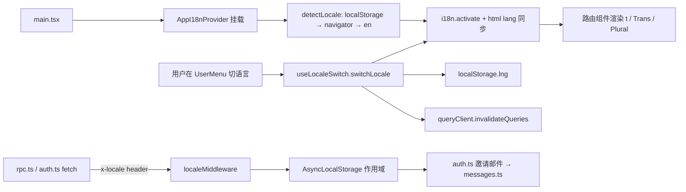

# 0009 · 前端采用 Lingui + 服务端轻量字典的 i18n 方案

## 背景（Context）

`docs/dev-file/05-Frontend-Architecture.md §11` 最初预先选定了
`i18next + react-i18next`。由于尚未落地任何代码，我们结合以下约束重新评估：

- **Bundle 预算**（`05 §12`）：单 chunk ≤ 150 KB gz，总计 ≤ 500 KB gz。
  `i18next` 仅运行时就有 ~40 KB gz（约占总预算 8%）。
- **Contract-first Zod**（ADR 0002）：`packages/contracts` 中的 schema 保持
  与 locale 无关；错误以结构化 code（`{ code, path }`）传递，由 UI 层渲染
  文案。i18n **不**用于翻译 Zod 报错。
- **AI 协作的两人团队**（ADR 0000）：string-key 形式的 i18n API
  （`t('feature.section.key')`）容易让 AI 生成与 catalog 漂移的键名，评审时
  难以察觉。
- **需要 ICU 格式化**：Penalty Radar / Overdue 表格 / 邮件摘要等场景需要复数
  与数字格式化（`{count, plural, one {# day} other {# days}}`）。
- **React Email 模板** 在 Worker 中渲染；服务端也要按调用方 locale 选文案。
- **Phase 0 demo sprint** 要求 en + zh-CN 端到端可用，而不是留到 Phase 2
  做技术验证。

## 决策（Decision）

SPA 采用 **Lingui v5**；Worker 采用**类型化字典 shim**（不引入任何 Lingui
运行时）：

- `apps/web`：`@lingui/core` + `@lingui/react`（运行时约 4 KB gz），
  `@lingui/cli` + `@lingui/babel-plugin-lingui-macro` + `@lingui/vite-plugin`
  （仅 dev 依赖）。版本全部在根 `pnpm-workspace.yaml` 的 catalog 中 pin 住。
- `apps/server`：约 40 行的类型化字典（`src/i18n/messages.ts`）+ 一个
  `resolveLocale(headers) → 'en' | 'zh-CN'` 辅助函数。Worker 产物里没有任何
  Lingui 依赖。

硬性规则：

1. **Zod 保持 locale-free。** schema 只用稳定 error code；所有面向用户的文案
   归 UI 层，走 Lingui macros。
2. **所有 UI 文案必须走 `<Trans>` / `` t`…` `` macros。** 属性字符串
   （`aria-label`、`placeholder` 等）使用函数形式。数量相关文案用 `<Plural>`。
3. **Catalog 位置**：`apps/web/src/i18n/locales/{locale}/messages.po`。
   `@lingui/vite-plugin` 负责把 `.po` 编译进依赖图；两个 locale 都用静态
   import 加载（体积可忽略）。如果将来新增第三种语言，再切换到
   `dynamicActivate`。
4. **构建期 macro 转换**：`vite-plugin-babel` 对每个 `.ts` / `.tsx` 文件跑
   `@lingui/babel-plugin-lingui-macro`。`@vitejs/plugin-react` v6 已切到 SWC
   并不再暴露 Babel hook，因此 Lingui macro 用独立的 Babel pass 来跑 ——
   这也是整条 pipeline 里**唯一**的 Babel pass。
5. **服务端本地化刻意做薄。** Worker 只提供一份面向事务邮件的类型化字典
   （subject / body / CTA）。locale 从 `x-locale` header 解析（由 SPA 注入），
   失败时回退 `Accept-Language`，并通过 `AsyncLocalStorage` 透传给解耦的
   回调（如 better-auth 的邀请邮件 hook），避免把 header 串进每一层签名。
6. **错误码合约。** 中间件返回稳定的英文 code（`UNAUTHORIZED`、
   `FORBIDDEN`、`RATE_LIMITED`、`TENANT_MISSING`、`TENANT_MISMATCH`、
   `NOT_FOUND`、`INVALID_REQUEST`、`CONFLICT`、`INTERNAL_SERVER_ERROR`）。
   SPA 通过 `translateServerErrorCode()` 查 `MessageDescriptor` 表做翻译，
   使得 `lingui extract` 能正确抓取英文源文案。

本决策取代 `docs/dev-file/05-Frontend-Architecture.md §11` 中的
`i18next + react-i18next` 条目。

## 架构（Architecture）

### SPA（`apps/web`）

```
src/i18n/
  i18n.ts               # @lingui/core 全局单例、locale 辅助函数、
                        #   attachLocaleHeader() 供 rpc.ts + auth.ts 复用
  locales.ts            # SUPPORTED_LOCALES、DEFAULT_LOCALE、INTL_LOCALE 映射、
                        #   detectLocale()（localStorage → navigator → en）、
                        #   persistLocale()
  provider.tsx          # AppI18nProvider 包裹 @lingui/react 的 I18nProvider，
                        #   通过 useState 懒初始化在首次挂载时执行 bootstrap
                        #   ——模块导入无副作用；
                        #   useLocaleSwitch() 基于 useSyncExternalStore
                        #   以避免并发渲染下的 tearing，切换 locale 时同步
                        #   失效 TanStack Query 缓存
  locales/{en,zh-CN}/messages.po
  locales/{en,zh-CN}/messages.ts   # 由 @lingui/vite-plugin 编译产出
```

横切辅助：

- `src/lib/utils.ts` —— `formatCents` / `formatDate` 通过
  `INTL_LOCALE['en'] = 'en-US'` / `INTL_LOCALE['zh-CN'] = 'zh-CN'`
  读取当前 locale，让 `Intl.NumberFormat` / `Intl.DateTimeFormat`
  自动选择合适的千分位与日期样式。
- `src/lib/i18n-error.ts` —— 使用 `i18n._(MessageDescriptor)` 做惰性查表，
  locale 切换无需预译，直接触发重渲染。
- `src/lib/rpc.ts` + `src/lib/auth.ts` —— 两处都通过
  `attachLocaleHeader(headers)` 注入共享的 `x-locale` header，避免字面量
  散落在多处。

已替换所有硬编码文案的路由：`_layout`、`login`、`dashboard`、`workboard`、
`settings`、`error`。语言切换器位于 `UserMenu` 下的 `DropdownMenuSub`，在
侧边栏 panel 与顶栏 compact 两种形态下都可见。`activateLocale()` 内部会把
`<html lang>` 同步到当前 locale，满足无障碍需求。

### Worker（`apps/server`）

```
src/i18n/
  resolve.ts            # resolveLocale(headers) —— x-locale > Accept-Language > en
                        # runWithLocale() / getRequestLocale() 基于 AsyncLocalStorage
  messages.ts           # MessageKey 类型化字典：invitation.{subject,body,cta}
                        # interpolate() 替换 {name} 占位符
src/middleware/locale.ts     # localeMiddleware：runWithLocale(resolveLocale(headers), next)
src/auth.ts                  # sendInvitationEmail 内部读取 getRequestLocale()
src/types/node-async-hooks.d.ts  # Workers 运行时的最小类型声明
```

`node:async_hooks` 依赖 `wrangler.toml` 中 `compatibility_flags =
["nodejs_compat"]`；Worker 运行时原生暴露 `AsyncLocalStorage`，但
`@cloudflare/workers-types` 没有声明，所以单独加一个类型 shim。

### 数据流（Data flow）



## 脚本（Scripts）

`apps/web/package.json` 新增：

- `pnpm --filter @duedatehq/web i18n:extract` —— 扫描源码并更新 `.po`。
- `pnpm --filter @duedatehq/web i18n:compile` —— 输出编译后的 catalog。
  Vite 插件在 `dev` / `build` 阶段会自动执行；保留脚本是为了在 CI 中单独
  校验一次。

两条命令也记录在 `AGENTS.md → Build, Test, and Development Commands`。
`pnpm ready`（check + test + build）覆盖整条链路。

## 测试（Tests）

- `apps/web/src/i18n/provider.test.tsx` —— bootstrap、切换、持久化、以及
  同 locale 切换应为 no-op；基于 `react-dom/client` + `happy-dom`，在
  真实的 provider + TanStack Query 树内运行。
- `apps/web/src/lib/utils.test.ts` —— `formatCents` / `formatDate` 的
  en / zh-CN 分支。
- `apps/web/src/lib/i18n-error.test.ts` —— 每个 locale 下的已知 code 翻译、
  未知 code 的 `null` 回退。
- `apps/server/src/i18n/resolve.test.ts` —— header 优先级
  （`x-locale` > `Accept-Language` > 默认）以及 `runWithLocale` 的作用域行为。
- `apps/server/src/middleware/locale.test.ts` —— 在并发 Hono 请求下验证
  locale 按请求隔离（保证 AsyncLocalStorage 的接线正确）。

## 影响（Consequences）

**好处**

- SPA 运行时占用约 4 KB gz（对比 i18next 的 ~40 KB gz），单 chunk 预算释放
  约 8%。
- 源码自然语言化（`<Trans>Client {name} has {count} overdue tasks</Trans>`），
  AI 生成代码无需发明 string key。`lingui extract` 会自动把删除的条目标记为
  obsolete。
- ICU 语法与占位符一致性在 `pnpm build` 阶段校验，出错在 CI 就暴露而非
  运行时在浏览器中才发现。
- `useSyncExternalStore` 支撑的 `useLocaleSwitch` 避免了 Lingui 自身变更
  通知与 React 19 并发渲染之间的 tearing。
- 服务端 locale 通过 `AsyncLocalStorage` 透传，新的邮件模板只需调用
  `getRequestLocale()`，不会在各层函数签名里蔓延。
- Worker bundle 保持 Lingui-free。服务端字典是约 40 行的纯 TypeScript，
  通过编译期 `MessageKey` 穷尽性检查保证每种语言都不漏译（缺译直接是
  类型错误）。

**代价**

- 生态比 i18next 小，新成员上手成本略高。靠 `AGENTS.md` 与本 ADR 来缓解。
- `@vitejs/plugin-react` v6 已改用 SWC，无法承载 Lingui macro，因此需要
  再挂一个 `vite-plugin-babel` 做 macro 转换。它每个源文件只跑一次
  Babel——不存在"双跑"问题，但这确实是 Vite+ 体系里多出来的一个插件，
  需要和主工具链一起 pin 版本。
- SPA 与 Worker 各维护一份 catalog（Lingui `.po` vs. 类型化字典）。当前
  重叠面极小（仅邀请邮件的 subject / body / CTA），分离换来的是 Worker 产物
  体积可控；但如果有人新增服务端渲染的字符串，必须改
  `apps/server/src/i18n/messages.ts`，不能直接复用 SPA 的 catalog。

**不确定项**

- 未来翻译厂商是否坚持要求扁平 JSON 交付。Lingui 可以输出 JSON，但 PO
  是其 happy path。选型时再重新评估。
- 如果 Worker 开始直接渲染 React Email 模板，类型化字典可能会撑不住，到时
  可以考虑在服务端引入 Lingui，或按模板分拆 catalog。

## 状态（Status）

implemented（Phase 0）—— 端到端双语（en、zh-CN）覆盖 SPA 所有路由与邀请
邮件，已随 `pnpm ready` 全绿通过。新增 locale 与翻译厂商接入作为后续事项
跟踪。
