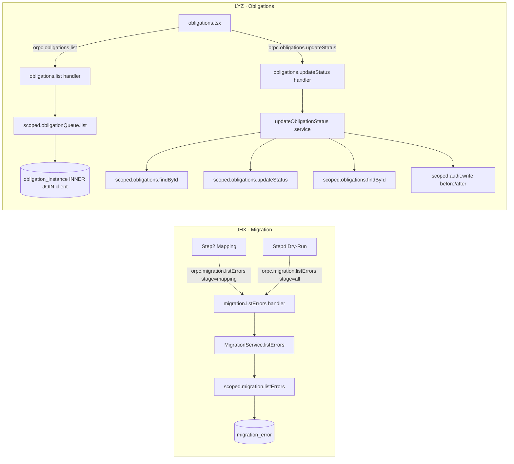

# Day 3 收口的技术设计：listErrors RPC、Obligations cursor 分页与 audit 不变量

## 背景

Day 3 收口落地见 [2026-04-26 day3 closeout](./2026-04-26-day3-closeout.md)（changelog 风格的"做了什么"）。
本文是它的姊妹篇，专注**为什么这样设计**——把这次新增的几个跨层契约
（`migration.listErrors` / `obligations.updateStatus` / `obligations.list`）
与 audit 不变量、cursor 分页、service 抽出等设计点的权衡固化下来，方便
Day 4 之后基于同一套约定往后推。

涉及的代码在以下层：

```
packages/contracts → packages/db (repo + audit-writer) → apps/server/src/procedures → apps/app
```

## 端到端拓扑



每条 RPC 的 firm 边界都由 `tenantMiddleware` 注入的 `scoped(db, firmId)` 强制，
procedures 层不能拿原始 `db` 句柄——这条 invariant 没动，新代码全部走
`requireTenant(ctx).scoped`。

## 设计决策

### 1. `migration.listErrors` 是只读旁路 RPC，不是扩展现有 procedure

**问题**：Step 2 完成 mapping 时需要把 `migration_error` 行展示给用户；
Step 4 的 dry-run 摘要里已有同样的数据但被截到 5 条。

**最终方案**：新增 `migration.listErrors(batchId, stage)` 只读 RPC。
`stage` 用 enum `['mapping','normalize','matrix','all']`，handler 在
[`apps/server/src/procedures/migration/_service.ts`](../../apps/server/src/procedures/migration/_service.ts)
里按 `errorCode` 前缀做启发式过滤。

**权衡过但没选的两条路径**：

| 备选                                           | 放弃原因                                                                                                                                                                           |
| ---------------------------------------------- | ---------------------------------------------------------------------------------------------------------------------------------------------------------------------------------- |
| 扩展 `confirmMapping` 输出，把 errors 塞进返回 | 改了已 freeze 的契约 shape，Day 2 测试要全部更新；且 Step 4 需要的是"全阶段汇总"，不只是 mapping 阶段                                                                              |
| 扩展 `getBatch` 返回 `errors[]`                | `getBatch` 是稳定的批次元数据查询，混入 errors 会让 cache 粒度失控（mapping 阶段刷一次、matrix 阶段又刷一次），并且 `MigrationBatchSchema` 不带 errors，扩展会破坏 schema 单一职责 |

只读旁路的好处：写型路径（`runMapper` / `applyDefaultMatrix`）不动；
TanStack Query 的 mutation cache 失效粒度天然对齐——`onSuccess` 之后单独触发
一次 `listErrors` mutation 就能填充 wizard reducer 的 `errors` 切片，
失败也不会让主流程回滚。

### 2. stage 过滤先用启发式，不引入新列

`migration_error.errorCode` 现在的取值都来自 `_deterministic.ts`：
`EIN_INVALID`、`EMPTY_NAME`、`STATE_INVALID`、`ENTITY_TYPE_INVALID` 等。
没有 `stage` 列，给每条 deterministic check 加 source-tag 列要起 migration、
回填、改 schema test。

代价收益不成比例。这次先用 **`classifyErrorStage(errorCode)`** 做前缀启发式，
把信息固化在文档里，等真有第二个 stage 误命中现有桶时再升级到列。
后续应该做的 SQL migration 见文末 _后续 / 未闭环_。

### 3. `obligations.updateStatus` 抽出独立 service 文件，handler 保持薄

**问题**：updateStatus 的核心逻辑（read-before / update / re-read /
audit-write）有四步，纯粹放在 handler 里测起来要构造完整的 oRPC
context；migration 那边也踩过这个坑（`MigrationService` 抽出来才好测）。

**最终方案**：新建 [`apps/server/src/procedures/obligations/_service.ts`](../../apps/server/src/procedures/obligations/_service.ts)，
导出 `updateObligationStatus(scoped, userId, input)` 纯函数；handler 只
负责 `requireTenant` + 调用。

```ts
// handler — 4 行
const updateStatus = os.obligations.updateStatus.handler(async ({ input, context }) => {
  const { scoped, userId } = requireTenant(context)
  return updateObligationStatus(scoped, userId, input)
})
```

测试在
[`_service.test.ts`](../../apps/server/src/procedures/obligations/_service.test.ts)
里用内存版 `ScopedRepo` 覆盖：正常路径、no-op 短路、跨 firm `NOT_FOUND`、
缺省 `reason` 不挂在 audit 上。

这个分层也给 Day 4/5 的写型 procedure（`migration.apply`、Pulse
`apply` 等）立了样板：复杂多步写入抽 service 文件，handler 只
做 context 解包 + delegation。

### 4. Audit 不变量：read-before → update → re-read → write-audit

每条 dangerous write 都遵循固定四步：

```ts
const before = await scoped.obligations.findById(id)
if (!before) throw NOT_FOUND
if (before.status === input.status) return shortCircuit()  // no-op
await scoped.obligations.updateStatus(id, input.status)
const after = await scoped.obligations.findById(id)
await scoped.audit.write({ before, after, ... })
```

**为什么不能调换顺序**：

- `before` 必须先读：write-then-read 拿到的值是 after，audit 就漂移。
- audit 在最后写：避免"audit 写了但 update 失败"造成虚假审计。
  虽然 D1 的 INSERT 也能失败，但 `audit_event` 是 append-only，重放容易；
  反过来"updated 了但 audit 没写"才是不可逆的审计黑洞。
- equal-status no-op 在第二步短路：避免双击下拉框产生噪声 audit
  （演示场景一秒能点 3 次）。返回稳定的 `00000000-...` audit id，UI
  toast 仍能正常渲染。

D1 没有真正的事务（只有 single-statement atomicity 与 batch），所以这条
不变量是**协议级**的，不是数据库级的。Day 5 Pulse apply 写
update + evidence + audit + outbox 时会改成 `db.batch([...])` 单
statement，那时不变量从协议层下沉到 storage 层。

### 5. Obligations cursor 分页：keyset on `(currentDueDate, id)`

**约束**：D1 单条 SQL 100 个 bound 参数，offset 大了之后 query plan
退化（即使有索引，offset N 也要扫 N 行）。Obligations 用户场景有几十到
几百行义务很常见。

**最终方案**：[`packages/db/src/repo/obligations.ts`](../../packages/db/src/repo/obligations.ts)
用 base64url(`${ISO_DATE}|${id}`) 作 cursor，keyset 比较：

```ts
// asc:  WHERE (currentDueDate > c.due) OR (currentDueDate = c.due AND id > c.id)
// desc: WHERE (currentDueDate < c.due) OR (currentDueDate = c.due AND id < c.id)
```

`limit + 1` 取多一行作 sentinel 探测 `nextCursor`，免去 count(\*)。

**100-param 预算核算**（最坏情况）：

```
firmId = 1
status[] up to 6
search LIKE = 1
cursor (due, id) = 2
ORDER BY 字段不算 bound param
合计 ≤ 10
```

剩下 90 多个余量给未来拓展（assignee、tax_type 多选筛选）。

`updated_desc` 排序故意**不**支持 cursor——只返回单页。
原因：keyset 在 `updatedAt` 上不稳定（status 变更立刻刷新 updatedAt，
分页边界会闪烁）。Demo Sprint 阶段没人需要"按更新顺序看第二页"，
等真有需求再加 server-side 时间戳锚 + 反向兼容标志。

### 6. Obligations 状态枚举权威下移到 DB schema

之前 `obligations.tsx` 自己造了 `'blocked' | 'in review' | 'draft' | 'waiting' | 'filed'`，
和 DB 里的 `'pending' | 'in_progress' | 'done' | 'waiting_on_client' | 'review' | 'not_applicable'`
完全不匹配。这是典型的"前端先做静态 mock、后端契约定型后没回灌"
留下的债。

这次从 [`packages/db/src/schema/obligations.ts`](../../packages/db/src/schema/obligations.ts)
开始定权威，contracts 的 `ObligationStatusSchema` 直接 mirror 它，
前端导入 `ObligationInstancePublic['status']` 派生 union，
不再自定义枚举。`contracts.test.ts` 加了一条断言锁住枚举顺序，
未来 DB 加状态时会从 contract test 失败开始反向追溯。

这条原则同样适用于 `EntityType` / `StateCode`：DB → contracts → app
的方向，前端永远不是 source of truth。

### 7. ObligationQueueRow 在 Public schema 上 extend，不另造 DTO

```ts
export const ObligationQueueRowSchema = ObligationInstancePublicSchema.extend({
  clientName: z.string().min(1),
})
```

`extend` 而不是新造 schema，让 Obligations 行的字段是
"obligation public 字段 + clientName"的超集。前端类型推导直接得到所有
字段；如果未来 `ObligationInstancePublic` 加了 `assigneeName`，Obligations
零代码同步。

## 测试策略

- **契约稳定性**：`contracts.test.ts` 锁住 procedure 列表、enum 顺序、
  required keys。这是 contract drift 的最早预警。
- **Repo 隔离**：Obligations 的 cursor / sentinel / limit 边界用 fake-Drizzle
  chain（参考 `tenant-scope.test.ts` 的模式），不依赖真实 D1。
- **Service 业务逻辑**：`obligations/_service.test.ts` 用内存 ScopedRepo
  覆盖 4 条业务路径；`migration/_service.test.ts` 沿用既有 in-memory 模式
  补 `listErrors` 的 stage 过滤 + 跨 firm。
- **没有做的**：oRPC handler 端到端测、前端 UI 渲染测。oRPC handler
  的逻辑已经下沉到 service，handler 是 4 行 delegation；前端测要求 RTL +
  oRPC mock 的基础设施，超 Day 3 工时预算。Day 4 起加。

## 验证

- `pnpm ready`（check + test + build）全绿
- `pnpm check:deps`：依赖方向 OK（packages/db 不依赖 procedures，contracts 不依赖 db）
- 7 个测试套件、102 个测试通过

## 后续 / 未闭环

1. **`migration_error` 加显式 stage 列**：把 `classifyErrorStage` 启发式
   退役，落到 schema 层。Day 5 之前没必要，但 Day 4 commit 会带
   `apply` 阶段的错误，那时 stage 桶要扩到 `commit`，是合并到 SQL
   migration 的好时机。
2. **Obligations 多选状态写型操作**：现在只有单条 `updateStatus`，
   Day 4/5 一定会有 bulk reassign / bulk dismiss 需求。延伸点是
   `obligations.updateStatusBatch` + audit `writeBatch`，注意 D1 100-param
   预算（每条 audit 12 列 → 一批最多 8 条，需要分批）。
3. **`updated_desc` 分页**：上文第 5 节说不做。等真有需求时引入
   server-side snapshot 时间戳作 anchor。
4. **前端 RTL + oRPC mock 基础设施**：Day 4 起补，把
   `useQuery / useMutation` 的 onSuccess 路径锁住。
5. **Audit 详情 drawer**：现在 toast 只显示 audit id 前 8 位作肉眼回溯，
   完整 drawer 是 LYZ Day 6 范围（[09 §5.9 Evidence + Audit Trail](../dev-file/09-Demo-Sprint-Module-Playbook.md)）。
6. **Obligations 空态 → migration wizard 跳转**：现在通过
   `useMigrationWizard().openWizard` 直接打开。如果未来 wizard 改成
   独立路由，要把这个跳转换成 `navigate('/migration', { state: { autoOpen: true } })`，
   保留 deep-link 能力。
