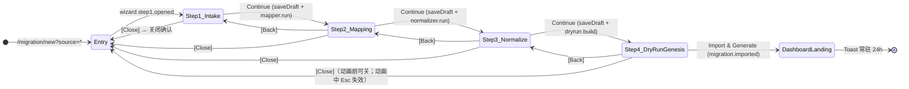

# Migration Copilot · 02 · 4 步向导 UX 规格

> 版本：v1.0（Demo Sprint · 2026-04-24）
> 上游：PRD Part1A §3.2 / §3.6.3 / §3.6.6 / §4.1 / §5.9 / §6.2.1 · Part1B §6A.6 / §6A.7 / §6A.9 · Part2A §7.5.6 / §7.6 / §7.7 · Part2B §12.3 / §13.2.1
> 设计系统：[`../../../DESIGN.md`](../../../DESIGN.md) · [`../../Design/DueDateHQ-DESIGN.md`](../../Design/DueDateHQ-DESIGN.md)
> 入册位置：[`./README.md`](./README.md) §2 第 02 份
> 配套：[`./01-mvp-and-journeys.md`](./01-mvp-and-journeys.md) · [`./10-conflict-resolutions.md`](./10-conflict-resolutions.md) · [`./07-live-genesis.md`](./07-live-genesis.md) · [`./09-design-system-deltas.md`](./09-design-system-deltas.md) · [`../../adr/0009-lingui-for-i18n.md`](../../adr/0009-lingui-for-i18n.md)

本文件把 Migration Copilot 4 步向导（Intake / Mapping / Normalize / Dry-Run + Live Genesis）收敛到**像素级 UX 规格**。ASCII 线框的视觉侧（背景 / 边框 / 圆角 / 字体）一律**只用 DESIGN token 名**引用，不落任何 hex 或 Tailwind 原子类（见 [`../../../DESIGN.md`](../../../DESIGN.md) 权威清单）。所有用户可见文案给出 EN 原文 + zh-CN 对照，并注明按 [`../../adr/0009-lingui-for-i18n.md`](../../adr/0009-lingui-for-i18n.md) 走 Lingui `<Trans />` / `` t`...` `` 宏标记。

---

## 1. 导航总图



| 步骤                     | 目标                                                                     | 退出条件                                           | AC 映射         | 本册锚点 |
| ------------------------ | ------------------------------------------------------------------------ | -------------------------------------------------- | --------------- | -------- |
| Step 1 Intake            | 选择数据入口（粘贴 / 上传 / Preset）；SSN 拦截；≤ 1000 行                | 粘贴或上传文件解析成功 + 至少 1 条非空行           | S2-AC1          | §4 本文  |
| Step 2 Mapping           | AI Mapper 输出 9 字段映射 + 置信度；EIN `★`；可手动 override             | 所有非 IGNORE 列有目标字段；EIN 识别率 = 100%      | S2-AC1 / S2-AC2 | §5 本文  |
| Step 3 Normalize         | 归一 entity / state / tax_year；冲突解决；确认或取消 Default Matrix cell | 冲突全部选择处置；needs_review 可非阻塞带入 Step 4 | S2-AC3 / S2-AC4 | §6 本文  |
| Step 4 Dry-Run + Genesis | 展示 counts + 风险预览 + Safety；触发原子导入 + Live Genesis 动画        | `migration.imported` 成功 + Dashboard 落地         | S2-AC5          | §7 本文  |

> 数字键 `1-4` **不** 跳步骤（避免误触）；步骤推进只允许 `Continue` / `Back`。来源于 [`./01-mvp-and-journeys.md`](./01-mvp-and-journeys.md) §7.2 键盘基线。

---

## 2. 全局外壳规格

### 2.1 Wizard 容器

```
┌──────────────────────────────────────────────────────────────────────┐
│  Import clients · Step X of 4                             [Close ×]  │   ← 顶栏：{typography.title} + {colors.text-primary}；高 56px；底线 1px {colors.border-default}
├──────────────────────────────────────────────────────────────────────┤
│  ①──────② · · · ③ · · · ④                                            │   ← Stepper 区：高 32px；间距 {spacing.3}；详见 §2.2
│                                                                      │
│  <Step body 区>                                                      │   ← 正文：背景 {colors.surface-canvas}；左右内边距 {spacing.5}；上下 {spacing.4}
│                                                                      │
├──────────────────────────────────────────────────────────────────────┤
│  [← Back]                                 [Continue →]               │   ← 底栏：高 56px；{colors.surface-panel}；底栏按钮区使用 button-primary / button-secondary
└──────────────────────────────────────────────────────────────────────┘
```

- 形态：**全屏 modal**（非 drawer）；最大宽度 960px；背景 `{colors.surface-canvas}`；圆角 `{rounded.lg}`；阴影 Level 4 Modal（DueDateHQ-DESIGN §6 行 478）
- 无障碍：`role="dialog"` + `aria-modal="true"` + `aria-labelledby="wizard-title"` + `aria-describedby="wizard-step-desc"`
- 焦点陷阱（Focus trap）：Tab / Shift+Tab 在向导内循环，不逃出宿主页面
- `Esc`：**不直接关闭**，而是打开关闭确认（见 §3.2）
- 顶栏：`Import clients · Step X of 4`（`{typography.title}` + `{colors.text-primary}`）+ 右上 `[Close ×]`（Icon-only 按钮；hover `{colors.surface-subtle}`）
- 底栏：左 `[← Back]`（Step 1 禁用，颜色 `{colors.text-disabled}`）；右 `[Continue →]` 使用 `button-primary`；Step 4 改为 `[Import & Generate deadlines ▶]`

### 2.2 Stepper（步骤条）

```
  [ ① Intake ]──[ ② Mapping ]──[ ③ Normalize ]──[ ④ Dry-Run ]
     active       upcoming        upcoming          upcoming        ← 当前步 {colors.accent-default} + {colors.accent-tint} 背景
     done         active          upcoming          upcoming        ← 已完成 {colors.status-done} + 勾
     done         error           upcoming          upcoming        ← 错误 {colors.severity-critical} + ! 图标
```

- 4 步水平；每格高 32px；间距 `{spacing.3}`；字号 `{typography.label}`（11px uppercase tracking 0.08em）
- 状态色：
  - 当前（active）→ `{colors.accent-default}` + `{colors.accent-tint}` 背景
  - 已完成（done）→ `{colors.status-done}` + ✓
  - 未开始（upcoming）→ `{colors.text-muted}`
  - 错误（error）→ `{colors.severity-critical}` + `!`
  - 禁用（disabled）→ `{colors.text-disabled}`
- 仅展示不可点击（避免跨步跳跃造成数据污染）
- 具体 YAML token 回灌见 [`./09-design-system-deltas.md#stepper`](./09-design-system-deltas.md#stepper)

### 2.3 键盘总览（向导级）

| 键                  | 行为                                                               | 备注                                                                |
| ------------------- | ------------------------------------------------------------------ | ------------------------------------------------------------------- |
| `Tab` / `Shift+Tab` | 焦点循环                                                           | 不逃出 modal                                                        |
| `Enter`             | 提交当前步（焦点在非 textarea / non-editable 区时等价于 Continue） | 对齐 [`./01-mvp-and-journeys.md`](./01-mvp-and-journeys.md) §7.2    |
| `Esc`               | 打开关闭确认（非 destructive）                                     | Step 4 动画期间 `Esc` **失效**                                      |
| `A`                 | 切换当前聚焦的 Step 3 `Apply to all`                               | 仅 Suggested tax types cell 内生效                                  |
| `1` - `4` 数字键    | 不跳步骤                                                           | 避免误触；通过 `[Back]` 逐级回退                                    |
| `Cmd/Ctrl + V`      | 粘贴                                                               | Step 1 textarea 默认生效                                            |
| `?`                 | 快捷键帮助浮层                                                     | 全局（[`./01-mvp-and-journeys.md`](./01-mvp-and-journeys.md) §7.1） |

---

## 3. 草稿与保存策略

### 3.1 每步保存

- 每次 `Continue` 触发 `rpc.migration.saveDraft`；服务端 `migration_batch.status='draft'` 或对应阶段状态（对齐 PRD Part1A §3.6.6 行 420 的"同一 firm 最多 1 draft batch"约束）
- Step 2 / 3 的 AI 调用结果写入 `evidence_link`（[`./01-mvp-and-journeys.md`](./01-mvp-and-journeys.md) §4.3）；失败不阻塞 UI 本地缓存
- `[Back]` **不** 清除下游已采集的用户输入；Step 3 override 回 Step 2 时可重跑 AI Mapper（按钮文案切换为 `[Re-run AI with my overrides]`）

### 3.2 关闭确认 AlertDialog

```
┌─────────────────────────────────────────────────────┐
│  Discard import?                                     │   ← 标题：{typography.title} + {colors.text-primary}
│                                                      │
│  Your pasted data and unsaved edits in this wizard   │   ← 正文：{typography.body} + {colors.text-secondary}
│  will be lost.                                       │
│                                                      │
│              [Keep editing]    [Discard import]      │   ← button-secondary + destructive-primary
└─────────────────────────────────────────────────────┘
```

- 外壳使用 `@duedatehq/ui/components/ui/alert-dialog`（shadcn Alert Dialog 结构 + Base UI primitive）；Level 4 Modal（宽 ≤ 480px）；`role="alertdialog"` + `aria-labelledby`
- DDL cut 不承诺完整 Import History / resume UI；关闭只表示丢弃当前向导内未完成信息
- 文案走 Lingui `<Trans />`（见 §8 全局文案表第 1~3 行）

### 3.3 并发串行提示（PRD §3.6.6 行 420）

同 firm 另一 Owner / Manager 已有 `draft` 批次时：

```
┌─ 顶栏内嵌 Alert（Wizard 顶栏下方，贴紧 Stepper）───────────────┐
│  ⓘ  {actor} is currently importing (Step 2 of 4).              │   ← 背景 {colors.severity-medium-tint}；文本 {colors.text-primary}
│      [View]    [Cancel theirs — Owner / Manager]                │   ← ghost 按钮；第二个仅 Owner / Manager 渲染
└─────────────────────────────────────────────────────────────────┘
```

- Demo Sprint Owner 单账号不会触发，但 UI 必须就位（对齐 Phase 0 RBAC 开闸）
- `role="status"` + `aria-live="polite"`

---

## 4. Step 1 · Intake

### 4.1 目标与状态机

- **目标**：粘贴 / 上传两条路径二选一；SSN 前端拦截；≤ 1000 行；可选 Preset 标签
- **状态机**：`idle → validating → ready → error | ssn_blocked`

| 状态        | 触发                | `[Continue →]`              | 视觉提示                                          |
| ----------- | ------------------- | --------------------------- | ------------------------------------------------- |
| idle        | 进入 Step 1 默认    | 禁用                        | Paste 区空；上传区待拖放                          |
| validating  | 粘贴 / 上传后解析中 | 禁用（loading spinner）     | 进度条 `{colors.accent-default}`                  |
| ready       | 解析成功 ≥ 1 行     | 启用（`button-primary`）    | 顶部计数 "N rows ready"                           |
| error       | 解析失败 / 空文件   | 禁用                        | 红 Banner（`{colors.severity-critical-tint}`）    |
| ssn_blocked | 命中 SSN 列         | 启用（但对应列强制 IGNORE） | 红 Banner + 该列边框 `{colors.severity-critical}` |

### 4.2 线框

```
┌──────────────────────────────────────────────────────────────────────┐
│  Import clients · Step 1 of 4                             [Close ×]  │
│  ①──────② · · · ③ · · · ④                                            │
├──────────────────────────────────────────────────────────────────────┤
│                                                                      │
│  Where is your data coming from?                                     │   ← {typography.title}（16/500）
│  We'll figure out the shape — paste or upload, your call.            │   ← {typography.body} + {colors.text-secondary}
│                                                                      │
│  ┌──────────────────────────────────────────────────────────────┐    │
│  │  Paste here — any shape, we'll figure it out.                │    │   ← Textarea：高 240px；背景 {colors.surface-elevated}
│  │  Include the header row if you have one.                     │    │     边框 1px {colors.border-default}；圆角 {rounded.md}
│  │                                                              │    │     字体 {typography.numeric}（mono）；aria-label 见 §4.5
│  │                                                              │    │
│  └──────────────────────────────────────────────────────────────┘    │
│                                                                      │
│        — or —                                                        │   ← 分隔线 + {colors.text-muted}；居中
│                                                                      │
│  ┌─ Drop CSV / TSV / XLSX here ─────────────────────────────┐        │   ← Upload zone：高 120px；虚线边框 1px {colors.border-strong}
│  │         or  [Choose file]     max 1000 rows · 2 MB       │        │     背景 {colors.surface-subtle}；圆角 {rounded.md}
│  └──────────────────────────────────────────────────────────┘        │     button-secondary
│                                                                      │
│  I'm coming from…  (optional)                                        │   ← {typography.label}（11/uppercase）
│   [TaxDome]  [Drake]  [Karbon]  [QuickBooks]  [File In Time]         │   ← 5 个 chip，{rounded.sm}；hover 边框 {colors.accent-default}
│                                                      ↑ 位置第 5 位   │     File In Time hover tip 见 §4.3
│                                                                      │
│  ─────────────────────────────────────────────────────────────       │
│  🔒 We block SSN-like patterns before sending anything to the AI.    │   ← 永久 hint：{typography.label} + {colors.text-muted}
│                                                                      │
├──────────────────────────────────────────────────────────────────────┤
│  [← Back]                                          [Continue →]      │   ← Back 禁用（{colors.text-disabled}）
└──────────────────────────────────────────────────────────────────────┘
```

**SSN 拦截态（叠加 Banner）**：

```
┌─ role="alert" · aria-live="assertive" ──────────────────────────────┐
│  ⚠ We blocked SSN-like patterns to protect your clients.             │   ← 背景 {colors.severity-critical-tint}；边框 {colors.severity-critical-border}
│     Those columns won't be sent to the AI.                           │     文本 {colors.text-primary}；圆角 {rounded.md}
│     Columns flagged: "SSN", "Taxpayer #" → forced IGNORE.            │
└──────────────────────────────────────────────────────────────────────┘
```

**Row overflow 态（>1000 行）**：

```
┌─ role="status" · aria-live="polite" ────────────────────────────────┐
│  ⓘ We imported the first 1000 rows.                                  │   ← 背景 {colors.severity-medium-tint}
│     Split your file to import more.                                  │     文本 {colors.text-primary}
└──────────────────────────────────────────────────────────────────────┘
```

### 4.3 交互细节

- Paste 区高度固定 240px；字体 `{typography.numeric}` 便于查看列对齐；粘贴后自动探测 header（空值则由 Step 2 Mapper 再决）
- Upload：拖放 + 点击；接受 `.csv .tsv .xlsx`；≤ 2MB；超 1000 行前端**只**读取前 1000 行 + 顶部 Banner（见线框）
- SSN 正则 `\d{3}-\d{2}-\d{4}`；命中列强制 `IGNORE` 并将表格列头边框替换为 `{colors.severity-critical}`（Step 2 透传给 Mapper 结果行）
- Preset chips：5 个顺序固定 **TaxDome · Drake · Karbon · QuickBooks · File In Time**（对齐 [`./10-conflict-resolutions.md#2-5-preset-含-file-in-time`](./10-conflict-resolutions.md#2-5-preset-含-file-in-time)）
- File In Time chip hover：弹出 tooltip（宽 240px，`{rounded.md}`，阴影 Level 3）

  ```
  ┌─ Tooltip · 200ms delay ───────────────────────────┐
  │  Coming from File In Time? We'll migrate your     │   ← 文本 {colors.text-secondary}
  │  full-year calendar in one shot.                  │
  └───────────────────────────────────────────────────┘
  ```

- 未选 Preset → Step 2 Mapper 以 `"General"` 先验运行（见 [`./04-ai-prompts.md`](./04-ai-prompts.md)）

### 4.4 文案表（EN + zh-CN + Lingui 宏）

| 字段                      | EN 原文                                                                                        | zh-CN 对照                                                             | 宏                                            |
| ------------------------- | ---------------------------------------------------------------------------------------------- | ---------------------------------------------------------------------- | --------------------------------------------- |
| Title                     | `Import clients · Step 1 of 4`                                                                 | `导入客户 · 第 1 步 / 共 4 步`                                         | `<Trans>`                                     |
| Subtitle                  | `Where is your data coming from?`                                                              | `你的数据从哪里来？`                                                   | `<Trans>`                                     |
| Paste placeholder         | `Paste here — any shape, we'll figure it out. Include the header row if you have one.`         | `粘贴到这里 —— 任何格式都行，我们会自动识别。如果有表头也请一并粘贴。` | `` t`...` ``（textarea placeholder 用函数式） |
| Upload hint               | `Drop CSV / TSV / XLSX here or choose file · max 1000 rows · 2 MB`                             | `把 CSV / TSV / XLSX 拖到这里或点击上传 · 最多 1000 行 · 2 MB`         | `<Trans>`                                     |
| Preset label              | `I'm coming from…`                                                                             | `我正在从…迁移过来`                                                    | `<Trans>`                                     |
| FIT tooltip               | `Coming from File In Time? We'll migrate your full-year calendar in one shot.`                 | `正在从 File In Time 迁移？我们一次性把全年日历迁过来。`               | `<Trans>`                                     |
| SSN banner                | `We blocked SSN-like patterns to protect your clients. Those columns won't be sent to the AI.` | `为了保护客户隐私，我们拦截了疑似 SSN 的列，不会发送给 AI。`           | `<Trans>`                                     |
| Row overflow warning      | `We imported the first 1000 rows. Split your file to import more.`                             | `我们只读取了前 1000 行。请拆分文件后再次导入。`                       | `<Plural>`（按 rows 数）                      |
| Primary CTA               | `Continue →`                                                                                   | `下一步 →`                                                             | `<Trans>`                                     |
| Secondary CTA             | `← Back`                                                                                       | `← 返回`                                                               | `<Trans>`                                     |
| Error banner (parse fail) | `We couldn't read that file. Try exporting as CSV.`                                            | `无法读取该文件。请先导出为 CSV 再试。`                                | `<Trans>`                                     |
| Empty state               | `Paste or upload to continue.`                                                                 | `请粘贴或上传数据以继续。`                                             | `<Trans>`                                     |
| Close confirm title       | `Discard import?`                                                                              | `要丢弃此次导入吗？`                                                   | `<Trans>`                                     |
| Close confirm body        | `Your pasted data and unsaved edits in this wizard will be lost.`                              | `你粘贴的数据和向导中未保存的修改将会丢失。`                           | `<Trans>`                                     |
| Close confirm CTAs        | `Keep editing` / `Discard import`                                                              | `继续编辑` / `丢弃导入`                                                | `<Trans>`                                     |

### 4.5 键盘 / a11y

- Paste textarea：`aria-label="Paste client data"`；`aria-describedby="paste-hint"`
- Upload zone：`role="button"` + `tabindex="0"` + `aria-describedby="upload-hint"`
- SSN Banner：`role="alert"` + `aria-live="assertive"`
- Row overflow：`role="status"` + `aria-live="polite"`
- `Enter` 提交：焦点在 textarea 时不劫持；焦点在 Preset chip 或按钮区时等价于 `[Continue →]`

### 4.6 Token 映射表

| 区域                     | 规格                   | Token                                                                   |
| ------------------------ | ---------------------- | ----------------------------------------------------------------------- |
| 容器背景                 | 全屏 modal canvas      | `{colors.surface-canvas}`                                               |
| 顶栏标题字体             | 16/500                 | `{typography.title}`                                                    |
| Paste textarea 背景      | 面板底                 | `{colors.surface-elevated}`                                             |
| Paste textarea 字体      | mono tabular           | `{typography.numeric}`                                                  |
| Paste textarea 边框      | 1px 默认               | `{colors.border-default}`                                               |
| Paste textarea 圆角      | 6px                    | `{rounded.md}`                                                          |
| Upload zone 背景         | subtle                 | `{colors.surface-subtle}`                                               |
| Upload zone 边框         | 1px strong 虚线        | `{colors.border-strong}`                                                |
| Preset chip hover 边框   | accent                 | `{colors.accent-default}`                                               |
| SSN banner 背景 / 边框   | critical tint + border | `{colors.severity-critical-tint}` / `{colors.severity-critical-border}` |
| Row overflow banner 背景 | medium tint            | `{colors.severity-medium-tint}`                                         |
| `[Continue →]`           | primary                | `button-primary`（[`../../../DESIGN.md`](../../../DESIGN.md) 行 90）    |
| `[Choose file]`          | secondary              | `button-secondary`                                                      |
| Hint 字体                | label                  | `{typography.label}` + `{colors.text-muted}`                            |

### 4.7 埋点

- `migration.wizard.step1.opened` · 触发：Step 1 首次渲染
- `migration.wizard.step1.continued` · 触发：`[Continue →]` 成功
- `migration.wizard.step1.ssn_blocked` · 触发：SSN 拦截命中，字段 `blocked_columns: string[]`
- `migration.wizard.step1.parse_failed` · 触发：解析失败错误分支

> 事件命名对齐 [`./01-mvp-and-journeys.md`](./01-mvp-and-journeys.md) §3 KPI 表 + [`./10-conflict-resolutions.md#6-audit-action-命名与-ui-文案分层`](./10-conflict-resolutions.md#6-audit-action-命名与-ui-文案分层)；不进 Lingui extract。

---

## 5. Step 2 · AI Mapping

### 5.1 目标与状态机

- **目标**：展示 AI Mapper 的 9 字段映射 + 置信度徽章 + EIN `★` 徽章；允许行内 override；`[Re-run AI]` / `[Export mapping]`
- **状态机**：`loading → success | fallback_preset | error`

| 状态                        | 触发                  | 顶栏提示                                                            | `[Continue →]`           |
| --------------------------- | --------------------- | ------------------------------------------------------------------- | ------------------------ |
| loading                     | 进入 Step 2 / Re-run  | Spinner + `Running AI Mapper…`                                      | 禁用                     |
| success                     | Mapper 返回有效 JSON  | 若 low-confidence 行 > 0 → 行 Banner `{n} columns need your review` | 启用                     |
| fallback_preset             | AI 失败且 Preset 已选 | 顶部 Banner（见 §5.4）                                              | 启用（审阅后）           |
| fallback_preset (no preset) | AI 失败且无 Preset    | 顶部 Banner + 表头全部 `IGNORE`                                     | 禁用（强制至少一列映射） |
| error                       | 网络 / 后端异常       | 红 Banner `Something went wrong. [Retry]`                           | 禁用                     |

### 5.2 线框

```
┌──────────────────────────────────────────────────────────────────────┐
│  Import clients · Step 2 of 4                             [Close ×]  │
│  ①──────② · · · ③ · · · ④                                            │
├──────────────────────────────────────────────────────────────────────┤
│  AI mapped your columns — review and confirm                         │   ← {typography.title}
│  Average confidence 92% · EIN detected 100%              [Re-run AI] │   ← 右侧 button-secondary；数值走 {typography.numeric}
│                                                          [Export ▼]  │
│                                                                      │
│  ⓘ 2 columns need your review                                        │   ← Banner：{colors.severity-medium-tint}；role="status"
│                                                                      │
│  ┌──────────────────┬───┬────────────────┬────────────┬───────────┐  │
│  │ Your column      │ → │ DueDateHQ field│ Confidence │ Sample    │  │   ← 表头：{typography.label} + {colors.text-secondary}
│  ├──────────────────┼───┼────────────────┼────────────┼───────────┤  │     表格行高 36px（Comfortable）
│  │ "Client Name"    │ → │ client.name    │  99% [H]   │ Acme LLC  │  │   ← 普通行；High 徽章背景 {colors.accent-tint}
│  │ "Tax ID"         │ → │ client.ein ★   │  96% [H]   │12-3456789 │  │   ← ★ 徽章 {colors.accent-text}；sample 走 {typography.numeric}
│  │ "Ent Type"       │ → │ entity_type    │  94% [M]   │ LLC       │  │   ← Medium 徽章：{colors.severity-neutral-tint} + {colors.text-secondary}
│  │ "State/Juris"    │ → │ state          │  97% [H]   │ CA        │  │
│  │ "County"         │ → │ county         │  88% [M]   │ LA        │  │
│  │ "Tax F/Y"        │ → │ tax_year       │  81% [L]   │ 2026      │  │   ← Low 徽章：{colors.severity-medium-tint} + {colors.text-primary}
│  │ "Resp"           │ → │ assignee_name  │  76% [L]   │ Sarah     │  │   ← 行整条染 {colors.severity-medium-tint}（对齐 needs review 裁定）
│  │ "status LY"      │ → │ ⚠ IGNORED      │    —       │   —       │  │   ← IGNORED：{colors.text-muted} + 斜体
│  │ "Notes"          │ → │ notes          │  92% [H]   │ …         │  │
│  │                  │   │         [Edit ▾]                        │  │   ← 行内按钮每行末尾，ghost
│  └──────────────────┴───┴────────────────┴────────────┴───────────┘  │
│                                                                      │
├──────────────────────────────────────────────────────────────────────┤
│  [← Back]                                          [Continue →]      │
└──────────────────────────────────────────────────────────────────────┘
```

**行内 `[Edit ▾]` 下拉**：

```
┌─ Popover · 宽 240px · Level 3 ────────────────┐
│  Map "Resp" to…                               │
│   ○ client.name                               │
│   ○ client.ein                                │
│   ○ state                                     │
│   ○ county                                    │
│   ○ entity_type                               │
│   ○ tax_types                                 │
│   ○ email                                     │
│   ● assignee_name     ← 当前选中              │
│   ○ notes                                     │
│   ──────────────────────────                  │
│   ○ Ignore this column                        │
└───────────────────────────────────────────────┘
```

- 9 目标字段 = `client.name / client.ein / state / county / entity_type / tax_types / email / assignee_name / notes`（对齐 Part1A P0-3 行 499）
- 边缘项：`IGNORE`（分组线分隔；`{colors.text-muted}`）

**行 hover Popover（AI reasoning）**：

```
┌─ Popover · 0.5s hover delay · 宽 320px ───────┐
│  Why this mapping?                            │
│  "Column values match ##-####### EIN pattern  │
│   in 5/5 rows" — fast-json · conf 0.96        │   ← {typography.numeric}
│                                               │
│  Sample after transform                       │
│   12-3456789 → ein=12-3456789 (normalized)    │
└───────────────────────────────────────────────┘
```

### 5.3 置信度徽章三档

| 档           | 区间          | 背景                             | 文字                      | 行染色                                                                                                                                                                    |
| ------------ | ------------- | -------------------------------- | ------------------------- | ------------------------------------------------------------------------------------------------------------------------------------------------------------------------- |
| High `[H]`   | `≥ 0.95`      | `{colors.accent-tint}`           | `{colors.accent-text}`    | 无                                                                                                                                                                        |
| Medium `[M]` | `0.80 – 0.94` | `{colors.severity-neutral-tint}` | `{colors.text-secondary}` | 无                                                                                                                                                                        |
| Low `[L]`    | `< 0.80`      | `{colors.severity-medium-tint}`  | `{colors.text-primary}`   | 整行 `{colors.severity-medium-tint}`（与 needs_review 对齐，见 [`./10-conflict-resolutions.md#3-t-s2-01-双指标口径`](./10-conflict-resolutions.md#3-t-s2-01-双指标口径)） |

- EIN `★` 徽章（行前缀）：`{colors.accent-text}` 字色 + 11px；始终渲染（不受置信度影响），对齐 T-S2-01 双指标
- 徽章圆角 `{rounded.sm}`；高 18px；与 Evidence Chip 同等量级（DueDateHQ-DESIGN §4.4 行 344–363）

### 5.4 fallback_preset 态 Banner

```
┌─ role="alert" · aria-live="assertive" ──────────────────────────────┐
│  ⚠ We couldn't reach AI. Using your {preset} default mapping —       │   ← 背景 {colors.severity-medium-tint}；边框 {colors.severity-medium-border}
│     review and edit as needed.                                       │     文本 {colors.text-primary}
└──────────────────────────────────────────────────────────────────────┘
```

- Preset 未选时降级为只读表头（全部 `IGNORE`），强制用户手动映射（对齐 Part2B §9.2 降级策略）
- `[Re-run AI]` 按钮保持可点；点击走 exponential backoff

### 5.5 交互细节

- `[Re-run AI]`：secondary；每次用户 override 后按钮文案变为 `[Re-run AI with my overrides]`（更新 prompt context；对齐 [`./04-ai-prompts.md`](./04-ai-prompts.md)）
- `[Export mapping]`：下拉菜单（`Download JSON` / `Copy to clipboard`），JSON 含 mapping + confidence + reasoning + model + prompt_version；服务于 audit trail / debug
- 冲突裁定联动：EIN 识别率 = 100%（[`./10-conflict-resolutions.md#3-t-s2-01-双指标口径`](./10-conflict-resolutions.md#3-t-s2-01-双指标口径)）；低置信度行**非阻塞**但顶部 Banner 高亮计数

### 5.6 文案表（EN + zh-CN + Lingui 宏）

| 字段                              | EN 原文                                                                                  | zh-CN 对照                                              | 宏                          |
| --------------------------------- | ---------------------------------------------------------------------------------------- | ------------------------------------------------------- | --------------------------- |
| Title                             | `AI mapped your columns — review and confirm`                                            | `AI 已识别你的列 —— 请审阅并确认`                       | `<Trans>`                   |
| Subtitle（metrics）               | `Average confidence {avg}% · EIN detected {einPct}%`                                     | `平均置信度 {avg}% · EIN 识别率 {einPct}%`              | `<Trans>` + `<Plural>` 可选 |
| Primary CTA                       | `Continue →`                                                                             | `下一步 →`                                              | `<Trans>`                   |
| Secondary CTA                     | `Re-run AI` / `Re-run AI with my overrides`                                              | `重新运行 AI` / `带上我的修改重跑 AI`                   | `<Trans>`                   |
| Export menu                       | `Export mapping ▼` → `Download JSON` / `Copy to clipboard`                               | `导出映射 ▼` → `下载 JSON` / `复制到剪贴板`             | `<Trans>`                   |
| Low-conf banner                   | `{count, plural, one {# column needs your review} other {# columns need your review}}`   | `{count} 列需要你复核`                                  | `<Plural>`                  |
| Fallback banner                   | `We couldn't reach AI. Using your {preset} default mapping — review and edit as needed.` | `无法连接 AI，已使用 {preset} 默认映射 —— 请按需修改。` | `<Trans>`                   |
| Error state                       | `Something went wrong while mapping. Retry?`                                             | `字段映射失败，要重试吗？`                              | `<Trans>`                   |
| Reasoning popover title           | `Why this mapping?`                                                                      | `AI 为什么这样映射？`                                   | `<Trans>`                   |
| Row hover: Sample after transform | `Sample after transform`                                                                 | `转换后样例`                                            | `<Trans>`                   |
| Edit popover title                | `Map "{column}" to…`                                                                     | `把 "{column}" 映射到…`                                 | `<Trans>`                   |
| Edit popover: ignore              | `Ignore this column`                                                                     | `忽略该列`                                              | `<Trans>`                   |

### 5.7 键盘 / a11y

- 表格 `role="table"` + `<caption>` 隐藏给 SR：`AI-generated column mapping, {rows} rows`
- 行内 `[Edit ▾]`：`aria-haspopup="listbox"` + `aria-expanded`；`↑/↓` 在选项间移动，`Enter` 选中
- Low-conf banner `aria-live="polite"`；fallback banner `aria-live="assertive"`
- Focus ring：`:focus-visible` 使用 `{colors.accent-default}` 2px outline

### 5.8 Token 映射表

| 区域                   | 规格             | Token                                                                       |
| ---------------------- | ---------------- | --------------------------------------------------------------------------- |
| 表头字体               | 11/500 upper     | `{typography.label}`                                                        |
| 表格行高               | Comfortable 36px | — （对齐 DueDateHQ-DESIGN §5.3）                                            |
| sample 列字体          | mono tabular     | `{typography.numeric}`                                                      |
| High 徽章              | 背景 / 文字      | `{colors.accent-tint}` / `{colors.accent-text}`                             |
| Medium 徽章            | 背景 / 文字      | `{colors.severity-neutral-tint}` / `{colors.text-secondary}`                |
| Low 徽章 + 行底色      | 背景 / 文字      | `{colors.severity-medium-tint}` / `{colors.text-primary}`                   |
| `★` EIN 徽章           | 字色             | `{colors.accent-text}`                                                      |
| IGNORED 文本           | 斜体 muted       | `{colors.text-muted}`                                                       |
| Popover                | Level 3 容器     | `{colors.surface-elevated}` + 1px `{colors.border-strong}` + `{rounded.lg}` |
| Reasoning popover 字体 | mono             | `{typography.numeric}`                                                      |
| Re-run button          | secondary        | `button-secondary`                                                          |

### 5.9 埋点

- `migration.wizard.step2.opened`
- `migration.wizard.step2.continued`
- `migration.mapper.run.completed` · 字段：`avg_confidence: number`, `ein_detection_rate: number`, `rerun_count: number`, `manual_override_count: number`, `model: string`, `prompt_version: string`（对齐 [`./01-mvp-and-journeys.md`](./01-mvp-and-journeys.md) §3 与 [`./10-conflict-resolutions.md#3-t-s2-01-双指标口径`](./10-conflict-resolutions.md#3-t-s2-01-双指标口径)）
- `migration.mapper.fallback_preset_used`
- `migration.mapper.confirmed`（对齐 [`./01-mvp-and-journeys.md`](./01-mvp-and-journeys.md) §4.3 工程 log）

---

## 6. Step 3 · Normalize & Resolve

### 6.1 目标与状态机

- **目标**：展示归一 summary（entity_types / states / tax_years）；冲突解决；确认或取消 Default Matrix 将自动补全的 tax types
- **状态机**：`idle → saving → ready`（Normalize 出错降级见 §6.5）

### 6.2 线框

```
┌──────────────────────────────────────────────────────────────────────┐
│  Import clients · Step 3 of 4                             [Close ×]  │
│  ①──────②──────③ · · · ④                                             │
├──────────────────────────────────────────────────────────────────────┤
│  We normalized 47 values — review if needed                          │   ← {typography.title}
│                                                                      │
│  Entity types                                                        │   ← 区块标题：{typography.label} + uppercase
│  ┌──────────────────────────────────────────────────────────────┐    │
│  │ "L.L.C.", "llc", "LLC" (12 rows)   → LLC          [edit] [e] │    │   ← [e] = Evidence Chip（见 §6.3）
│  │ "Corp (S)", "S Corp" (8 rows)      → S-Corp       [edit] [e] │    │
│  │ "Partnership", "Ptnr" (5 rows)     → Partnership  [edit] [e] │    │
│  │ ⚠ "LP" (2 rows)                    → Needs review [review]   │    │   ← 行背景 {colors.severity-medium-tint}；needs_review pill
│  └──────────────────────────────────────────────────────────────┘    │
│                                                                      │
│  States                                                              │
│  ┌──────────────────────────────────────────────────────────────┐    │
│  │ "California", "Calif", "CA" (18)   → CA           [edit] [e] │    │
│  │ "NY", "New York" (10)              → NY           [edit] [e] │    │
│  └──────────────────────────────────────────────────────────────┘    │
│                                                                      │
│  Suggested tax types (from entity × state matrix)                    │   ← {typography.label}
│  ┌──────────────────────────────────────────────────────────────┐    │
│  │ Default Matrix applies these suggestions only where imported   │
│  │ rows do not already include tax types.                        │
│  │ 12 LLC × CA clients                                          │    │
│  │   → CA Franchise · CA LLC Fee · Fed 1065  [✓ Apply to all] [e]│    │   ← tax type chips（高 18px）
│  │                                                              │    │
│  │  5 S-Corp × NY clients                                       │    │
│  │   → NY CT-3-S · NY PTET · Fed 1120-S [✓ Apply to all] [e]    │    │
│  └──────────────────────────────────────────────────────────────┘    │
│                                                                      │
│  Conflicts (3)                                                       │   ← {typography.label}
│  ┌──────────────────────────────────────────────────────────────┐    │
│  │ • "Acme LLC" matches existing client ID 42                   │    │
│  │   [Merge]  [Overwrite]  [● Skip]  [Create as new]            │    │   ← 默认 Skip（最安全）；button 组高 28px
│  │     tip: merge appends fields     tip: overwrite replaces    │    │   ← hover tooltip 每个按钮
│  └──────────────────────────────────────────────────────────────┘    │
│                                                                      │
├──────────────────────────────────────────────────────────────────────┤
│  [← Back]                                          [Continue →]      │
└──────────────────────────────────────────────────────────────────────┘
```

### 6.3 needs_review 与 Evidence Chip

**needs_review pill（归一置信度 `< 0.5`）**：

- 背景 `{colors.severity-medium-tint}` + 文字 `{colors.text-primary}`；高 18px；`{rounded.sm}`
- hover Popover（320px，Level 3）：展示候选值（Top 3） + Evidence Chip 指向 `source_type=ai_migration_normalize` 的 evidence（含 `model` + `confidence`）

**Evidence Chip `[e]`（每条归一决策右侧）**：

- 严格遵循 DueDateHQ-DESIGN §4.4 行 344–363：高 18px；font `{typography.numeric}` 10px；1px 边框 + 无背景
- 示例 chip 文本：`AI · fast-json · 0.93`
- 缺 `source_url + verified_at + verbatim_quote` 的场景 → **按 DueDateHQ-DESIGN §8.3（No Provenance = No Render）降级**为：

  ```
  ⚠ Verification needed    [Ask human to verify]
  ```

  底色 `{colors.severity-medium-tint}`；文字 `{colors.text-primary}`

**Verbatim Quote Popover（长按 chip · 0.5s delay · 320px）** 对齐 DueDateHQ-DESIGN §8.2 行 525–541：

```
┌─── Normalizer decision: "LP" → Limited Partnership ───┐
│  "LP" matches 0.93 similarity to enum                 │
│   'Limited Partnership' (dictionary v2)               │
│                                                       │
│  fast-json · 2026-04-24T10:12:00Z                      │   ← {typography.numeric}
│  [Copy as evidence]                                   │
└───────────────────────────────────────────────────────┘
```

### 6.4 Default Matrix `Apply to all`

- 默认勾选（兑现 §6A.5 "无需额外配置"）：Default Matrix 只对导入行中缺失 `client.tax_types` 的客户补全税种
- 可逐 cell 取消：取消 `Apply to all` 表示该 `(entity_type, state)` cell 下缺 `tax_types` 的客户不使用 Default Matrix 自动补全，也不会在 Step 4 生成对应 obligations
- 用户 CSV / paste 已明确提供 `client.tax_types` 的行不受该开关影响
- 前端选择通过 `applyDefaultMatrix({ matrixSelections })` 写入 `migration_batch.mapping_json.matrixApplied[].enabled`；`dryRun` 与最终 `apply` 必须消费同一份 enabled 状态，禁止前端本地假状态
- 键盘快捷键 `A` = 对当前聚焦的 suggestion cell 切换 `Apply to all`（`aria-keyshortcuts="A"`）
- 冲突解决按钮组默认 **`Skip`**（最安全）；Owner 可在 Settings 修改默认为 `Create as new`（Phase 0 扩展位，Demo Sprint 不渲染 Settings 面板）

### 6.5 错误 / 降级

- Normalizer 调用失败 → 展示本地字典 fallback + Banner `We couldn't reach AI for some values. Using dictionary fallback — please review.`；不阻塞 `[Continue →]`
- needs_review 行 > 20 时区块自动折叠（`<details open>`），顶部 `{count} need review · [Expand]`

### 6.6 文案表（EN + zh-CN + Lingui 宏）

| 字段                         | EN 原文                                                                                               | zh-CN 对照                                          | 宏                     |
| ---------------------------- | ----------------------------------------------------------------------------------------------------- | --------------------------------------------------- | ---------------------- |
| Title                        | `We normalized {count} values — review if needed`                                                     | `我们已归一 {count} 个值 —— 需要的话请复核`         | `<Trans>` + `<Plural>` |
| Section: Entity types        | `Entity types`                                                                                        | `实体类型`                                          | `<Trans>`              |
| Section: States              | `States`                                                                                              | `州`                                                | `<Trans>`              |
| Section: Suggested tax types | `Suggested tax types (from entity × state matrix)`                                                    | `建议的税种（由实体 × 州矩阵推断）`                 | `<Trans>`              |
| Default Matrix note          | `Default Matrix applies these suggestions only where imported rows do not already include tax types.` | `Default Matrix 仅在导入行没有税种时应用这些建议。` | `<Trans>`              |
| Apply to all toggle          | `Apply to all`                                                                                        | `全部应用`                                          | `<Trans>`              |
| Section: Conflicts           | `Conflicts ({count})`                                                                                 | `冲突（{count}）`                                   | `<Plural>`             |
| Needs review pill            | `Needs review`                                                                                        | `待复核`                                            | `<Trans>`              |
| Conflict CTA: Merge          | `Merge` (tooltip `Append new fields without overwriting`)                                             | `合并` / `将新字段补齐到现有客户，不覆盖已有值`     | `<Trans>`              |
| Conflict CTA: Overwrite      | `Overwrite` (tooltip `Replace existing values with new ones`)                                         | `覆盖` / `用新值替换已有字段`                       | `<Trans>`              |
| Conflict CTA: Skip           | `Skip` (tooltip `Leave existing client untouched`)                                                    | `跳过` / `保留现有客户不变`                         | `<Trans>`              |
| Conflict CTA: Create as new  | `Create as new` (tooltip `Create a new client; existing one stays`)                                   | `另存为新客户` / `新建客户，不影响现有客户`         | `<Trans>`              |
| Fallback banner              | `We couldn't reach AI for some values. Using dictionary fallback — please review.`                    | `部分值无法调用 AI，已使用字典降级 —— 请复核。`     | `<Trans>`              |
| Verification needed          | `Verification needed`                                                                                 | `需要人工验证`                                      | `<Trans>`              |
| Primary CTA                  | `Continue →`                                                                                          | `下一步 →`                                          | `<Trans>`              |
| Secondary CTA                | `← Back`                                                                                              | `← 返回`                                            | `<Trans>`              |

### 6.7 键盘 / a11y

- Suggested tax types 区块 `role="group"` + `aria-labelledby`；tax type chip 不进入 tab order
- `Apply to all` checkbox 使用项目 `Checkbox` primitive，label 暴露 `aria-keyshortcuts="A"`
- 冲突按钮组 `role="radiogroup"`；默认选中 `Skip` 带 `aria-checked="true"`
- needs_review pill hover Popover：`role="tooltip"`；键盘用 Enter / Space 打开；`Esc` 关闭

### 6.8 Token 映射表

| 区域                                      | 规格                          | Token                                                                     |
| ----------------------------------------- | ----------------------------- | ------------------------------------------------------------------------- |
| 区块标题字体                              | 11/500 upper                  | `{typography.label}`                                                      |
| 区块容器背景                              | Panel                         | `{colors.surface-panel}` + 1px `{colors.border-default}` + `{rounded.md}` |
| needs_review pill 背景 / 文字             | medium tint                   | `{colors.severity-medium-tint}` / `{colors.text-primary}`                 |
| Evidence chip 样式                        | 遵 `evidence-chip` 组件 token | `evidence-chip`（[`../../../DESIGN.md`](../../../DESIGN.md) 行 115）      |
| Verification-needed 降级                  | pill + 次级按钮               | `{colors.severity-medium-tint}` + `button-secondary`                      |
| Conflict Merge/Overwrite/Skip/CreateAsNew | 按钮组 radio                  | `button-secondary` + 选中 `{colors.accent-tint}` 背景                     |
| Apply to all checkbox                     | 16px checkbox + label         | `components.checkbox-*` + `{colors.text-secondary}`                       |
| tax type chip                             | 18px 高 mono                  | `{typography.numeric}` + `{rounded.sm}` + `{colors.surface-elevated}`     |

### 6.9 埋点

- `migration.wizard.step3.opened`
- `migration.wizard.step3.continued`
- `migration.normalize.reviewed` · 字段：`override_count`, `needs_review_count`, `dictionary_fallback_used: boolean`
- `migration.normalize.conflicts_resolved` · 字段：`merge`, `overwrite`, `skip`, `create_as_new`（四类计数）
- `migration.matrix.applied` · 字段：`enabled_cells`, `disabled_cells`, `clients_affected`；对齐 [`./01-mvp-and-journeys.md`](./01-mvp-and-journeys.md) §4.3
- `migration.normalizer.confirmed`

---

## 7. Step 4 · Dry-Run + Live Genesis

### 7.1 目标与状态机

- **目标**：展示即将创建的 counts + 顶部风险预览 + Safety 三条 + 触发 Live Genesis
- **状态机**：`preview → importing → success → toast_persisted`；失败 `import_failed`

| 状态            | 视觉                                                                              | CTA                                                 |
| --------------- | --------------------------------------------------------------------------------- | --------------------------------------------------- |
| preview         | 见 §7.2 线框                                                                      | `[Import & Generate deadlines ▶]` 启用（primary）   |
| importing       | Modal 锁定交互 + Stepper 高亮步 4 + spinner；底栏 `Importing… please don't close` | CTA 禁用 + spinner                                  |
| success         | 过渡到 Live Genesis 动画（见 §7.3）                                               | —                                                   |
| toast_persisted | 跳 Dashboard + 顶部常驻 toast 24h                                                 | `[View audit]` / `[Undo all]`                       |
| import_failed   | 红 Banner + 失败计数                                                              | `[Review errors]` 跳 `/migration/<batch_id>/errors` |

### 7.2 线框（preview 态）

```
┌──────────────────────────────────────────────────────────────────────┐
│  Import clients · Step 4 of 4                             [Close ×]  │
│  ①──────②──────③──────④                                              │
├──────────────────────────────────────────────────────────────────────┤
│  Ready to import                                                     │   ← {typography.title}
│                                                                      │
│  You're about to create                                              │
│    • 30 clients                                                      │   ← 数值走 {typography.numeric}
│    • 152 obligations (full tax year 2026)                            │
│    • Est. $19,200 total exposure this quarter                        │   ← $ 金额 {typography.numeric} + {colors.text-primary}
│                                                                      │
│  Top risk (this week)                                                │   ← {typography.label}
│  ┌──────────────────────────────────────────────────────────────┐    │
│  │ CRITICAL  Acme LLC — CA Franchise Tax   $4,200    3 days  [e]│    │   ← risk-row-critical 组件：{colors.severity-critical-tint}
│  │ HIGH      Bright Studio — 1120-S        $2,800    5 days  [e]│    │   ← risk-row-high（类 DESIGN §7）
│  │ HIGH      Zen Holdings — Q1 Est.        $1,650    6 days  [e]│    │
│  └──────────────────────────────────────────────────────────────┘    │
│  [See all 152 →]                                                     │   ← ghost 按钮；打开右侧 Drawer（宽 400px，Level 3）
│                                                                      │
│  Safety                                                              │   ← {typography.label}
│  ┌──────────────────────────────────────────────────────────────┐    │
│  │  ✓  One-click revert available for 24 hours                  │    │   ← ✓ 色 {colors.status-done}；文本 {colors.text-primary}
│  │  ✓  Audit log captures every AI decision                     │    │
│  │  ✓  No emails will be sent automatically                     │    │
│  └──────────────────────────────────────────────────────────────┘    │
│                                                                      │
├──────────────────────────────────────────────────────────────────────┤
│  [← Back]                   [Import & Generate deadlines ▶]          │   ← primary；hover {colors.accent-hover}
└──────────────────────────────────────────────────────────────────────┘
```

### 7.3 Live Genesis 入口与成功后状态

> 动画详细规格（时序 / 粒子参数 / rAF tween / `prefers-reduced-motion`）由 [`./07-live-genesis.md`](./07-live-genesis.md) 定义；**本文件只定义 UX 入口 + 成功状态**。

**触发顺序**：

1. 点击 `[Import & Generate deadlines ▶]` → 调用 `rpc.migration.apply`（事务内 insert clients + obligations + evidence_link + audit_event；对齐 PRD Part1B §6A.7 行 301–317）
2. 4 – 6 秒动画：
   - Wizard 淡出（300ms）→ Dashboard 布局淡入（300ms）
   - 粒子（每张 deadline 卡片发射 `+$X` 标签）弧线飞入顶栏（[`../../PRD/DueDateHQ-PRD-v2.0-Part2A.md`](../../PRD/DueDateHQ-PRD-v2.0-Part2A.md) §7.5.6）
   - 顶栏 Penalty Radar odometer：`$0 → $19,200`（stagger 80ms；每位 `cubic-bezier(0.34, 1.56, 0.64, 1)`）
3. 动画结束 → Dashboard，`This Week` tab 默认选中第 1 条 obligation

**`prefers-reduced-motion: reduce`**：

- 关闭粒子 + 弧线轨迹
- 保留 $ 数字 0.3s fade-in + Toast 替代庆祝反馈
- Stepper 与 Wizard 直接瞬时切换到 Dashboard
- 详细降级在 [`./07-live-genesis.md`](./07-live-genesis.md) §3.x

### 7.4 持久 Toast（24h）

```
┌─ Toast · Level 3 · 固定顶栏下 · 宽 720px · {rounded.md} ─────────────┐
│  ✓ Imported 30 clients, 152 obligations, $19,200 at risk.            │   ← ✓ 色 {colors.status-done}
│                                      [View audit]      [Undo all]    │   ← [View audit] ghost；[Undo all] destructive（Owner / Manager 可见）
└──────────────────────────────────────────────────────────────────────┘
```

- 背景 `{colors.surface-elevated}` + 1px `{colors.border-strong}` + shadow Level 3
- 数值走 `{typography.numeric}`
- `[Undo all]`：**Owner + Manager**（对齐裁定 1，见 [`./10-conflict-resolutions.md#1-revert-24h-全量撤销权限`](./10-conflict-resolutions.md#1-revert-24h-全量撤销权限)）；Preparer / Coordinator 不渲染该按钮
- 24h 后 `[Undo all]` 灰化 → `{colors.text-disabled}` + `cursor: not-allowed`；hover tooltip：

  ```
  This import can no longer be fully reverted.
  You can still delete individual clients.
  ```

- `[View audit]` → 打开 `/imports/{batch_id}`

### 7.5 import_failed 态

```
┌─ role="alert" · aria-live="assertive" ──────────────────────────────┐
│  ✕ Import failed for 3 of 30 rows.                                   │   ← 背景 {colors.severity-critical-tint}；边框 {colors.severity-critical-border}
│     27 clients created successfully.  [Review errors]  [Retry all]   │
└──────────────────────────────────────────────────────────────────────┘
```

- `[Review errors]` → R2 下载 CSV `/migration/<batch_id>/errors`
- 单行失败不阻塞整批（PRD Part1B §6A.7 行 320"单行失败不阻塞"）

### 7.6 文案表（EN + zh-CN + Lingui 宏）

| 字段                  | EN 原文                                                                                                            | zh-CN 对照                                                                        | 宏                         |
| --------------------- | ------------------------------------------------------------------------------------------------------------------ | --------------------------------------------------------------------------------- | -------------------------- |
| Title                 | `Ready to import`                                                                                                  | `准备就绪，开始导入`                                                              | `<Trans>`                  |
| Summary line 1        | `You're about to create`                                                                                           | `你即将创建`                                                                      | `<Trans>`                  |
| Summary counts        | `{clients} clients · {obligations} obligations (full tax year {year}) · Est. {amount} total exposure this quarter` | `{clients} 个客户 · {obligations} 条义务（{year} 全年）· 本季度预计敞口 {amount}` | `<Plural>` × 2 + `<Trans>` |
| Top-risk section      | `Top risk (this week)`                                                                                             | `本周最高风险`                                                                    | `<Trans>`                  |
| See-all CTA           | `See all {count} →`                                                                                                | `查看全部 {count} 条 →`                                                           | `<Plural>`                 |
| Safety header         | `Safety`                                                                                                           | `安全保障`                                                                        | `<Trans>`                  |
| Safety 1              | `One-click revert available for 24 hours`                                                                          | `24 小时内可一键撤销`                                                             | `<Trans>`                  |
| Safety 2              | `Audit log captures every AI decision`                                                                             | `审计日志记录每一次 AI 决策`                                                      | `<Trans>`                  |
| Safety 3              | `No emails will be sent automatically`                                                                             | `不会自动发送任何邮件`                                                            | `<Trans>`                  |
| Primary CTA           | `Import & Generate deadlines ▶`                                                                                    | `导入并生成截止日历 ▶`                                                            | `<Trans>`                  |
| Secondary CTA         | `← Back`                                                                                                           | `← 返回`                                                                          | `<Trans>`                  |
| Toast success         | `Imported {clients} clients, {obligations} obligations, {amount} at risk.`                                         | `已导入 {clients} 个客户、{obligations} 条义务，敞口 {amount}。`                  | `<Plural>` + `<Trans>`     |
| Toast actions         | `View audit` / `Undo all`                                                                                          | `查看审计` / `全部撤销`                                                           | `<Trans>`                  |
| Undo disabled tooltip | `This import can no longer be fully reverted. You can still delete individual clients.`                            | `此次导入已超过 24 小时不能整体撤销。你仍可单独删除客户。`                        | `<Trans>`                  |
| Import failed banner  | `Import failed for {failed} of {total} rows. {ok} clients created successfully.`                                   | `{total} 行中有 {failed} 行导入失败，{ok} 个客户已成功创建。`                     | `<Plural>`                 |
| Importing (disabled)  | `Importing… please don't close`                                                                                    | `正在导入…请不要关闭`                                                             | `<Trans>`                  |
| Empty Top-risk state  | `No at-risk obligations this week. Scroll down for upcoming month view.`                                           | `本周无高风险义务，可向下滚动查看本月。`                                          | `<Trans>`                  |

### 7.7 键盘 / a11y

- `Enter`（焦点在非按钮元素时）= `[Import & Generate deadlines ▶]`
- `Esc`：preview 态打开关闭确认；**importing + 动画期间失效**（防止撤销到半态）
- 动画完成时 `aria-live="polite"` 广播：`Imported 30 clients, 152 obligations, 19200 dollars at risk.`
- 失败 banner `role="alert"` + `aria-live="assertive"`
- 粒子动画 `aria-hidden="true"` + `pointer-events: none`（对齐 DueDateHQ-DESIGN §7.5.6.7 行 335）

### 7.8 Token 映射表

| 区域                                     | 规格            | Token                                                                                                                                                                          |
| ---------------------------------------- | --------------- | ------------------------------------------------------------------------------------------------------------------------------------------------------------------------------ |
| 数值字体                                 | mono tabular    | `{typography.numeric}`                                                                                                                                                         |
| Hero metric（$19,200 on top of summary） | —               | 保持 body 态；Live Genesis 动画接管后切到 `hero-metric` token                                                                                                                  |
| Top-risk rows                            | critical / high | `risk-row-critical`（[`../../../DESIGN.md`](../../../DESIGN.md) 行 103） + 同族 `risk-row-high`（token 回灌见 [`./09-design-system-deltas.md`](./09-design-system-deltas.md)） |
| Safety ✓ 色                              | done            | `{colors.status-done}`                                                                                                                                                         |
| Primary CTA                              | accent          | `button-primary`                                                                                                                                                               |
| Toast 容器                               | Level 3         | `{colors.surface-elevated}` + 1px `{colors.border-strong}` + `{rounded.md}`                                                                                                    |
| Toast `[Undo all]` disabled              | muted           | `{colors.text-disabled}`                                                                                                                                                       |
| import_failed banner 背景                | critical tint   | `{colors.severity-critical-tint}`                                                                                                                                              |

### 7.9 埋点

- `migration.wizard.step4.opened`
- `migration.dryrun.previewed`
- `migration.imported` · 同时是 audit action（Part2B §13.2.1）；字段：`clients: number`, `obligations: number`, `exposure_cents: number`, `preset: string`, `duration_ms: number`
- `migration.import_failed` · 字段：`failed_count`, `total_count`, `first_error_code`
- `dashboard.penalty_radar.first_rendered` · 由 Dashboard 模块 emit（对齐 [`./01-mvp-and-journeys.md`](./01-mvp-and-journeys.md) §3 KPI 表第 1 行）

---

## 8. Revert UX（24h 全量 + 7d 单客户）

### 8.1 入口矩阵（对齐 [`./01-mvp-and-journeys.md`](./01-mvp-and-journeys.md) §5 + Part1A §3.6.3）

| 入口                               | 权限                        | 触发路径               | 备注                      |
| ---------------------------------- | --------------------------- | ---------------------- | ------------------------- |
| Import 完成持久 Toast `[Undo all]` | Owner + Manager             | Step 4 → Toast         | 24h 内有效                |
| Imports history 列表行 `[Revert]`  | Owner + Manager（24h 全量） | `/imports` → batch row | 同上                      |
| 单客户详情页 `[Delete client]`     | Owner + Manager             | `/clients/{id}` → 右上 | 7d 软删 + 级联 obligation |

> Demo Sprint Owner 单账号下 Manager 分支不渲染，但长期 RBAC 规格必须就位。

### 8.2 确认 Modal · 24h 全量

```
┌─ Modal · role="alertdialog" · 宽 480px · Level 4 ────────────────────┐
│  Undo import?                                                        │   ← {typography.title}
│                                                                      │
│  This will delete {clients} clients and {obligations} obligations.   │   ← {typography.body}
│  This action is logged.                                              │
│                                                                      │
│                              [Keep import]    [Undo all]             │   ← 右按钮 destructive：{colors.severity-critical}
└──────────────────────────────────────────────────────────────────────┘
```

- `[Undo all]` 按钮色 `{colors.severity-critical}` + 白字（对齐 DueDateHQ-DESIGN §4.8 Destructive）；`aria-describedby` 指向 body 文本
- 成功后写 `audit_event migration.reverted` + evidence_link `source_type=migration_revert`

### 8.3 确认 Modal · 7d 单客户

```
┌─ Modal · 宽 480px · Level 4 ─────────────────────────────────────────┐
│  Delete {client_name}?                                               │
│                                                                      │
│  This will soft-delete {obligations} obligations.                    │
│  Recoverable for 7 days from Settings.                               │
│                                                                      │
│                                         [Cancel]   [Delete client]   │   ← [Delete client] destructive
└──────────────────────────────────────────────────────────────────────┘
```

- 成功后写 `audit_event migration.single_undo`
- 7 天后灰化入口（与 24h 同策略）

### 8.4 状态机

```
Toast 持久态  ──24h──>  Expired（Undo all 灰化）
        │
        └── [Undo all] 点击 ─> Confirm Modal ─> reverting ─> reverted（toast 消失 + Dashboard 计数归零）
                                                  │
                                                  └── 失败 → error Banner "Revert failed. Contact support."
单客户详情页  ─── [Delete client] ─> Confirm Modal ─> deleting ─> deleted（列表消失；Undo in Settings）
        │
        └── 7d 后按钮隐藏（入口不再渲染）
```

### 8.5 文案表（EN + zh-CN + Lingui 宏）

| 字段            | EN 原文                                                                                    | zh-CN 对照                                                         | 宏             |
| --------------- | ------------------------------------------------------------------------------------------ | ------------------------------------------------------------------ | -------------- |
| 24h title       | `Undo import?`                                                                             | `要撤销此次导入吗？`                                               | `<Trans>`      |
| 24h body        | `This will delete {clients} clients and {obligations} obligations. This action is logged.` | `这将删除 {clients} 个客户和 {obligations} 条义务。操作已被记录。` | `<Plural>` × 2 |
| 24h CTAs        | `Keep import` / `Undo all`                                                                 | `保留导入` / `全部撤销`                                            | `<Trans>`      |
| 7d title        | `Delete {client_name}?`                                                                    | `要删除 {client_name} 吗？`                                        | `<Trans>`      |
| 7d body         | `This will soft-delete {obligations} obligations. Recoverable for 7 days from Settings.`   | `这将软删除 {obligations} 条义务。7 天内可在"设置"中恢复。`        | `<Plural>`     |
| 7d CTAs         | `Cancel` / `Delete client`                                                                 | `取消` / `删除客户`                                                | `<Trans>`      |
| Revert failed   | `Revert failed. Contact support.`                                                          | `撤销失败，请联系支持。`                                           | `<Trans>`      |
| Expired tooltip | `This import can no longer be fully reverted. You can still delete individual clients.`    | `此次导入已超过 24 小时不能整体撤销。你仍可单独删除客户。`         | `<Trans>`      |

### 8.6 a11y

- 两个 Modal 均 `role="alertdialog"` + `aria-modal="true"` + `aria-labelledby` + `aria-describedby`
- Destructive 按钮 `aria-describedby` 指向影响描述，避免视觉弱用户误点
- Focus 进入时默认落在**非 destructive** 按钮（`Keep import` / `Cancel`）

---

## 9. 全局键盘速查

| 键                  | 行为                                                                                                  | 适用步骤                   | 来源                                                                                       |
| ------------------- | ----------------------------------------------------------------------------------------------------- | -------------------------- | ------------------------------------------------------------------------------------------ |
| `Tab` / `Shift+Tab` | 在 Wizard 内循环焦点（Focus trap）                                                                    | 全部                       | [`./01-mvp-and-journeys.md`](./01-mvp-and-journeys.md) §7.3 + DueDateHQ-DESIGN §13（a11y） |
| `Enter`             | 提交当前步（等价 `[Continue →]` / Step 4 = `[Import ▶]`）；焦点在 textarea / contenteditable 时不劫持 | 全部                       | PRD Part2A §7.7 行 390                                                                     |
| `Esc`               | 打开关闭确认（非 destructive）；Step 4 animation 期间失效                                             | 全部                       | DueDateHQ-DESIGN §13 + 本文 §2.3                                                           |
| `Cmd/Ctrl + K`      | 命令面板（向导内可用但不建议；对齐 Part2A §7.6 行 375–377）                                           | 全部                       | PRD Part2A §7.6                                                                            |
| `?`                 | 快捷键帮助浮层                                                                                        | 全部（非 textarea 焦点时） | PRD Part2A §7.7 行 384                                                                     |
| `Cmd/Ctrl + V`      | 粘贴（textarea 默认）                                                                                 | Step 1                     | PRD Part1B §6A.6 Step 1                                                                    |
| `1` - `4`           | 不跳步骤（禁用）；若按下 → 广播 "Use Back to return."                                                 | 全部                       | 本文 §2.3                                                                                  |
| `↑` / `↓`           | 在 Edit 下拉选项间移动                                                                                | Step 2 / Step 3            | 本文 §5.2                                                                                  |
| `Enter` / `Space`   | 选中 Edit 下拉当前项 / 触发 needs_review Popover                                                      | Step 2 / Step 3            | 本文 §5.7 / §6.7                                                                           |

> 与 `G then D` / `G then W` 等全局导航快捷键（PRD Part2A §7.7 行 396–400）在 Wizard 内**禁用**，避免导出向导意外导航。
> 实现归属：Wizard 的 `Enter` / `Esc` 由 app keyboard shell 的 overlay scope 统一注册；禁止在子组件里直接挂全局 `keydown` listener。

---

## 10. Token 回灌清单（链到 09）

本文件用到但 [`../../../DESIGN.md`](../../../DESIGN.md) 尚未定义的组件 token，规格**统一在** [`./09-design-system-deltas.md`](./09-design-system-deltas.md) 维护，本文件仅引用 token 名：

| Token 名           | 用途                                                                  | 本文件锚点                                                                                                                                                      |
| ------------------ | --------------------------------------------------------------------- | --------------------------------------------------------------------------------------------------------------------------------------------------------------- |
| `stepper`          | 4 步水平步骤条（active / done / upcoming / error / disabled 五态）    | §2.2 · [`./09-design-system-deltas.md#stepper`](./09-design-system-deltas.md#stepper)                                                                           |
| `confidence-badge` | AI Mapper High / Medium / Low 三档 + EIN `★`                          | §5.3 · [`./09-design-system-deltas.md#confidence-badge`](./09-design-system-deltas.md#confidence-badge)                                                         |
| `toast`            | Step 4 持久 Toast（24h）                                              | §7.4 · [`./09-design-system-deltas.md#toast`](./09-design-system-deltas.md#toast)                                                                               |
| `genesis-odometer` | 顶栏 Penalty Radar 数值滚动                                           | §7.3 · [`./09-design-system-deltas.md#genesis-odometer`](./09-design-system-deltas.md#genesis-odometer)                                                         |
| `email-shell`      | Migration Report 战报邮件容器（本文不定义，但 Safety 文案与邮件同源） | — · [`./08-migration-report-email.md`](./08-migration-report-email.md) + [`./09-design-system-deltas.md#email-shell`](./09-design-system-deltas.md#email-shell) |
| `risk-row-high`    | Step 4 Top-risk 列表 High 档行（现有 `risk-row-critical` 的同族）     | §7.8 · [`./09-design-system-deltas.md#risk-row-high`](./09-design-system-deltas.md#risk-row-high)                                                               |

> 规格（尺寸 / 色 / 字体 / 状态）以 09 为唯一事实源；本文件若与 09 冲突，以 09 为准，同时在 09 回标 PR 号。

---

## 11. Phase 0 扩展位（本轮不展开）

- **Manager 进入 Import / Revert 路径的可见性开关**（对齐 Part1A §3.6.3 Migration Import / Revert ✓；Demo Sprint 单 Owner 不渲染 Manager 分支，Phase 0 起需要在 Wizard 容器的权限 guard 打开）
- **Preset 自定义（第 6 位 `Custom CSV template`）**：用户上传字段模板 + 保存为个人 Preset
- **多 firm 切换时进行中 draft 的跨 firm 可见性提示**（对齐 Part1A §3.6.4 多事务所切换）
- **Pulse Apply 与 Migration-generated obligations 的联动 Banner**（Demo Sprint 静态 seed 未联动；Phase 0 起在 Step 4 成功后展示 `1 rule updated recently affects your new clients`）
- **Audit-Ready Evidence Package 导出**：Step 4 Toast 新增 `[Download audit ZIP]`，对齐 Part2B §13.3 Phase 1

---

## 变更记录

| 版本 | 日期       | 作者       | 摘要                                                                 |
| ---- | ---------- | ---------- | -------------------------------------------------------------------- |
| v1.0 | 2026-04-24 | Subagent B | 初稿：4 步向导像素级 UX 规格 + Revert UX + 键盘速查 + Token 回灌清单 |
