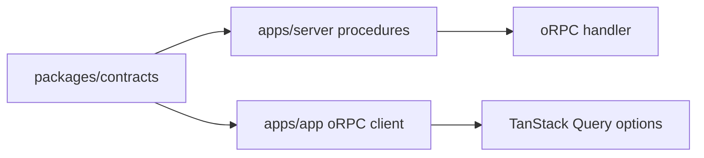
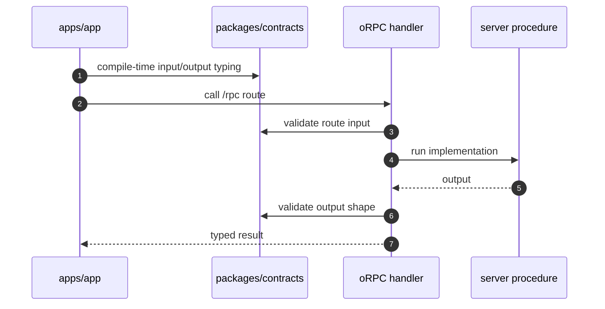
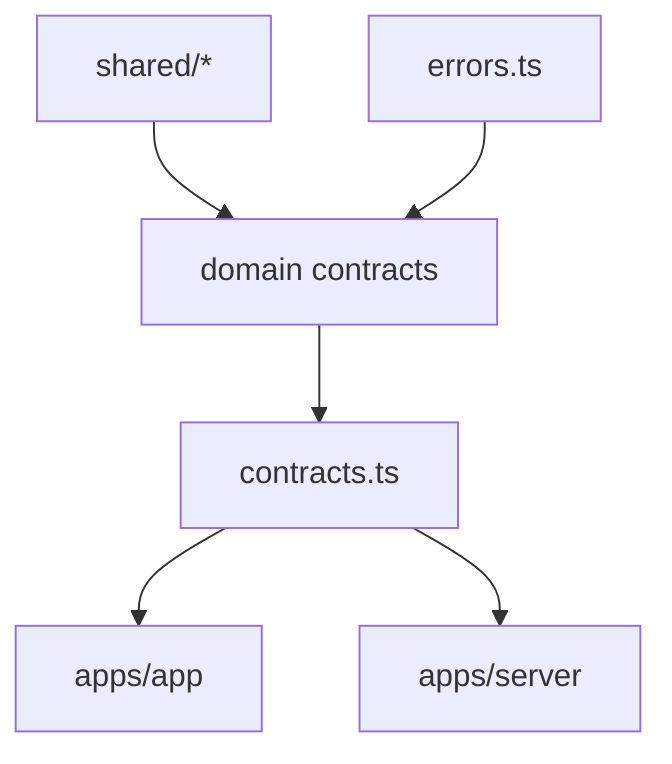
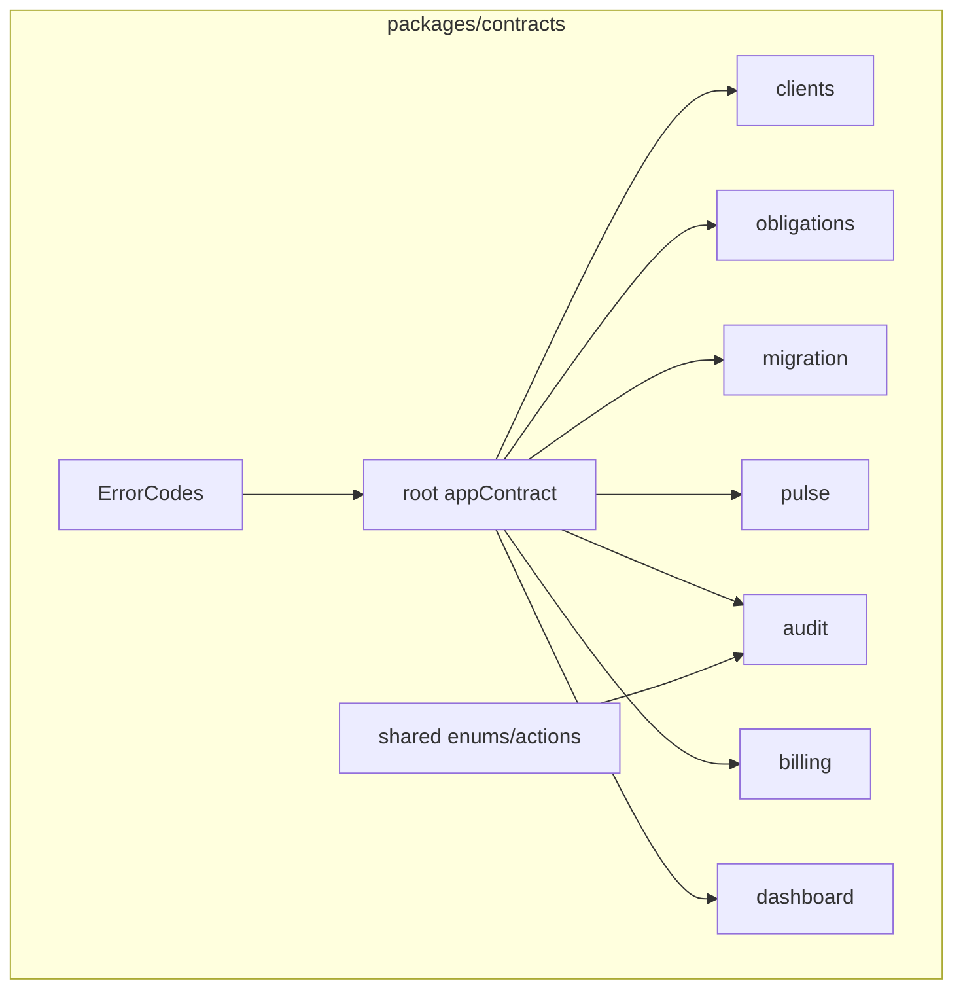

# packages/contracts 模块文档：Zod 与 oRPC 合约

## 功能定位

`packages/contracts` 是 DueDateHQ 前后端共享的 API 合约层。它使用 Zod 定义输入输出 schema，使用 oRPC contract 描述 RPC 端点，并集中管理业务错误码、共享枚举和领域 DTO。

这个包不实现业务逻辑，不访问数据库，也不调用外部服务。它的职责是让 app 和 server 对 API shape、错误 shape 和字段语义达成同一份类型化协议。

## 关键路径

| 路径                                    | 职责                                              |
| --------------------------------------- | ------------------------------------------------- |
| `packages/contracts/src/index.ts`       | 合约导出入口                                      |
| `packages/contracts/src/contracts.ts`   | root contract 组织                                |
| `packages/contracts/src/errors.ts`      | 业务错误码与错误 shape                            |
| `packages/contracts/src/shared`         | 共享 enum、audit actions 等                       |
| `packages/contracts/src/clients.ts`     | clients contract                                  |
| `packages/contracts/src/obligations.ts` | obligations contract                              |
| `packages/contracts/src/dashboard.ts`   | dashboard contract                                |
| `packages/contracts/src/migration.ts`   | migration contract                                |
| `packages/contracts/src/pulse.ts`       | pulse contract                                    |
| `packages/contracts/src/audit.ts`       | audit/evidence package contract                   |
| `packages/contracts/src/billing.ts`     | billing audit/pay intent contract，当前工作区新增 |

## 主要功能

### API contract

每个业务域导出自己的 contract 片段，root contract 聚合后由：

- server `implement(appContract)` 实现。
- app `createORPCClient` 和 TanStack Query utils 使用。

这样前端调用 API 时可以获得端到端类型推导。

### 输入输出 schema

合约层用 Zod 表达：

- route input。
- route output。
- list filter。
- pagination cursor。
- mutation payload。
- enum 与 discriminated union。
- nullable/optional 字段。

Clients contract now exposes filing jurisdictions as first-class DTOs:

- `ClientFilingProfilePublic` carries `state/counties/taxTypes/isPrimary/source/archivedAt`.
- `ClientPublic.filingProfiles` is always present; `client.state/county` remain compatibility
  mirrors for primary profile display.
- `clients.replaceFilingProfiles` replaces active profiles for one client, archives removed states,
  and returns the re-serialized client.
- `ObligationInstancePublic` includes `jurisdiction` and nullable `clientFilingProfileId`, so app
  surfaces no longer infer obligation geography from `ClientPublic.state`.

Migration mapping adds `client.filing_states` for multi-state import. `client.state` still works as a
legacy/single-state mapping target, but commit planning treats both targets as filing profile input.

### 错误码

`errors.ts` 将可预期业务错误集中成稳定码，例如：

- auth/permission。
- plan required。
- migration conflict。
- pulse state conflict。
- validation failure。

前端可以基于错误码做 toast、inline error 或升级提示，而不是解析后端 message。

### Shared actions and enums

`shared/audit-actions.ts` 提供 audit action 常量，避免 server、DB、UI 文案在字符串上漂移。

## 创新点

- **合约先行**：前后端不用分别维护 fetch DTO 和 handler DTO。
- **schema 即文档**：Zod schema 既提供 runtime validation，也表达字段语义。
- **错误码稳定化**：把可预期失败变成产品状态，尤其适合 migration、Pulse 和 billing 这种多步骤流程。
- **审计动作常量化**：audit action 作为产品语义的一部分集中维护。

## 技术实现

### 合约流向

### Contract 到 procedure

### 模块组织

## 架构图

## 设计约束

- 不导入 server runtime、Drizzle、Hono、React 或 AI provider。
- 不保存业务状态。
- Schema 名称应尽量表达产品语义，而不是数据库表名。
- 新增 mutation 时应同步考虑：
  - permission error。
  - validation error。
  - plan-gated error。
  - audit action 是否需要共享常量。

## 当前关注点

- 当前工作区中 billing contract 是活跃开发内容，应确保 server procedure、frontend route 和 audit action 最终对齐。
- Contract 变更通常会产生跨 app/server 的编译影响，需要配合 `pnpm check`。
- 如果 DB schema 增字段，不应直接暴露 DB row；需要在 contract 层定义面向 UI 的 DTO。

## 后续演进关注点

- 为 cursor pagination、list filter、money display 等重复模式沉淀 shared schema helper。
- 给 ErrorCodes 增加文档化分类，方便前端统一错误展示。
- 对 migration/Pulse 这类状态机接口补更强的状态枚举注释和状态迁移说明。
