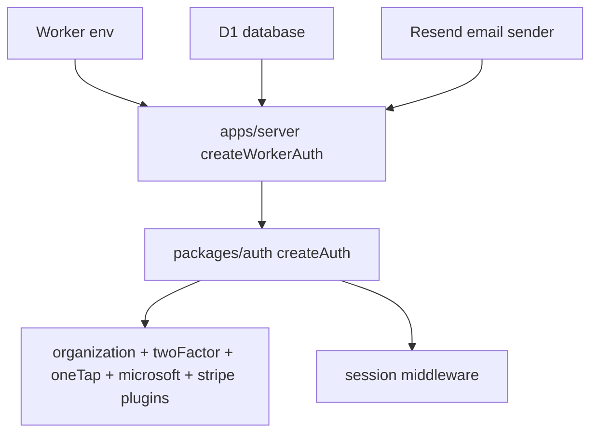
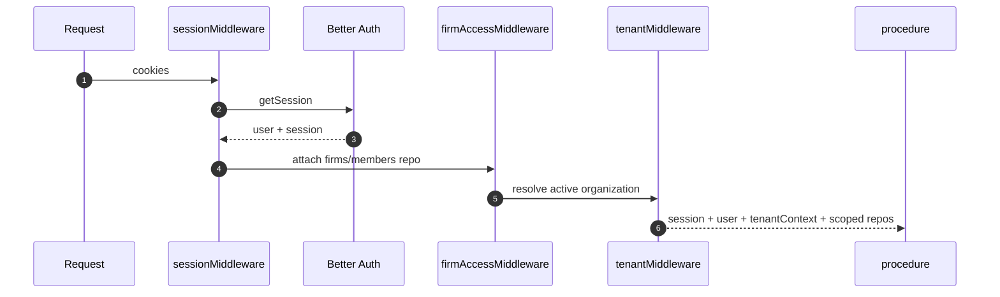
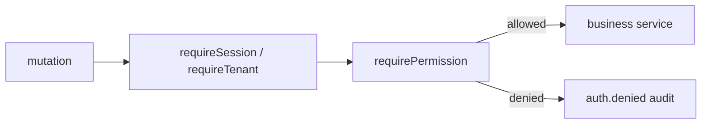
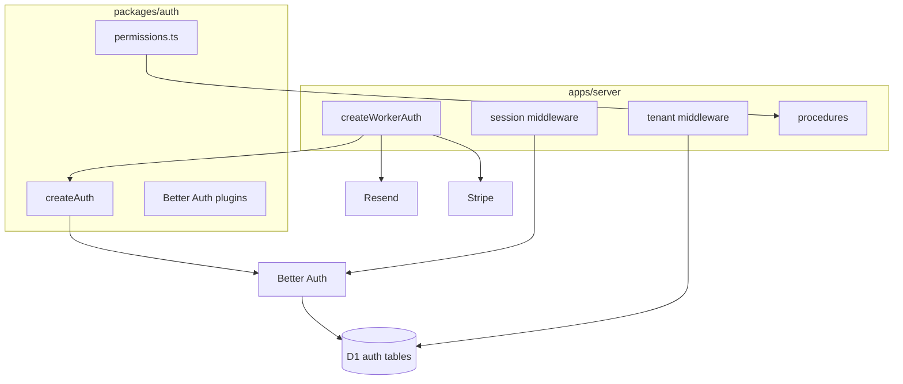

# packages/auth 模块文档：身份、组织与权限

## 功能定位

`packages/auth` 封装 DueDateHQ 的 Better Auth 配置、Google OAuth/One Tap、组织插件、角色权限矩阵和可选 Stripe plugin。`apps/server` 在 Worker runtime 中创建具体 auth instance，并负责注入 D1 database、邮件发送、locale、organization hooks 和 billing hooks。

认证模块解决三件事：

1. 谁是当前用户。
2. 用户当前处于哪个 firm。
3. 当前角色能做哪些业务动作。

## 关键路径

| 路径                                         | 职责                                  |
| -------------------------------------------- | ------------------------------------- |
| `packages/auth/src/index.ts`                 | `createAuth`，Better Auth 主配置      |
| `packages/auth/src/permissions.ts`           | role、permission 和 access control    |
| `apps/server/src/auth.ts`                    | Worker runtime auth wiring            |
| `apps/server/src/middleware/session.ts`      | 从 request 解析 session/user          |
| `apps/server/src/middleware/tenant.ts`       | active organization 到 tenant context |
| `apps/server/src/middleware/firm-access.ts`  | 注入 firms/members repo               |
| `apps/server/src/procedures/_permissions.ts` | 业务 permission enforcement           |
| `apps/server/src/procedures/security`        | MFA 与 session management wrapper     |
| `apps/app/src/routes/account.security.tsx`   | 账号安全页                            |
| `apps/app/src/routes/accept-invite.tsx`      | 邀请接受入口                          |

## 主要功能

### 登录与 session

- Google OAuth + Google One Tap；可选 Microsoft Entra ID OAuth（`MICROSOFT_CLIENT_ID/SECRET` 成对配置后显示）。
- `/api/auth-capabilities` 暴露公开的 Google Client ID 给 SPA 初始化 One Tap；`GOOGLE_CLIENT_SECRET` 仍只存在于 Worker secret/runtime env。
- One Tap 复用 Better Auth 既有 `user` / `account` / `session` 表，不引入新的 auth 表或迁移。
- Better Auth session。
- Cookie prefix `duedatehq`。
- 非 development 环境启用 secure cookies。
- trusted origins 来自 `AUTH_URL` 和 `APP_URL`。
- `twoFactor` plugin 提供可选 TOTP MFA；启用后当前登录 session 必须完成 `/two-factor` 验证，项目接口权限仍只由 tenant + role 决定。

### Organization 与 firm

- Better Auth organization plugin 表示事务所组织。
- `firm_profile` 扩展 organization，保存 plan、seat、timezone、billing、状态和偏好。
- session 中的 `activeOrganizationId` 决定当前租户上下文。

### 角色权限

核心角色：

- owner。
- manager。
- preparer。
- coordinator。

权限覆盖：

- audit read/export。
- billing read/update。
- client write。
- migration run/revert。
- obligation status update。
- pulse read/apply。
- organization/member 管理能力。

### Invitation 与成员管理

server 注入 Resend 邮件发送器，邀请邮件根据 request locale 选择文案。成员管理 procedure 处理：

- invite。
- cancel invitation。
- resend invitation。
- update role。
- suspend/reactivate。
- remove。
- seat limit。

邀请邮件落到 `/accept-invite?id=...`。用户未登录时先走 Google/Microsoft OAuth（登录页可先显示 Google One Tap），登录后调用 Better Auth `accept-invitation`，接受后回到受保护工作台。

### Security settings

`security.*` oRPC wrapper 避免前端直接暴露 Better Auth session token：

- `status`：返回 `twoFactorEnabled` 和脱敏 session 列表。
- `enableTwoFactor` / `verifyTwoFactor` / `disableTwoFactor`：驱动 `/account/security`，前端把 Better Auth `totpURI` 渲染为 QR code，并保留手动 setup URI fallback。
- `verifyTwoFactor` 同时服务 `/two-factor` 登录挑战：server 透传 Better Auth 旋转 session 时返回的 `Set-Cookie`，并把当前 session 标记为 `twoFactorVerified`。
- `revokeSession` / `revokeOtherSessions`：撤销 stale browser access。
- 安全动作写 `auth.mfa.*` / `auth.session.revoked` audit event；登录成功由 session hook 写 `auth.login.success`。

### Billing integration

Better Auth Stripe plugin 参与 subscription/customer portal/checkout 流程。当前代码还包含 billing pay intent audit 相关 contract/procedure 的活跃变更。

## 创新点

- **active organization 即租户入口**：避免客户端每个请求传 firmId。
- **组织插件 + firm profile 双层模型**：Better Auth 负责身份组织通用能力，业务 profile 承载税务 SaaS 特有字段。
- **权限失败可审计**：业务权限 helper 能写入 `auth.denied`。
- **coordinator 金额可见性独立控制**：角色权限和金额脱敏不是同一件事，firm setting 可调整。

## 技术实现

### Auth wiring

### 请求上下文

### 权限检查

## 架构图

## 权限矩阵摘要

| 能力             | owner | manager  | preparer | coordinator |
| ---------------- | ----- | -------- | -------- | ----------- |
| client write     | 是    | 是       | 是       | 通常否      |
| migration run    | 是    | 是       | 是       | 通常否      |
| migration revert | 是    | 是       | 是       | 通常否      |
| pulse read       | 是    | 是       | 是       | 是          |
| pulse apply      | 是    | 是       | 是或受限 | 通常否      |
| audit export     | 是    | 是       | 受限     | 否          |
| billing update   | 是    | 是或受限 | 否       | 否          |
| member admin     | 是    | 否       | 否       | 否          |

最终权限以 `packages/auth/src/permissions.ts` 和 server procedure guard 为准。

## 后续演进关注点

- Billing 权限需要随 Stripe subscription 状态机最终确认。
- Firm 删除、成员 suspension 和 active organization 切换需要继续保持 audit 语义一致。
- 如果未来支持多 firm 快速切换，前端 cache invalidation 和 server session update 必须一起设计。
- 权限矩阵建议生成文档化快照，避免代码和产品说明漂移。
