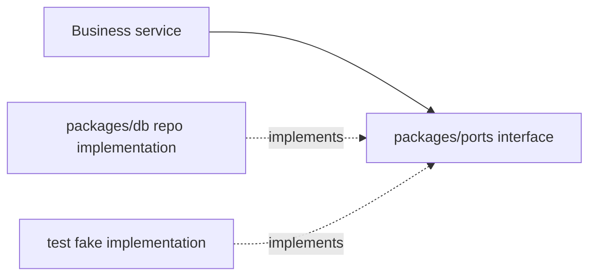
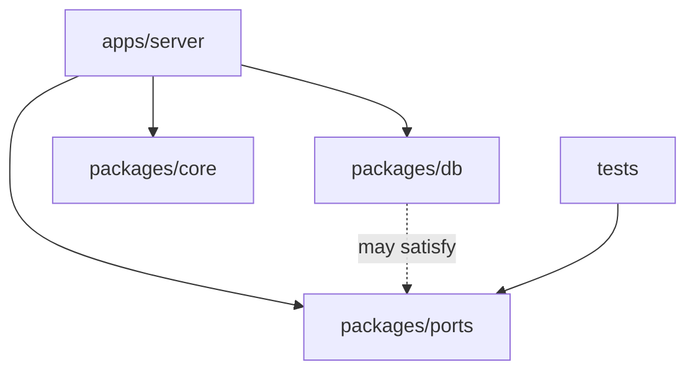
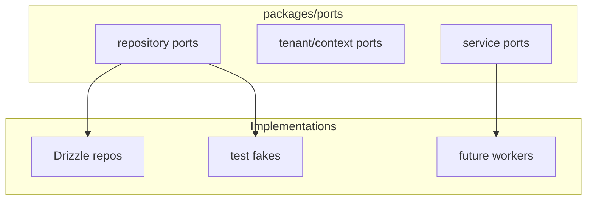

# packages/ports 模块文档：边界接口

## 功能定位

`packages/ports` 保存 DueDateHQ 的纯 TypeScript 边界接口，用来表达领域服务对仓储、租户上下文或外部能力的抽象需求。它不绑定 Drizzle、D1、Hono、React 或具体 provider。

这个包目前体量较小，但它表达了一个重要架构方向：当业务服务需要跨 runtime 复用或测试替身时，优先依赖接口，而不是直接依赖基础设施实现。

## 关键路径

| 路径                          | 职责                              |
| ----------------------------- | --------------------------------- |
| `packages/ports/src`          | repo、tenant 或 service port 类型 |
| `packages/ports/package.json` | 独立 TS package 定义              |

当前包没有统一 root barrel。调用方应按具体文件导入，避免把未稳定接口一次性变成公共 API。

## 主要功能

- 定义仓储接口形状。
- 定义租户上下文相关类型。
- 为 server service、测试替身和未来 background worker 拆分提供边界语言。
- 降低业务服务对 `packages/db` repo implementation 的直接耦合。

## 创新点

- **提前定义可替换边界**：复杂服务可以面向 port 编程，测试时注入 fake repo。
- **基础设施和业务用例解耦**：port 只表达“需要什么能力”，不表达“用 D1 如何查”。
- **保持轻量**：当前没有过早创建完整领域服务框架，避免抽象超前。

## 技术实现

### Port 模式

### 与其他包的关系

## 架构图

## 使用场景

| 场景                  | 适合使用 port 的原因                  |
| --------------------- | ------------------------------------- |
| 复杂 service 单元测试 | 不需要真实 D1/Drizzle                 |
| 未来任务 worker 拆分  | 同一业务服务可在不同 runtime 注入实现 |
| 替换外部 provider     | 业务代码不直接依赖 provider SDK       |
| repo 行为稳定化       | service 面向最小接口，而非完整 repo   |

## 当前限制

- 包内接口还不多，没有覆盖所有 repo。
- 当前 server 多数 procedure 仍直接使用 `packages/db` scoped repo。
- 没有 root export，使用者需要知道具体文件路径。

## 后续演进关注点

- 只有当服务复杂度需要时再引入 port，避免为简单 CRUD 过度抽象。
- 对 Migration、Pulse apply、Dashboard brief 这类复杂流程可逐步提取明确 port。
- 如果 port 成为正式公共 API，需要增加命名规范和文档注释。
