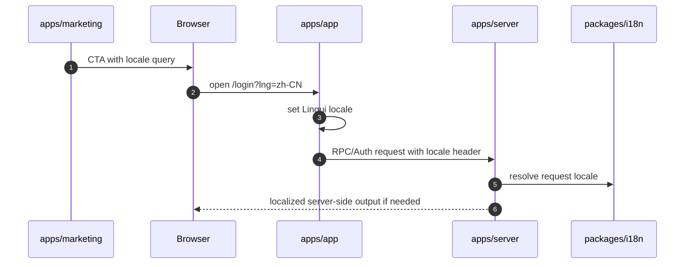
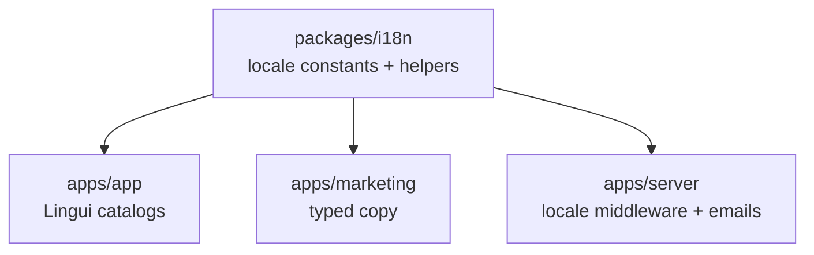
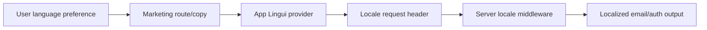

# packages/i18n 模块文档：共享语言与本地化基础

## 功能定位

`packages/i18n` 提供 DueDateHQ 跨 app/server/marketing 共享的 locale 常量和请求语言 helper。应用层使用 Lingui 处理 SPA 翻译，营销站维护 typed copy dictionary，server 用 locale helper 选择邮件、错误或 auth invitation 文案。

该模块本身保持很小，职责是建立语言枚举和协商规则，而不是承载所有翻译资源。

## 关键路径

| 路径                                   | 职责                                       |
| -------------------------------------- | ------------------------------------------ |
| `packages/i18n/src`                    | locale 常量、header/helper                 |
| `apps/app/src/i18n`                    | Lingui provider、catalog、locale switching |
| `apps/marketing/src/i18n`              | typed landing copy                         |
| `apps/server/src/middleware/locale.ts` | request locale middleware                  |
| `apps/server/src/auth.ts`              | invitation email locale handling           |

## 主要功能

- 定义支持的 locale，例如 English 和 Simplified Chinese。
- 约定 locale header。
- 从 request 中解析 locale。
- server auth/email 使用 request locale。
- app route 支持 URL locale handoff。
- marketing CTA 可将 locale 传入 app。

## 创新点

- **语言基础共享，翻译资源分层**：公共包只管 locale 基础设施，避免把 app catalog 和 marketing copy 混在一起。
- **从营销到应用的 locale handoff**：中文营销页进入 app 时携带语言意图。
- **server 文案也使用 locale**：邀请邮件等 server-side 输出不会固定英文。

## 技术实现

### Locale 流程



### 分层



## 架构图



## 工作流

App 翻译相关命令：

```bash
pnpm --filter @duedatehq/app i18n:extract
pnpm --filter @duedatehq/app i18n:compile
```

项目约定要求 extract 清理 obsolete entries，compile 使用 `--strict`，缺失翻译应导致 CI 失败。

## 当前限制

- `packages/i18n` 不保存所有翻译内容，定位是基础设施包。
- Marketing 的 typed copy 与 app Lingui catalog 是分开的，需要人为保持产品措辞一致。
- Server-side 错误信息是否本地化取决于具体 procedure/route 实现。

## 后续演进关注点

- 将常见产品术语沉淀为 glossary，减少 app/marketing/server 三处翻译不一致。
- 增加 CI 检查，确保 Lingui catalog 编译后无未提交漂移。
- 对邮件模板建立更明确的多语言模板结构。
