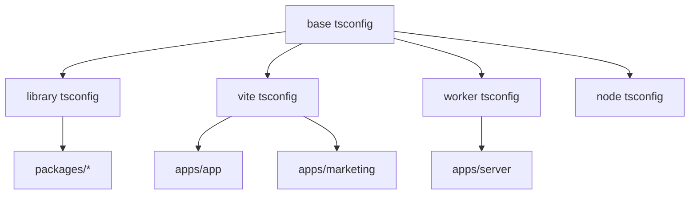
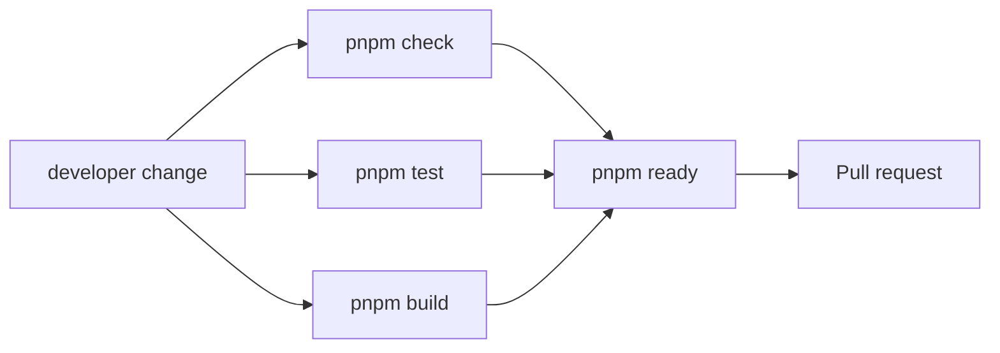
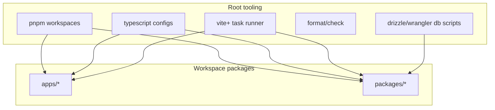

# packages/typescript-config 与工程化模块文档

## 功能定位

`packages/typescript-config` 提供 monorepo 共享 TypeScript 配置。根目录的 pnpm/vite+ 脚本负责 dev、build、test、check、format、依赖方向检查、数据库迁移、部署和 secrets scan。

这个模块代表项目的工程化基线：各 app/package 可以按 runtime 继承不同 tsconfig，同时通过 workspace scripts 保持一致的质量门槛。

## 关键路径

| 路径                            | 职责                                           |
| ------------------------------- | ---------------------------------------------- |
| `packages/typescript-config`    | base/library/node/vite/worker TS 配置          |
| `package.json`                  | root scripts、packageManager、Node/pnpm engine |
| `pnpm-workspace.yaml`           | workspace package 范围                         |
| `vite.config` / package configs | 各 app/package build/test/check 接入           |
| `drizzle.config.ts`             | DB migration/generate 配置                     |
| `eslint`/`prettier`/`vp` 配置   | check/format 质量控制                          |

## 主要功能

- 统一 TypeScript target、module、strictness 和 module resolution。
- 为 library package、Vite app、Worker app、Node script 提供不同配置基线。
- root `pnpm` scripts 聚合 workspace 任务。
- `pnpm ready` 作为交付前质量门。
- `pnpm check:deps` 检查内部 package 依赖方向。
- `pnpm secrets:scan` 支持配置变更前检查。

## 创新点

- **runtime-aware tsconfig**：前端、Worker、Node 和 library 不强行共用同一份 runtime 配置。
- **workspace 质量门统一**：开发者不需要记住每个 package 的命令，root script 聚合常见流程。
- **依赖方向显式检查**：帮助维护 core/contracts/db/ui/auth/ai 等包的边界。
- **Cloudflare 与前端构建并行纳入 monorepo**：server、app、marketing 都作为 deployable workspace 参与构建。

## 技术实现

### Workspace 脚本

常用 root 命令：

```bash
pnpm dev
pnpm build
pnpm test
pnpm check
pnpm check:fix
pnpm format
pnpm format:fix
pnpm ready
pnpm check:deps
pnpm db:generate
pnpm db:migrate:local
pnpm db:seed:demo
pnpm deploy
pnpm secrets:scan
```

### 配置继承



### 质量门



## 架构图



## 工程约束

- Node `>=22.19.0`。
- pnpm `10.33.2`。
- TypeScript ESM。
- 两空格缩进、单引号、无分号、trailing commas、100 列格式。
- app/package code 不使用 React `useEffect`。
- Env 文件按 app 所有，不在 repo root 放 env。

## 后续演进关注点

- 新增 package 时必须检查 tsconfig 继承、exports、dependency direction 和 scripts。
- 如果 `pnpm ready` 变慢，可按 package graph 做更细的 affected task，但不能降低 PR 质量门。
- docs-only 变更可以不跑完整 ready，但如果文档伴随代码变更，应按代码风险运行对应验证。
- 依赖升级要同步检查 Cloudflare Worker runtime、Vite、Astro 和 Better Auth 兼容性。
