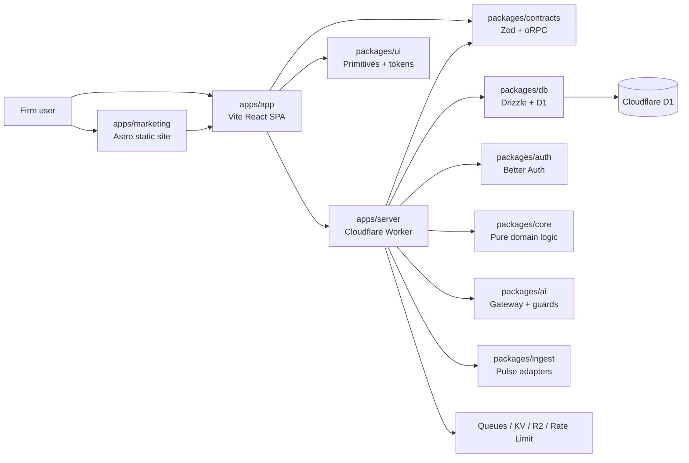

# DueDateHQ 项目模块文档

本目录面向新加入的研发、产品和架构评审者，按 monorepo 模块拆解 DueDateHQ 的当前实现。每份文档都覆盖模块职责、核心功能、技术实现、架构图、关键源码和后续演进关注点。

> 文档基于 2026-05-05 的当前代码和根 README 口径整理。对外表达以“已实现能力 + 明确边界”为准，不把候选规则、规划集成或未接入外部服务写成已可用生产能力。

## 阅读顺序

1. [00-overview.md](./00-overview.md)：项目总览、产品流程、系统架构和模块依赖。
2. [01-app-spa.md](./01-app-spa.md)：`apps/app`，Vite React 单页应用。
3. [02-server-worker.md](./02-server-worker.md)：`apps/server`，Cloudflare Worker API。
4. [03-marketing-site.md](./03-marketing-site.md)：`apps/marketing`，Astro 营销站。
5. [04-ui-design-system.md](./04-ui-design-system.md)：`packages/ui`，UI primitives 与设计 token。
6. [05-core-domain.md](./05-core-domain.md)：`packages/core`，纯领域逻辑。
7. [06-contracts.md](./06-contracts.md)：`packages/contracts`，Zod/oRPC 合约。
8. [07-db-data-access.md](./07-db-data-access.md)：`packages/db`，Drizzle/D1 数据模型与租户仓储。
9. [08-auth-identity.md](./08-auth-identity.md)：`packages/auth` 与 server auth wiring。
10. [09-ai-engine.md](./09-ai-engine.md)：`packages/ai`，AI Gateway、提示词、guard 与 trace。
11. [10-ingest-pulse-sources.md](./10-ingest-pulse-sources.md)：`packages/ingest`，Pulse 源抓取与解析。
12. [11-ports-boundaries.md](./11-ports-boundaries.md)：`packages/ports`，边界接口。
13. [12-i18n.md](./12-i18n.md)：`packages/i18n` 与 app/marketing 多语言。
14. [13-typescript-config-tooling.md](./13-typescript-config-tooling.md)：`packages/typescript-config` 与工程化脚本。
15. [14-user-manual.md](./14-user-manual.md)：面向用户和跨职能读者的产品/技术模块使用手册。
16. [15-tax-prep-workflow-gap-analysis.md](./15-tax-prep-workflow-gap-analysis.md)：参考 1040 报税服务线流程，对当前项目的产品/工程缺陷做差距分析。

## 对外 README 口径

- 根 [README.md](../../README.md) 使用英文，面向公开仓库和新贡献者。
- 根 [README.zh-CN.md](../../README.zh-CN.md) 使用中文，内容与英文 README 对齐。
- 当前公开州覆盖按 Federal + CA/NY/TX/FL/WA 表达；`FED + 50 states + DC` 的 broader source/candidate registry 不能等同于全量 verified coverage。
- 第三方 provider API、公开 OpenAPI、PWA/native、SOC 2/WISP 认证等规划或可配置能力，只能在对应设计/架构文档中按未来态描述，不能在 README 中宣传为已完成。
- 当前 workspace packages 仍为 `UNLICENSED`；公开发布前需要补充明确 license file。

## 模块地图

| 模块                                                        | 类型           | 核心职责                                                               |
| ----------------------------------------------------------- | -------------- | ---------------------------------------------------------------------- |
| `apps/app`                                                  | Deployable app | 会计事务所操作台、迁移向导、工单、Pulse、审计、成员、计费              |
| `apps/server`                                               | Deployable app | Cloudflare Worker API、oRPC、Better Auth、队列、定时任务、邮件 webhook |
| `apps/marketing`                                            | Deployable app | 静态营销站、双语 landing/pricing/rules/state/guides                    |
| `packages/ui`                                               | Shared package | Base UI primitives、Tailwind v4 token、主题脚本、sidebar               |
| `packages/core`                                             | Shared package | 无基础设施依赖的税务/日期/导入/罚金/规则纯逻辑                         |
| `packages/contracts`                                        | Shared package | 前后端共享 oRPC contract、Zod schema、错误码                           |
| `packages/db`                                               | Shared package | Drizzle schema、D1 client、tenant-scoped repositories                  |
| `packages/auth`                                             | Shared package | Better Auth 配置、组织权限、角色权限矩阵、Stripe plugin                |
| `packages/ai`                                               | Shared package | AI Gateway 调用、提示词、结构化输出、PII redaction、guard              |
| `packages/ingest`                                           | Shared package | Pulse 来源 adapter、fetcher、robots/conditional fetch、HTML/RSS 解析   |
| `packages/i18n`                                             | Shared package | locale 常量、请求语言协商 helper                                       |
| `packages/ports`                                            | Shared package | 领域服务与仓储边界接口                                                 |
| `packages/typescript-config`                                | Shared package | workspace TS 配置基线                                                  |
| `docs/project-modules/14-user-manual.md`                    | Documentation  | 用户功能手册、角色权限、常见路径和技术模块使用指南                     |
| `docs/project-modules/15-tax-prep-workflow-gap-analysis.md` | Documentation  | 对照 1040 报税 workflow 的缺陷、优先级和模块补全建议                   |

## 总体架构速览

## 文档维护约定

- 当模块职责、公共 API、数据模型或权限边界变化时，同步更新本目录对应文档。
- 当新增 workspace package 或 deployable app 时，在本 README 和 `00-overview.md` 增加模块入口。
- Mermaid 图应表达当前实现，不写未来态图；规划内容放在“后续演进关注点”。
