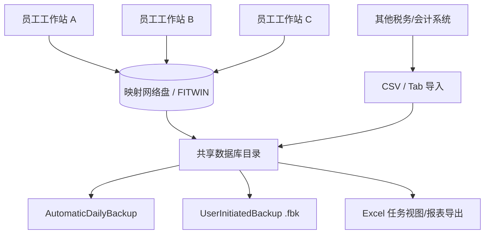

# File In Time 产品介绍与竞品分析研究报告

> 文档状态：竞品资料输入。当前 DueDateHQ 两周真实用户验证范围以 [DueDateHQ MVP v0.3 单一执行口径](./DueDateHQ%20-%20MVP%20边界声明.md) 为准。本文用于理解 File In Time 的定位、功能与价格口径，不代表 DueDateHQ 要覆盖其全部功能。

## 执行摘要

file-in-time 是 TimeValue 旗下的一款“到期日追踪 + 任务管理”产品，核心价值并不是做全栈式事务所运营平台，而是用较轻量、较本地化的方式，把税务/会计事务所最刚性的“申报截止日、延长期限、重复性任务、项目滚转”管理好。官方公开材料显示，它仍在持续更新，2026 年仍有新版本发布与税表期限更新，说明这不是停更老软件，而是一款仍在维护的成熟垂直工具。citeturn20search15turn20search17turn13search4

从竞品视角看，file-in-time 的最佳定位不是对标全功能云端事务所平台，而是位于“Excel/共享表格”和“云端一体化 Practice Management Suite”之间：它比表格更结构化，有任务、到期提醒、滚转、客户端分组、网络共享和备份恢复；但它明显弱于一体化平台在客户门户、电子签名、原生沟通、支付、自动化、API/生态集成和现代化 UI 等方面。公开评论也反映出这一点：它对小型事务所“够用且便宜”，但能力范围较窄，界面和体验偏旧。citeturn38search0turn13search6turn35search4turn25view0turn25view1

本次研究的一个重要限制是：官网若干页面在抓取时无法直接展开，因此部分结论来自官方搜索摘要、下载页/PDF 索引、FAQ 片段，以及来自 entity["company","Capterra","software marketplace"]、entity["company","G2","software marketplace"]、entity["company","Slashdot","technology media"]、entity["company","SourceForge","software marketplace"] 等第三方目录/评论。报告中凡属“第三方反复描述但官网未完整直读验证”的内容，我都明确标为“部分公开”或“未说明”。citeturn25view0turn25view1turn24search2turn24search1

## 目录

- 产品概述
- 功能详解
- 技术架构与集成
- 目标用户与市场定位
- 定价与商业模式
- 用户体验与界面要点
- 安全与合规
- 优劣势分析与关键差异化
- 竞品对比表
- 建议的竞品定位与产品改进建议
- 结论与下一步研究建议

## 产品概述

TimeValue 官方主页将公司定位为面向税务、法律、租赁、银行及其他金融专业人士的软件供应商；file-in-time 的官方标题则明确是 “Due Date Tracking and Task Management Software”，主张“追踪所有 filing due dates 和 projects”，本质是面向税务/会计工作流的截止日与任务控制系统，而不是通用 CRM 或文档中台。citeturn13search2turn20search15turn16search0

从可见公开资料看，这款产品更像是 Windows 桌面软件：下载页公开了单机/多用户版本、Quick Start Guide、User’s Guide 和 Network Installation Instructions；FAQ 反复提到本地目录 `fitwin`、映射网络盘、服务器工作站安装、备份恢复和多员工权限，说明其交付模式以本地安装和共享数据库为主，而非纯浏览器 SaaS。citeturn13search3turn13search4turn20search2turn20search5turn21search3

它的产品边界也比较清楚：一方面，官方博客/FAQ 表明它不只适用于税表申报，还可以跟踪生日、会议、预约等任意日期事件；另一方面，它并没有在公开产品页中展示客户端门户、支付、电子签名、开放 API、移动端协作这类“现代一体化平台”叙事。换句话说，它的市场位置是“以日历/截止日驱动的轻量作业管理器”。citeturn39search2turn39search3turn16search0

在“是否还值得列为竞品”这个问题上，答案是肯定的。因为官方 “What’s New” 片段显示 file-in-time 2026.1 版本仍可用，并包含 2025 税年的表单/期限更新；这意味着它仍服务于真实的税务截止日管理场景，而不是历史遗留产品。citeturn10search6turn20search17

## 功能详解

公开官方线索显示，file-in-time 的核心能力包括：任务视图（默认列含 client、service、due date、status、key person、是否延期、notes）、到期颜色提醒、任务 rollover/roll-forward、客户数据导入、Excel 导出工作量报表、客户分组/多实体关系、备份恢复和员工权限控制。第三方目录还反复补充了“近 200 个联邦/州所得税预置日期”“约 40 个跟踪字段”等信息，但这两点未在本次直读的官方页面中完整展开，因此应视为“中等可信度”。citeturn38search0turn18search0turn13search6turn22search2turn37search0turn40search0turn35search4turn41search3turn41search2

### 功能清单表

| 功能名称           | 描述                                                                                                                          | 是否公开 | 优先级/重要性 |
| ------------------ | ----------------------------------------------------------------------------------------------------------------------------- | -------: | ------------: |
| 到期日跟踪         | 用于追踪 filing due dates 与 projects，是产品最核心价值。citeturn20search15turn16search0                                  |       是 |            高 |
| 任务视图           | 默认列含 client、service、due date、status、key person、extended、notes，说明其核心 UI 是表格式任务总览。citeturn38search0 |       是 |            高 |
| 红色到期提醒       | 到期当天、提前 1–4 周可将 due date 变红，强化临期提醒。citeturn18search0turn38search2                                     |       是 |            高 |
| 任务滚转           | 已完成任务可 rollover 到下一个期间/年度，适合税务季重复性工作。citeturn13search6turn38search1                             |       是 |            高 |
| 客户数据导入       | 支持从可导出 CSV/制表符文件的其他系统导入客户数据。citeturn22search2turn22search6                                         |       是 |            高 |
| Excel 导出         | 支持 Display Task View in Excel，用于工作量报告和归档。citeturn37search0turn37search1                                     |       是 |          中高 |
| 客户分组/多实体    | FAQ 提到可通过 Client Group 关联同一公司下多个实体。citeturn40search0                                                      |       是 |          中高 |
| 任务/数据权限      | 可给不同员工分配不同修改权限。citeturn35search4                                                                            |       是 |          中高 |
| 单机/网络多用户    | 支持本地安装，也支持网络驱动器和多工作站。citeturn20search2turn20search5turn21search3                                    |       是 |            高 |
| 自动/手动备份恢复  | 有 Backup Database、Restore from Backup、AutomaticDailyBackup。citeturn35search4turn21search3                             |       是 |            高 |
| 任意日期/事件追踪  | 不仅跟踪税表，也可跟踪生日、会议、预约等事件。citeturn39search2turn39search3                                              |       是 |            中 |
| 预置税务日期库     | 第三方资料反复提到近 200 个联邦/州税务期限预置。citeturn41search3turn41search2                                            | 部分公开 |          中高 |
| 多跟踪字段         | 第三方资料提到最多约 40 个 tracking fields。citeturn41search2turn41search6                                                | 部分公开 |            中 |
| 自定义服务/模板    | 第三方资料提到可设计 custom services / checklist templates，但本次未从官方页面完整直读。citeturn40search8turn40search1    | 部分公开 |            中 |
| 客户门户/电子签名  | 本次检索到的官方产品材料未说明。                                                                                              |   未说明 |            中 |
| 开放 API / Webhook | 本次检索到的官方产品材料未说明。                                                                                              |   未说明 |            中 |
| 原生移动端         | 本次检索到的官方产品材料未说明。                                                                                              |   未说明 |            中 |

从用户流程看，file-in-time 的“最小闭环”很清晰：导入/建立客户 → 建立服务与任务 → 通过任务视图按人/状态/到期查看 → 临期红色警示 → 完成后滚转到下一周期 → 必要时导出 Excel 报表。这个路径简单、直白，适合把“每年都要发生、时间强约束、定义相对固定”的工作标准化。citeturn22search2turn38search0turn18search0turn13search6turn37search0


在界面风格上，公开线索指向“典型桌面表格式数据库”而非现代化卡片式体验：任务视图默认列和 Excel 导出都强化了这种判断。来自 entity["company","Capterra","software marketplace"] 的评论认为它对小型事务所“便宜、有效”，但功能范围较窄，往往需要与其他邮件、文件、日历、账单系统并存；来自 entity["company","G2","software marketplace"] 的评论则直接指出界面和功能“outdated”。因此，如果你要做竞品分析，可将其 UX 评价概括为：**低复杂度、高表格感、学习成本低于大型套件，但现代协作体验明显不足**。citeturn25view0turn25view1

## 技术架构与集成

file-in-time 的技术架构最重要的特征是**本地/网络共享式部署**。官方 FAQ 明确提到：可把数据库从本地硬盘迁移到网络驱动器；服务器端安装后，各工作站运行 `Workstationsetup.exe`；每台工作站都需要映射到相同的网络盘；数据库目录为 `fitwin`；并且可以通过 `.fbk` 备份文件在不同实例之间恢复。这说明其更接近“共享数据库的桌面工作组应用”，而不是云端多租户产品。citeturn21search1turn21search3turn35search4

从“集成”能力看，公开官方证据最确定的是**文件式集成**：可从任意可导出 CSV/Tab 的税务/会计系统导入客户信息，并将任务视图导出到 Excel。除此之外，本次检索到的官方可见材料里，没有找到公开 API 文档、Webhook、原生邮件/日历双向同步、支付或文档签署接口说明。这意味着它更依赖“导入/导出 + 手工流程衔接”，而不是开放生态。citeturn22search2turn22search6turn37search0turn13search4

下图是基于官方 FAQ、下载页和帮助材料**推断**出的 file-in-time 典型部署形态，而非厂商正式架构图。citeturn13search3turn20search2turn21search1turn35search4



支持与教育资源方面，官方公开了下载、Training Videos、Webinars；其中 webinar 页面还出现了 “Mastering File In Time Software” 的录播信息。这说明厂商对该产品仍提供一定培训与客户成功支持，但公开内容更偏“演示/使用指导”，不像现代 SaaS 那样强调开发者平台和应用市场。citeturn20search3turn20search10turn20search13

## 目标用户与市场定位

最适合 file-in-time 的客户，不是追求“一个平台包打天下”的数字化事务所，而是以下三类：其一，已有税务软件、邮件、文档、账单系统，但缺一个独立、稳定、低成本的截止日中控台的小型或中型事务所；其二，以税表申报和重复性 compliance 任务为主、协作复杂度不高的团队；其三，对本地部署/共享网络盘更安心，不愿把核心截止日清单完全放到云端的组织。citeturn25view0turn20search15turn35search4

其市场定位可以概括为：**“deadline-first、workflow-light、integration-light”**。它以到期日为中心，而不是以客户生命周期、计费回款、门户协作或文档流转为中心；这也是它与 entity["company","Karbon","accounting software"]、entity["company","TaxDome","practice management"]、entity["company","Canopy","accounting software"]、entity["company","Jetpack Workflow","accounting workflow"] 等云端平台的根本差异。前者解决“我别漏报”，后者解决“我用一个平台跑完整个事务所”。citeturn28view0turn31view0turn33view0turn29view0

如果把市场分层，file-in-time 大概率不是大型成长型事务所的首选主系统，因为这类客户更看重统一沟通、客户门户、签名、支付、自动化与分析；但对那些仍处于“从 Excel 升级到专用工具”的事务所，它有明显吸引力。公开评论中“小型事务所如果已有别的系统来管客户信息、邮箱、文件和日历，它就足够便宜且有效”这句评价，本质上就是它的真实定位。citeturn25view0

## 定价与商业模式

公开价格信息存在冲突，但总体可以判断其商业模式更接近**一次性授权 + 首年维护 + 后续续保**，而不是纯订阅。官方产品页/宣传单片段写明“Maintenance 首年包含，含更新与无限支持；一年后收取维护续费”；而快购页搜索摘要显示当前可能存在较低的新客授权价（例如单用户 $149、2 用户 $248 等），同时旧宣传单与 Capterra 仍显示 $199/用户一次性价格。因此，**“一次性授权”是高可信结论，“当前精确单价”则必须二次确认**。citeturn15search0turn15search1turn14search0turn25view0

这类定价对 file-in-time 的商业逻辑很重要：它天然适合把自己卖成“轻量生产工具”，而不是“高 ARR 的一体化平台”。优点是客户首单心理门槛低；缺点是厂商在持续研发、云化和生态建设上的收入弹性通常小于订阅制竞品。对你做竞品分析时，这意味着它在价格沟通上可能看似便宜，但如果用户最终还要叠加邮件、文档、门户、支付、签名等其他软件，总拥有成本并不一定最低。citeturn15search0turn25view0turn28view0turn31view0turn33view0turn29view0

### 我方未知假设与未说明项

| 项目                            | 当前判断   | 说明                                                                                                            |
| ------------------------------- | ---------- | --------------------------------------------------------------------------------------------------------------- |
| 公开 API 文档                   | 未说明     | 本次检索到的官方产品页、下载页、FAQ 中未见公开开发者/API 文档。citeturn13search3turn13search4turn35search4 |
| 精确现价                        | 未完全确认 | 快购页摘要与第三方商城/旧资料存在 $149 与 $199 的冲突。citeturn14search0turn25view0turn11search3           |
| 维护续费金额                    | 未说明     | 只看到“首年含维护，一年后续费”，未见公开续费表。citeturn15search0turn15search1                              |
| 支持的附件/文档格式             | 未说明     | 公开明确的仅是客户导入格式为 CSV / Tab，以及 Excel 导出。citeturn22search2turn22search6turn37search0       |
| 离线能力边界                    | 部分已知   | 可本地/网络运行，但脱网同步冲突、远程协作边界未公开说明。citeturn21search3turn35search4                     |
| 移动端 App                      | 未说明     | 本次官方材料未见原生 iOS/Android 说明。                                                                         |
| SSO / MFA                       | 未说明     | 本次官方材料未见说明。                                                                                          |
| 数据加密 / 审计日志             | 未说明     | 公开可见信息主要是备份、网络部署与权限控制。citeturn35search4                                                |
| SOC 2 / ISO 27001 / GDPR 等认证 | 未说明     | 本次检索到的产品相关公开材料未见说明。                                                                          |
| 云版本 / SaaS 版本              | 未说明     | 公开材料更像桌面/网络共享部署；未见独立云版说明。citeturn13search4turn21search1turn35search4               |

## 用户体验与界面要点

file-in-time 的 UI 优势在于“足够直接”。任务视图列天然适合税务繁忙季按客户、服务、负责人、到期日和状态进行批量筛选；红色预警和 rollover 也符合税务办公对“重复性、临期性、不可漏”的认知方式。换言之，它不是“漂亮”的产品，而是“有操作肌肉记忆”的产品。citeturn38search0turn18search0turn13search6

但这套体验的代价也很明显。公开评论反映其界面老旧、功能描述简短、整体能力范围窄，尤其当事务所希望把客户信息、邮箱、文件、日历、账单、门户通信放在同一系统时，file-in-time 很容易沦为“另一个需要登录、录入和维护的系统”。对现代事务所来说，这会直接转化为上下文切换和重复录入成本。citeturn25view0turn25view1

## 安全与合规

就已公开能力而言，file-in-time 能确认的“安全控制”主要是：数据库备份/恢复、自动每日备份、共享网络盘部署、员工权限区分，以及通过本地/网络目录来控制数据位置。这类控制对传统事务所是有现实价值的，尤其是那些更偏好自己控制数据目录和备份文件的团队。citeturn21search3turn35search4

但从合规审查角度看，它的公开材料明显不够充分。对于今天企业软件常见的安全问题——如 at-rest/in-transit 加密、SSO、MFA、审计日志、数据保留策略、第三方认证、隐私分区、灾备 SLA——本次检索到的官方产品材料没有给出明确答案。因此，如果你方产品要与它竞争，**把“安全能力可被销售清晰讲述”本身做成卖点，会非常有效**；而如果你方要采购/对标它，就必须通过销售问卷或安全审计来补齐。citeturn13search3turn13search4turn35search4

## 优劣势分析与关键差异化要点

file-in-time 的最大优势，不是“全”，而是“专”。它聚焦一个刚需：**截止日不会漏、重复任务能滚转、负责人和状态有地方集中看**。相比臃肿的一体化平台，它更容易被小团队理解、上线和接受；相比 Excel，它又更结构化，减少了手工公式和散乱视图的风险。citeturn20search15turn13search6turn38search0

它的劣势则同样清楚：第一，生态弱，公开可见的集成方式主要还是导入/导出；第二，体验旧，现代协作和客户自助能力不足；第三，安全与可扩展性叙事不足，尤其不利于中大型事务所采购；第四，价格信息透明度一般，且公开片段有冲突。citeturn22search2turn37search0turn25view0turn25view1turn14search0turn15search0

因此，其关键差异化可以简化为三点：**本地化部署偏好、deadline-first 设计、一体化程度低但上手快**。这也是你做竞品时最值得抓住的对比轴。citeturn21search3turn20search15turn25view0

## 竞品对比表

| 产品                                                          | 功能侧重                                                                                                                                                                                                                   | 定价                                                                                                                           | 目标用户                                                                                          | 集成                                                                                                                                                                      | 优点                                                                              | 缺点                                                                        |
| ------------------------------------------------------------- | -------------------------------------------------------------------------------------------------------------------------------------------------------------------------------------------------------------------------- | ------------------------------------------------------------------------------------------------------------------------------ | ------------------------------------------------------------------------------------------------- | ------------------------------------------------------------------------------------------------------------------------------------------------------------------------- | --------------------------------------------------------------------------------- | --------------------------------------------------------------------------- |
| file-in-time                                                  | 截止日追踪、任务视图、红色提醒、滚转、CSV 导入、Excel 报表；更像轻量 deadline 控制台。citeturn38search0turn18search0turn13search6turn22search2turn37search0                                                         | 一次性授权为主；公开现价有冲突，约 $149–$199/用户区间；首年含维护。citeturn14search0turn25view0turn15search0              | 小中型税务/会计事务所，或只想先解决 deadline 管理的税务团队。citeturn20search15turn25view0    | 公开可见以 CSV/Tab 导入、Excel 导出为主；开放 API 未说明。citeturn22search2turn37search0                                                                              | 轻量、聚焦、对税务重复任务友好、本地/网络部署。citeturn21search3turn13search6 | 体验偏旧，平台能力窄，公开安全/生态信息不足。citeturn25view0turn25view1 |
| entity["company","Karbon","accounting software"]           | 邮件整合、协作、工作流、计时预算、账单支付、文档、客户门户、自动提醒与行业集成。citeturn28view0turn30search1turn30search14                                                                                            | Team $59/用户/月（年付），Business $89/用户/月（年付）。citeturn28view0                                                     | 成长型会计事务所，尤其需要协作和邮件深度整合的团队。citeturn28view0turn30search31             | 官方强调行业集成、API Developer Center，以及 Gmail/Outlook/Exchange、Dropbox/OneDrive 等。citeturn30search5turn30search14turn30search25                              | 一体化程度高、自动化强、适合成长型团队。citeturn28view0turn30search12         | 价格高于轻量工具，实施复杂度更高。citeturn28view0                        |
| entity["company","TaxDome","practice management"]          | 全栈事务所平台：CRM、门户、移动端、邮件/SMS/安全聊天、自动化、文档、签名、计费与 AI。citeturn31view0turn28view2                                                                                                        | Essentials/Pro/Business 约 $700/$900/$1100 起（3 年期每用户每年）；1 年期到 $800/$1000/$1200。citeturn32search1turn31view1 | 税务、会计、记账公司，尤其是想“一个平台跑全流程”的成长型团队。citeturn28view2turn32search3    | 官方强调门户、移动 App、自动化、沟通等；定价结构透明。citeturn31view0turn32search0turn32search2                                                                      | 功能全、价格透明、客户侧体验强。citeturn32search2turn31view0                  | 学习与启用成本高于轻量工具。citeturn32search8                            |
| entity["company","Canopy","accounting software"]           | CRM、文档、Workflow、Time & Billing、Payments、Client Portal、Engagements、Smart Intake、AI；并强调与 entity["organization","IRS","us tax agency"] 相关税务 resolution 能力。citeturn33view0turn28view1turn33view1 | 当前公开页未直接展示明确美元价；按分层 + credits + add-ons 模式，需询价/试用确认。citeturn33view0                           | 需要一体化平台且税务 resolution/文档/门户较重要的事务所。citeturn28view1turn33view1           | 官方公开 QuickBooks Online、Outlook、API、Xero（经 Zapier）等线索；另有 Desktop Assistant / Virtual Drive。citeturn34search0turn34search1turn34search7turn34search2 | 模块全、税务特色强、桌面桥接能力好。citeturn28view1turn34search2turn33view1  | 定价结构较复杂，公开透明度不如 TaxDome。citeturn33view0                  |
| entity["company","Jetpack Workflow","accounting workflow"] | 面向会计/记账的 workflow 管理：无限项目与客户、模板、自动化、团队协作、培训支持。citeturn29view0                                                                                                                        | 年付 $40/用户/月，月付 $49/用户/月。citeturn29view0                                                                         | 想从 Excel/任务表升级、但暂不需要大型一体化套件的会计与记账团队。citeturn29view0turn27search1 | 官方提到 Zapier 和 2,000+ app 连接能力。citeturn27search2                                                                                                              | 比大型套件更轻，协作和云化明显强于 file-in-time。citeturn29view0turn27search2 | 不是完整事务所操作系统，仍需外部工具补齐。citeturn29view0                |

## 建议的竞品定位与产品改进建议

基于以上对比，如果你方准备切入这一赛道，最有机会的不是复制 file-in-time，而是**保留其“deadline-first”的上手优势，同时补齐它最明显缺口**。下面给出三条差异化策略与三条产品改进建议。相关判断为分析性推断，依据是 file-in-time 的桌面/网络部署逻辑与云端竞品的一体化能力差异。citeturn21search3turn28view0turn31view0turn33view0turn29view0

### 差异化策略

| 策略                            | 说明                                                                                                                                                                                                                      | 优先级 | 预期影响 |
| ------------------------------- | ------------------------------------------------------------------------------------------------------------------------------------------------------------------------------------------------------------------------- | -----: | -------: |
| 做“轻量一体化”而不是“大而全”    | 保留 deadline、rollover、批量任务视图这些税务高频刚需，同时原生补上客户门户、邮件提醒、电子签名、文档请求。这样可以精准打 file-in-time 的升级盘，而不是直接与重型套件硬碰硬。citeturn13search6turn31view0turn33view0 |     高 |       高 |
| 把“现代协作 + 易迁移”做成主卖点 | 支持从 Excel/CSV/file-in-time 风格任务表一键迁移，提供 Outlook/Gmail/日历同步和可视化工作负载，让用户感受到“上手不更难，但协作好很多”。citeturn22search2turn25view0turn30search14turn34search0                      |     高 |       高 |
| 用“安全可讲清楚”抢中型客户      | 明确公开 SSO、MFA、审计日志、加密、数据保留、SLA、认证，而这正是 file-in-time 公开资料的空白区。citeturn35search4turn31view0turn29view0                                                                              |   中高 |       高 |

### 产品功能改进建议

| 改进建议                           | 实现优先级 | 预期影响 | 说明                                                                                                                                                                |
| ---------------------------------- | ---------: | -------: | ------------------------------------------------------------------------------------------------------------------------------------------------------------------- |
| 原生门户 + 文档请求 + 电子签名     |         P0 |       高 | 这是 file-in-time 与主流云竞品差距最大的地方，也是最能提升客户体验与内部跟催效率的模块。citeturn31view0turn33view0turn28view0                                  |
| 开放 API / Zapier / 邮件日历连接器 |         P1 |       高 | file-in-time 的公开集成较弱；如果你方能让客户无痛接入邮箱、账单、文档和税务系统，迁移阻力会显著下降。citeturn22search2turn37search0turn27search2turn34search1 |
| 现代化控制台与容量看板             |         P1 |     中高 | 在保留“表格效率”的同时加入 workload/capacity 视图、风险预警、跨团队筛选，可明显优于 file-in-time 的传统桌面视图。citeturn38search0turn28view1turn31view0       |
| 税务规则引擎与州/联邦期限库可视化  |         P1 |     中高 | file-in-time 的截止日价值很强；如果你方把规则维护、版本提醒、影响范围可视化做得更现代，会很有说服力。citeturn20search17turn41search3                            |
| 迁移向导                           |         P2 |       中 | 支持 CSV、Excel、共享网络盘导入，降低从旧工具迁移的总成本。citeturn22search2turn35search4                                                                       |
| 透明定价页                         |         P2 |       中 | 相比 file-in-time 的公开价格冲突和 Canopy 的较复杂定价，清晰的按用户/按功能价目能提升转化。citeturn14search0turn25view0turn33view0                             |

## 结论与下一步研究建议

综合判断，file-in-time 是一款**仍在维护、聚焦明确、但明显偏传统**的税务截止日与任务管理产品。它的产品哲学可以概括为：**把时间点和重复任务管理好，而不是把事务所的一切都纳入平台**。这使它在小型税务团队、预算敏感客户、偏好本地化部署的组织中仍然成立；但也注定它在现代事务所软件竞争中，会在协作、客户体验、生态集成和安全叙事上被云端套件拉开差距。citeturn20search17turn21search3turn25view0turn31view0turn33view0turn29view0

下一步研究建议有三点。第一，建议实际下载试用其 2026.1 版本，验证 UI、数据库形式、导入模板、字段上限和报表能力；第二，建议向厂商索取最新价格单、维护续费、部署要求、安全问卷和是否有 API/集成说明；第三，建议选择 2–3 个云端竞品做同一业务场景的任务完成测试，例如“新客户导入—创建重复任务—分派—提醒—收集文件—结案滚转”，以量化 file-in-time 在完整流程中的断点。citeturn13search4turn15search0turn31view0turn33view0turn29view0

## 主要来源 URL

```text
https://www.timevalue.com/file-in-time
https://www.timevalue.com/file-in-time-download
https://www.timevalue.com/product-downloads
https://www.timevalue.com/sites/default/files/product-download/File-In-Time-Users-Guide.pdf
https://www.timevalue.com/sites/default/files/product-download/File-In-Time-Network-Installation-Instructions.pdf
https://www.timevalue.com/sites/default/files/pdf-brochures/File-In-Time-Flyer.pdf
https://www.timevalue.com/faqs-category/file-time
https://www.timevalue.com/faqs-category/installing-admin
https://www.timevalue.com/faqs-category/miscellaneous
https://www.timevalue.com/blog/file-time-importing-client-data
https://www.timevalue.com/blog/file-time-will-remind-you-red-what-due
https://www.timevalue.com/blog/file-time-can-track-any-date-or-event-you-want
https://www.timevalue.com/whats-new
https://www.capterra.com/p/176073/FileInTime/
https://www.g2.com/products/fileintime/reviews
https://slashdot.org/software/p/FileInTime/
https://sourceforge.net/software/product/FileInTime/
https://karbonhq.com/pricing/
https://karbonhq.com/
https://taxdome.com/
https://help.taxdome.com/article/1800-taxdome-pricing-plans-us-ca
https://help.taxdome.com/article/187-taxdome-pricing-faq
https://www.getcanopy.com/
https://www.getcanopy.com/pricing/
https://www.getcanopy.com/integrations
https://www.getcanopy.com/desktop-assistant
https://jetpackworkflow.com/pricing/
https://jetpackworkflow.com/
```
