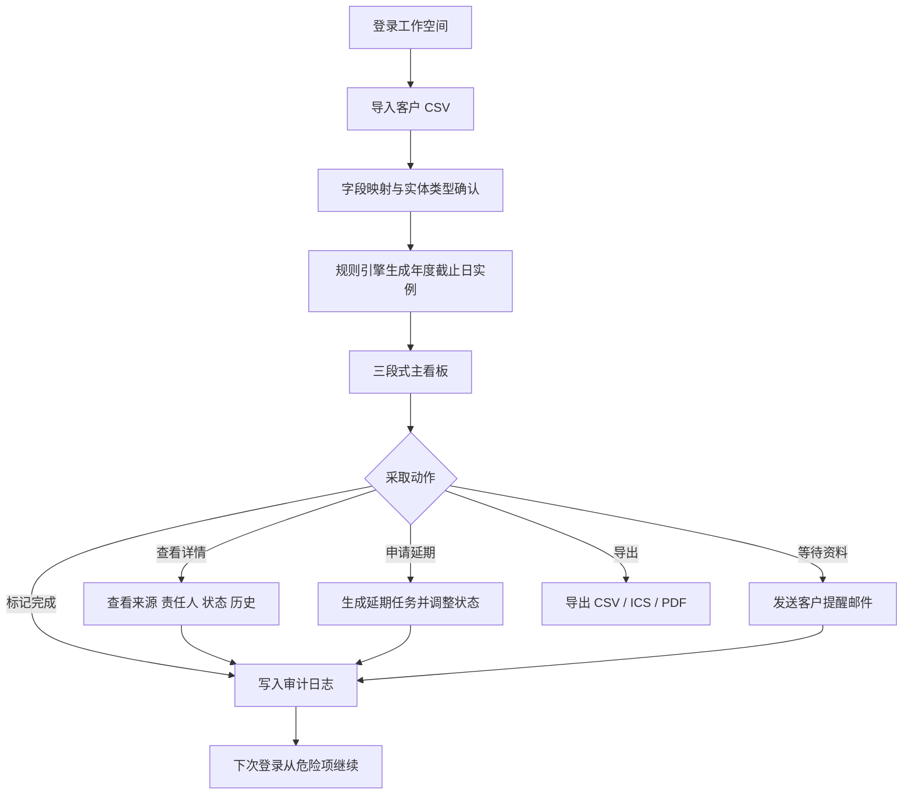
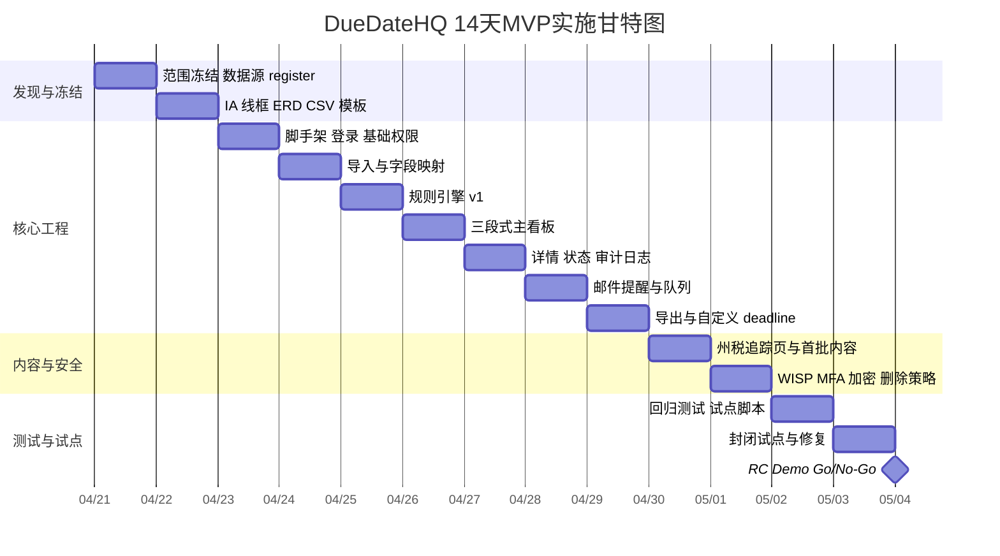

# DueDateHQ 14天MVP深度调研报告

> 文档状态：研究输入 / Demo 扩展方案。当前两周真实用户验证范围以 [DueDateHQ MVP v0.3 单一执行口径](./DueDateHQ%20-%20MVP%20边界声明.md) 为准。本文中的 CSV 导入、导出、审计日志、公开追踪页等建议不自动进入 v0.3 MVP。

DueDateHQ 在 14 天内最可行的目标，不是做“完整报税软件”，而是做面向独立 CPA 与小型事务所的“税务截止日 intelligence 层 + 轻工作流”Web MVP：先把官方截止日、州税差异、灾害延期、客户导入、提醒与审计日志做深，再把直接电子申报放到后续合作或受控扩展阶段。

## 行业背景与法规边界

在“预算、目标州、平台、语言均未指定”的前提下，本报告建议首发市场优先选择美国，首发平台采用 Web-first、桌面端优先、移动端响应式。这样做的原因是：entity["organization","美国州会计委员会全国协会","us accountancy boards"] 统计截至 2025-08-28 全美有 653,408 名活跃持证 CPA；entity["organization","美国小企业管理局","us small business agency"] 2026 FAQ 显示美国有 36,207,130 家小企业，占全部企业的 99.9%；entity["organization","美国国税局","us tax agency"] FY2024 数据则显示 266.6 million 份报表和表单中有 219.9 million 采用电子提交。也就是说，市场规模、数字化基础和付费土壤都足够成熟。citeturn1search0turn1search1turn1search6

税务截止日对会计师行业而言不是“静态日历问题”，而是“动态规则问题”。以官方页面为例：entity["state","加利福尼亚州","us state"] 个人所得税 2026 年申报可自动延期到 10 月 15 日，但税款仍应在 4 月 15 日前支付；entity["state","纽约州","us state"] PTET 选举必须在税年 3 月 15 日前完成；entity["state","得克萨斯州","us state"] franchise tax 年报通常在 5 月 15 日到期；而 IRS 的灾害减免页面又会持续发布“某州/某县某类申报延后至新的日期”的公告。这意味着 DueDateHQ 的产品本体应该是“规则引擎 + 官方源更新层”，而不是一张手工维护的月历。citeturn3search0turn4search3turn3search2turn21search0turn21search3

从监管边界看，14 天 MVP 必须明确不做 direct e-file transmission。原因有三点：第一，IRS 官方说明成为授权 e-file provider 从提交申请到获批最多可能需要 45 天；第二，IRS Publication 1345 对在线提供方规定了额外的 6 项安全、隐私和业务标准；第三，加州 FTB 明确写明其不接受 preparer 或 third-party transmitter 直接提交，只接受 approved software provider 传输。换言之，首发阶段应做“导入、规则计算、提醒、导出、伙伴衔接”，而不是直接联邦/州报送。citeturn17view4turn12view4turn18view0

| 研究假设 | 当前状态 | 建议设定 |
|---|---|---|
| 目标市场 | 未指定 | 美国税务从业者市场 |
| 首发州 | 未指定 | 联邦 + California / New York / Texas |
| 平台 | 未指定 | Web-first，HTML-first |
| 语言 | 未指定 | 对外英文优先；内部文档与运营可中英双语 |
| 预算 | 未指定 | 按 14 天 MVP 极限压缩，优先“能用、能测、能卖” |

## 目标用户与核心痛点

首发付费核心不应是“泛纳税人”，而应是独立 CPA、1–15 人小型事务所负责人、税务经理与高级 preparer。entity["organization","美国注册会计师协会","us cpa association"] 的 small firms 资源中心长期围绕小所经营、实践管理、忙季生存和技术工具展开，其 2025 MAP Survey 页面也强调 benchmarking、运营管理和战略调整的重要性。这说明小所不是“不需要工具”，而是需要更贴近其规模和节奏的工具。citeturn16search5turn16search0turn16search6

真正驱动购买的，不是“提醒一下到期了”，而是“减少 Monday triage 时间 + 降低漏报风险”。美国国税局对 late filing 和 late payment 都有明确罚则：failure-to-file 通常为每月 5%，最高 25%；failure-to-pay 通常为每月 0.5%，最高 25%。因此，会计师并不是在为一个“效率小优化”买单，而是在为“减少漏报、减少罚款、减少反复核对”买单。citeturn13search0turn13search1turn13search11

| 用户画像 | 典型规模 | 核心场景 | 最大痛点 | 首发优先级 |
|---|---:|---|---|---|
| 独立 CPA | 80–300 客户 | 每周分诊、延期判断、截止日追踪 | Excel、日历、邮件、便签割裂；多州规则记不住 | 最高 |
| 小型事务所税务经理 | 2–15 人所 | 团队分派、状态看板、批量提醒 | 看得到任务，看不到“官方规则变化” | 高 |
| 税务顾问 / Senior preparer | 多实体、多州客户 | PTET、延期、州税例外处理 | 查官网和复核日期耗时过高 | 高 |
| 小微企业主 | 1–50 人企业 | 配合 CPA 上传资料、确认何时做什么 | 不懂术语，只想接收清晰提醒 | 中 |
| 复杂个人纳税人 | 多州收入、K-1、延期需求 | 上传资料、签字、确认下一步动作 | 依赖 CPA 指引，自己不愿研究规则 | 中低 |

因此，DueDateHQ 的首发 JTBD 应压缩为三件事：第一，5 分钟内完成本周分诊；第二，规则变化后快速识别受影响客户；第三，把“谁做了什么、何时完成、是否延期”沉淀成可追溯记录。这个定义与小所管理现实、罚款风险和监管边界一致，也与您现有的产品草案方向高度一致。citeturn16search15turn13search0turn13search1

## 竞品格局与差异化定位

当前竞品分成两类：一类是“deadline / workflow-first”的轻工具，另一类是“practice management suite”的重平台。前者更接近痛点但通常老旧；后者现代化程度高，但常常不把官方截止日和州税变化作为核心能力。你上传的 File In Time 研究也支持这一判断：File In Time 更像“截止日控制台”，而非完整事务所操作系统。 fileciteturn1file0

| 竞品 | 主要功能 | 公开定价 | 目标客户 | 优势 | 劣势 |
|---|---|---|---|---|---|
| **entity["company","TimeValue Software","tax software vendor"] / File In Time** | auto reminders、roll-forward、打印 extension forms、批量修改、多达约 200 个联邦/州所得税返回服务、CSV 导入、Excel 导出、本地/网络部署 | 宣传单显示 $199/用户；首年含维护，次年维护 $100/用户；2026.1 仍在更新 | 小型税务所、偏本地化团队 | 最贴近“deadline-first”原始需求；价格直观；重复任务管理成熟 | Windows/桌面化明显；云协作、门户、API、现代 UI 弱 | citeturn10view0turn2search12 |
| **entity["company","TaxDome","practice management platform"]** | CRM、客户端门户、集成邮件/SMS/安全聊天、自动化、e-sign、支付、活动流、税务工作流、QBO 集成 | 1 年期每席位约：Essentials $800、Pro $1,000、Business $1,200；另有季节席位 | Solo 到成长型事务所 | 一体化很强，客户体验成熟，功能面广 | 核心不是“官方截止日 intelligence”；对极小团队偏重 | citeturn14view0 |
| **entity["company","Canopy","accounting software vendor"]** | CRM、文档与 eSign、Client Portal、Workflow、Payments、Reporting、AI、Smart Intake | Standard $74 / Plus $109 / Premium $149，按 user/month、年付 | 税务、会计、记账事务所 | 税务与运营结合较深，模块齐全 | 模块更多、价格更高，首发对手不是“小而专”工具 | citeturn7view3 |
| **entity["company","Jetpack Workflow","accounting workflow tool"]** | recurring work、deadline visibility、workflow templates、团队协作、14 天试用 | $49/月/席 或 $480/年/席 | 会计师、bookkeeper、CPA firm | “别漏 deadline”价值主张很清晰；云化轻量 | 权威规则层和州税变化监控不是强项 | citeturn9view0turn7view1 |
| **entity["company","Karbon","accounting practice management"]** | integrated email、workflow、client portal、document management、billing、payments、mobile app | Team $59/月/席（年付）/ $79 月付；Business $89/月/席（年付）/ $99 月付 | 成长型会计所 | 协作、邮件流、自动化和容量视图强 | 对独立 CPA 偏重、偏贵；不以截止日规则库为核心 | citeturn8view7 |
| **entity["company","Financial Cents","accounting practice management"]** | client CRM、audit trail、chat、billing、QBO 集成、client portal、自动提醒 | Solo $19/月；Team $49/月/席；Scale $69/月/席（年付）；另有 Enterprise | 小所、bookkeeper、CPA | 易用、上手快、QBO 整合好；主页展示 AICPA SOC 2 徽章 | 仍是 workflow-first，规则权威性与州税差异不是护城河 | citeturn8view3turn8view5turn15view0turn11search0 |

结论很明确：DueDateHQ 不应在 14 天内尝试“打赢所有平台”，而应卡位在 File In Time 与云端通用 PM 套件之间，成为“官方截止日 intelligence 层”。一句话定位可以写成：**把最正确的截止日，用最短的路径，送到最需要行动的人眼前。** 这一定位既能正面吃掉 Excel/File In Time 升级盘，也能作为 TaxDome、Canopy、Karbon、Financial Cents 之上的增强层存在。citeturn10view0turn14view0turn7view3turn8view7turn15view0

## MVP-14d 范围与功能优先级

14 天内交付“相对完整的 MVP”是可行的，但前提非常严格：**不做 direct e-file、不做税额计算、不做全国 50 州完整覆盖、不做复杂客户门户、不做重型自动化引擎。** 否则项目会直接撞上 IRS/州级 e-file 准入、测试和支持成本。citeturn17view4turn18view0turn12view4

| 优先级 | MVP-14d 功能 | 实现要点 | 验收标准 | 估算工时 | 负责人角色 |
|---|---|---|---|---:|---|
| P0 | 登录、工作空间、基础权限 | 管理员/成员两级权限；预留 MFA；租户隔离优先做“单租户多所配置”或轻多租户 | 非管理员无法修改规则与导出全量数据；登录稳定可用 | 3 人日 | 工程、产品 |
| P0 | 客户 CSV 导入与字段映射 | 支持客户名、州、实体类型、税种、联系邮箱；导入后立即生成任务实例 | 3 套样例 CSV 成功导入；字段缺失有清晰报错 | 5 人日 | 工程、设计、QA |
| P0 | 规则引擎 v1 | 联邦 + CA/NY/TX；按州/实体/税种/可延期与否建模；规则版本化 | 20 组样例客户与人工核对一致率 100% | 6 人日 | 工程、内容/合规 |
| P0 | 三段式主看板 | 本周到期 / 本月预警 / 长期计划；支持州/税种/状态筛选 | 1,000 条实例列表筛选 p95 ≤ 800ms | 5 人日 | 工程、设计 |
| P0 | 截止日详情与状态流转 | 状态：未开始/进行中/已完成/已延期；备注、责任人、更新时间 | 每次状态变更都写审计日志 | 3 人日 | 工程、QA |
| P0 | 邮件提醒 | 每日摘要、即将到期提醒、规则变化横幅 | 发送成功率 ≥95%；用户可关闭某类提醒 | 3 人日 | 工程、运营 |
| P1 | 自定义截止日与批量调整 | 补充非标准任务；规则变动后批量更新 | 批量更新可回滚；写全量日志 | 2.5 人日 | 工程、产品 |
| P1 | 导出能力 | CSV、ICS、PDF 至少做两项，建议三项都做 | CSV 可回导；ICS 可入日历；PDF 可作为客户摘要 | 2.5 人日 | 工程、设计 |
| P1 | 公开演示页 | 州税追踪页、官方来源链接、更新时间、订阅表单 | 对外可访问；首批内容 ≥10 条 | 3 人日 | 运营、内容、设计 |
| P0 跨项 | 部署、日志、备份、安全基线 | HTTPS、加密、最小权限、基础监控、删除策略 | 无 P0 安全缺陷；可试点上线 | 4 人日 | 工程、合规、QA |

**MVP-14d 最小可交付功能清单**建议冻结为：  
客户导入、规则引擎 v1、三段式看板、详情与状态流转、邮件提醒、导出、审计日志、基础权限、公开追踪页。所有其他需求——包括 direct e-file、短信、多语言客户端门户、AI 自然语言助理、QBO 深度双向写回——都放到 D15 以后。这个取舍，是 14 天内达成“可演示、可试点、可收费”的关键。citeturn17view4turn18view0

## 技术实现与UX方案

技术路线建议采用 **HTML-first + 服务器端渲染 + 渐进增强**。原因是 DueDateHQ 首版主要由表格、筛选器、表单、详情抽屉、导入映射页和导出页面构成；这类后台工作台并不需要重型 SPA，反而更适合用简洁的 HTML 模板让复杂度留给“规则、提醒、审计、合规”。如果坚持前端“以 HTML 为主”，最推荐的组合是：**HTMX + Alpine.js + Tailwind CSS + Tabler/Flowbite Dashboard 模板**；后端采用 **Fastify 或 Express + TypeScript + PostgreSQL + Redis + S3 兼容对象存储**。这套组合的优势是上手快、样板少、SSR 友好、利于 SEO、利于无障碍、利于 14 天内连续交付。  

| 技术层 | 建议栈 | 为什么能加速 14 天交付 |
|---|---|---|
| 前端渲染 | 服务器端模板（Nunjucks / EJS） | 页面以列表与表单为主，SSR 明显比 SPA 更省时 |
| 交互增强 | HTMX + Alpine.js | 避免前后端双状态；只在局部加交互 |
| 样式与模板 | Tailwind CSS + Tabler / Flowbite Dashboard | 后台组件现成，减少 CSS 与设计开销 |
| 后端 | Fastify + TypeScript；若团队更熟悉 Express，则优先沿用 | 比 Nest 更轻，14 天内更适合快速迭代 |
| ORM / 数据迁移 | Prisma | deadline rule / instance / audit log 变更快，迁移成本低 |
| 数据库 | PostgreSQL | 结构化规则、实例、租户、日志都适合关系型建模 |
| 队列与缓存 | Redis + BullMQ | 邮件摘要、批处理、提醒队列最省心 |
| 文件存储 | S3 / R2 兼容对象存储 | 导出文件、日志快照、附件统一存放 |
| 邮件 | Resend / Postmark | 提醒与试点通知可快速打通 |
| 部署 | Render / Fly.io / Railway | 降低 DevOps 重活，适合 MVP |

集成策略建议分三层。第一层是最低公共接口：CSV 导入导出、ICS、PDF；这是 14 天内必须打通的互通方式。第二层是账务数据接口：优先接入 entity["company","Intuit","financial software company"] 生态中的 QuickBooks Online，因为其官方开发者文档明确提供 REST Framework、API Explorer、Sandbox 和 Webhooks；同时预留 entity["company","Xero","accounting software company"] Accounting API 作为后续扩展。第三层才是税务软件生态衔接：Intuit ProConnect 官方页面显示其现有集成更偏向 QBOA、Google Drive/Dropbox、SmartVault、Karbon、Ignition 等“围绕税务工作的生态拼接”，而不是给新产品一条零门槛的 direct filing API，因此 MVP 更合理的路线仍是“衔接而非直提”。citeturn3search3turn3search4turn19search1turn19search3turn19search8

在 UX 上，首版不应追求“很炫”，而应追求“CPA 一眼就会用”。主看板只保留三个高频视图：本周到期、本月危险、长期计划；每个实例都必须同时展示客户、州、税种、实体、到期日、状态、责任人与官方来源更新时间。对 DueDateHQ 这种产品来说，视觉复杂度越低，用户越容易在第一次试用时感知到价值。

## 安全合规、测试计划与上线门槛

只要 DueDateHQ 存储或处理 taxpayer information，它就不再是普通 SaaS。entity["organization","美国联邦贸易委员会","us consumer regulator"] 的 Safeguards Rule 要求受监管机构建立书面的信息安全计划，并进行风险评估、访问控制、加密、MFA、服务商管理和事件报告；IRS Publication 4557 明确写明“保护纳税人数据是法律要求”，Publication 5708 则专门帮助税务从业者——尤其是小型实践——建立一版 WISP。citeturn17view0turn17view1turn17view2

另一个必须正视的边界是 IRC §7216。IRS Section 7216 信息中心强调，未经纳税人同意，tax return information 的使用和披露受到限制；即便法规允许在特定条件下形成匿名统计，也不能把该信息随意用于非 return preparation 目的。因此，DueDateHQ 首版必须明确禁止两类危险动作：一是默认把客户税务数据送入外部 AI 作训练或无控制分析；二是让与 return preparation 无关的服务商、外包支持或营销系统直接接触完整客户数据。citeturn17view3turn0search11turn0search18

如果未来要走“在线直接申报”路线，则安全要求还会再上一个台阶。Publication 1345 指出，在线提供方需要满足六类附加标准，包括 EV 证书/TLS 1.2+、独立第三方每周外部漏洞扫描、书面信息隐私与 safeguard 政策、防 bulk fraudulent filing、公开且锁定的美国域名注册，以及在确认事件后的**下一个工作日**向 IRS 报告安全事故。这再次证明：14 天 MVP 不应跨进这一层。citeturn12view4turn12view1

| 上线前安全/合规检查清单 | 最低门槛 | 风险说明 |
|---|---|---|
| WISP（书面信息安全计划） | 必须完成 v1 | 否则很难通过税务所客户的安全问卷与内部放行 citeturn17view1turn17view2 |
| MFA | 管理员与内部成员启用 | Safeguards Rule 明确要求对访问 customer information 的人员实施 MFA citeturn20view0 |
| 加密 | 传输中 TLS；静态加密开启 | FTC 要求保护 customer information 的机密性与完整性 citeturn20view1 |
| 最小权限 | 管理员/成员至少两级；敏感导出受限 | 访问控制必须定期复核 citeturn20view2 |
| 审计日志 | 状态变更、导出、批量调整全留痕 | FTC 要求维护授权用户活动日志并检测越权访问 citeturn20view3 |
| 数据删除策略 | 默认“最近一次使用后 2 年内删除”，除非有合法保留理由 | FTC 对 customer information 处置有明确时限导向 citeturn20view3 |
| 第三方/服务商控制 | 邮件、云存储、分析、客服服务商需签合同并受审查 | Safeguards Rule 要求监控 service providers citeturn20view4 |
| IRC §7216 风险说明 | 隐私政策、内部 SOP、AI 使用政策里均应落地 | 防止越权使用税表信息 citeturn17view3turn0search11 |
| 可访问性 | 关键路径按 WCAG 2.2 AA 近似目标验收 | HTML-first 天然利于无障碍，但仍需人工测试 citeturn17view6 |
| 隐私权准备 | 若后续触发 CCPA 阈值，应补请求处理和告知机制 | CCPA 赋予知情、删除、更正、限制等权利 citeturn17view5 |

测试计划建议采用“封闭试点优先”。情景 A 小团队建议试点 **5 家事务所、8–10 名从业者、300–500 个客户档案**；情景 B 中等团队建议试点 **8 家事务所、12–15 名从业者、600–800 个客户档案**。首轮只验证三件事：导入是否顺畅、危险项是否一眼看懂、提醒与状态流是否真正减少人工追踪。  

| 测试维度 | 关键用例 | 验收门槛 |
|---|---|---|
| 导入 | 3 种 CSV 样式、字段缺失、州/实体映射错误 | 映射成功率 ≥70%，其余可人工完成 |
| 规则正确性 | 联邦 + CA/NY/TX 样例 20 组 | P0 样例一致率 100% |
| 列表与筛选性能 | 1,000 条实例、多筛选组合 | p95 ≤ 800ms |
| 提醒链路 | 每日摘要、即将到期提醒、规则变化通知 | 邮件发送成功率 ≥95% |
| 审计与权限 | 普通成员尝试导出、批量调整、改规则 | 越权必须失败；日志可回放 |
| 回归门槛 | D12–D14 修复后全量复测 | P0 缺陷为 0；P1 未解决 ≤5 且有绕行方案 |

## 商业模式、14天时间线与交付物

定价不建议抄大而全平台，也不建议做成低价一次性桌面授权。更合理的方式是做“轻专精 SaaS”：价格明显低于大型 practice management 套件，但能体现“官方规则维护、持续更新、提醒和审计”的持续价值。结合官方竞品价格锚点，建议首发定价如下：Solo $39/月、Firm $99/月、Pro $199/月，并配 14–30 天试用。这个区间低于 TaxDome、Canopy、Karbon 的主流席位成本，也与 Financial Cents/Jetpack 的轻量云工具区间相邻，更适合独立 CPA 与 1–5 人小所。citeturn14view0turn7view3turn8view7turn8view3turn9view0

| 套餐 | 建议价格 | 对象 | 核心内容 |
|---|---:|---|---|
| Solo | $39/月 | 独立 CPA | 规则库、导入、看板、提醒、导出、自定义截止日 |
| Firm | $99/月 | 2–5 人事务所 | 多席位、责任人、共享视图、批量调整、增强审计 |
| Pro | $199/月 | 6–15 人事务所 | API 预留、优先支持、扩州别、增强导出 |
| Trial | 14–30 天 | 全部新用户 | 导入样例数据并看到“本季度危险项” |

市场进入建议走“内容驱动 + 社区验证 + 伙伴嵌入”三步。最好的最小演示页不是品牌首页，而是“州税变更追踪页”：它既能承接搜索流量，又能证明 DueDateHQ 的产品核心真的是“官方来源 + 变化跟踪”。同时，应优先接触 AICPA small firm 语境中的独立所、小所运营者和税务顾问，而不是直接做散户纳税人投放。citeturn21search0turn16search5turn16search15

| 对外公开的最小演示页 | 草案结构 |
|---|---|
| 州税变更追踪页 | H1；州筛选；最新公告卡片；影响税种/实体；更新时间；官方来源；邮件订阅 |
| 联邦+州截止日总览页 | 年度时间轴；联邦主节点；州差异；延期与缴款分离说明；FAQ |
| 多州 CPA 看板演示页 | 匿名测试数据；看板截图/交互；导入前后对比；CTA |
| 安全与合规页 | WISP 摘要、MFA、加密、日志、删除策略、数据使用边界 |

| 首批 10 条可发布内容主题 | 用途 |
|---|---|
| 2026 联邦报税关键截止日总表 | 抓综合检索流量 |
| California 截止日与自动延期说明 | 高搜索意图州内容 |
| New York PTET 选举与常见误区 | 高价值专业长尾 |
| Texas franchise tax 申报速查 | 服务多州小企客户 |
| 灾害减免如何改变 deadline 管理逻辑 | 强化“动态规则”认知 |
| S Corp / Partnership / LLC 节点差异 | 实体类型型搜索 |
| 为什么延期申报不等于延期缴税 | 教育型内容 |
| 小型事务所如何减少 Monday triage 时间 | 直接承接卖点 |
| IRC §7216 对税务软件意味着什么 | 吸引高质量专业访客 |
| 如何写一版 CPA 事务所 WISP | 合规型内容与品牌信任 |

按“今天即启动”计算，建议把 14 天计划定为 **2026-04-21 至 2026-05-04**。A/B 两种团队情景的最大日可用工时约为：A 情景 37.6h/天，B 情景 68h/天；以下计划均在该约束内。  

| 日期 | 每日里程碑 | 负责人角色 | 当日交付物 | 情景A 分配与工时 | 情景B 分配与工时 | 主要风险与应对 |
|---|---|---|---|---|---|---|
| D1 04/21 | 冻结范围 | 产品、工程、合规 | PRD v1、非目标项清单、州别范围、数据源 register | 产品 8h；工程 14h；合规 2h；设计 2h；QA 2h；运营 2h＝30h | 产品 8h；工程 24h；合规 4h；设计 6h；QA 4h；运营 4h＝50h | 范围漂移；当日签字冻结“不做清单” |
| D2 04/22 | IA 与数据模型 | 产品、设计、工程 | 页面树、低保真线框、ERD、CSV 模板 v1 | 34h | 56h | 页面过多；只保留 6–8 个关键页面 |
| D3 04/23 | 脚手架跑通 | 工程、设计 | SSR 模板、Tailwind/HTMX、登录页、布局组件 | 36h | 60h | 技术栈过重；不启用重 SPA |
| D4 04/24 | 导入链路可用 | 工程、设计、QA | 上传页、映射页、样例 CSV、错误提示 | 37h | 62h | 映射复杂；先做建议映射，不做黑盒 AI |
| D5 04/25 | 规则引擎 v1 | 工程、内容、合规 | 联邦+CA/NY/TX 规则表、版本号、实例生成器 | 38h | 66h | 规则误读；双人复核并保留来源 |
| D6 04/26 | 主看板完成 | 工程、设计 | 三段式 Dashboard、筛选器、排序与倒计时 | 38h | 66h | 交互过多；先做表格/卡片混合视图 |
| D7 04/27 | 核心流程闭环 | 工程、QA | 详情页、状态机、备注、责任人与 audit log | 34h | 60h | 状态设计返工；状态枚举当天冻结 |
| D8 04/28 | 提醒系统可用 | 工程、运营 | reminder worker、邮件模板、通知设置页 | 32h | 56h | 邮件可达率；使用成熟邮件服务并预热域名 |
| D9 04/29 | 导出与自定义能力 | 工程、设计、QA | CSV/ICS/PDF、自定义截止日、批量调整 | 34h | 58h | PDF 耗时；模板化输出并限字段 |
| D10 04/30 | 公共演示内容完成 | 运营、内容、设计、产品 | 州税追踪页、首批 10 条内容、SEO metadata | 35h | 60h | 内容太广；只做高意图主题 |
| D11 05/01 | 安全基线完成 | 合规、工程、QA | WISP v1、MFA、加密、删除策略、权限复核 | 28h | 52h | 文档滞后；先产出 v1 并映射实际控制 |
| D12 05/02 | 测试就绪 | QA、工程、运营 | 回归用例、试点脚本、种子数据、性能报告 | 32h | 56h | 缺陷堆积；当日开始 bug triage |
| D13 05/03 | 封闭试点 | 运营、QA、工程、产品 | 试点反馈表、修复清单、Beta build | 36h | 62h | 反馈过多；只处理 P0/P1，不扩功能 |
| D14 05/04 | 发布候选 | 产品、工程、运营、合规 | RC 包、Demo 脚本、销售 FAQ、Go/No-Go 决议 | 34h | 58h | 临门加需求；Go/No-Go 后禁止再加功能 |

| 14 天内最终交付物清单 | 说明 |
|---|---|
| PRD v1 与冻结范围表 | 明确做/不做、成功指标、首发州 |
| 规则源矩阵 | 联邦 + 首发州 + 税种 + 规则版本 + 官方来源 |
| HTML-first 可交互 MVP | 登录、导入、看板、详情、提醒、导出、公开页 |
| 规则引擎 v1 | deadline rule / instance 生成与版本管理 |
| CSV 模板与种子数据 | 用于试点导入和演示 |
| WISP v1 与安全清单 | 覆盖 MFA、加密、日志、删除策略、服务商控制 |
| 测试用例与试点包 | 回归清单、FAQ、反馈表、支持脚本 |
| 商业化材料 | 定价页草案、销售 FAQ、Demo 脚本、首批 SEO 内容 |

最终的产品决策建议与优先级如下：

| 维度 | P0 现在做 | P1 下一轮做 | P2 暂缓 |
|---|---|---|---|
| 产品范围 | 官方规则层、导入、看板、提醒、导出、审计 | 团队协作增强、客户共享页、规则变化摘要、QBO/Xero 更深集成 | 税额计算、完整门户、短信、direct e-file |
| 技术路线 | HTML-first、SSR、HTMX、Fastify/Express、Postgres、Redis | 局部复杂模块再引入更重前端 | 一开始做 SPA 重架构 |
| 商业策略 | 独立 CPA / 小所；试点 5–8 家；内容驱动获客 | 合作伙伴集成、扩州别、API 商业化 | 直接打泛个人纳税人市场 |
| 合规策略 | WISP、MFA、加密、最小权限、审计日志、删除策略 | SOC 2 路线、更多州规则复核流程 | 首发即申请成为 direct transmitter |

**最终判断：建议立项，而且建议立即按 14 天 MVP 路径推进；但必须把“DueDateHQ = 截止日 intelligence 层”写成项目守则。** 这一路线既符合美国税务行业的真实监管门槛，也最贴合小型事务所的付费逻辑与 14 天交付窗口。如果范围守住，DueDateHQ 有机会在两周内交出一个“能演示、能试点、能开始收集真实付费信号”的首版。
