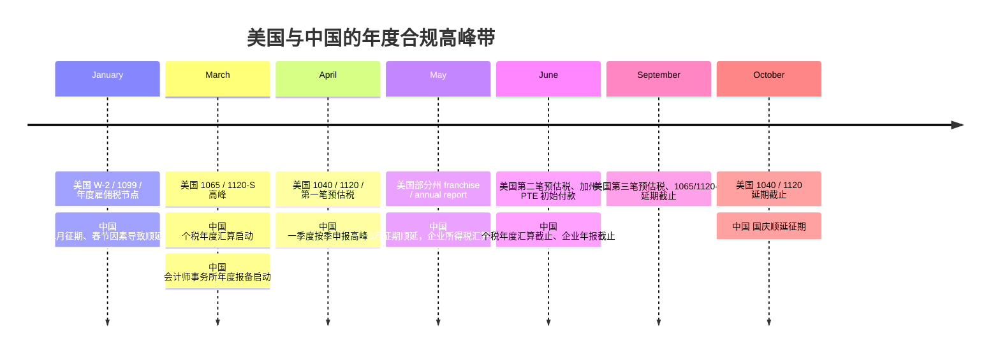
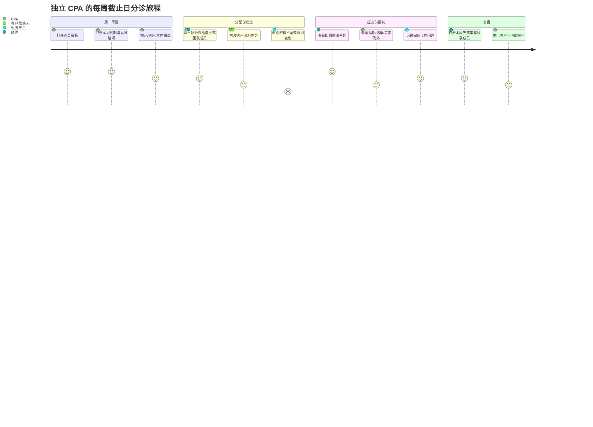

# DueDateHQ 截止日与合规负载控制台行业与产品调研报告

> 文档状态：行业与产品研究输入。当前两周真实用户验证范围以 [DueDateHQ MVP v0.3 单一执行口径](./DueDateHQ%20-%20MVP%20边界声明.md) 为准。本文中的负载平衡、规则中心、风险中心、团队视图等是长期产品方向，不直接扩大 v0.3 MVP。

## 执行摘要

基于你提供的内部材料，DueDateHQ 当前被定义为面向独立 CPA 与小型事务所的“截止日与合规负载控制台”，核心目标不是再做一个通用事务所管理系统，而是把分散在 Excel、日历、邮件与州税门户中的截止日、优先级与执行状态收拢成一个高信号密度的工作台。内部文档已经给出了三个很清晰的北极星场景：周一早晨的快速分诊、从竞品/CSV 的低摩擦导入、以及面对税法变化时的快速重排与响应；并提出了“30 秒看到本周行动项”“5 分钟完成分诊”“30 分钟导入 30 个客户”的体验目标。fileciteturn0file1 fileciteturn0file2

从行业与监管角度看，这个定位是成立的，但要比内部材料里写得更“窄、更深、更可执行”。美国市场的复杂性来自联邦与州两层规则叠加、实体类型差异、灾害延期与州级特别税制；中国市场的复杂性则主要来自月/季征期、年度汇算清缴、企业年报与本地电子税务局流程。两地都不是“缺提醒”，而是缺一个能把法规变化、客户状态、团队容量和风险优先级同时可视化的控制台。citeturn17view0turn19view0turn19view2turn20search0turn21search1turn29view3turn11search13turn29view0

竞品格局也支持这一判断。最接近 DueDateHQ 的不是大而全的一体化事务所平台，而是“直接截止日工具 + 通用工作流/事务所管理平台 + 本地财税 SaaS”的混合竞争面：直接工具代表是 File In Time；更强的一体化平台包括 TaxDome、Karbon、Canopy、Jetpack Workflow、Financial Cents；中国侧更常见的是金蝶账无忧、用友好会计、柠檬云这类强调票财税一体、批量报税或代账流程的平台。问题在于，前者偏老旧，后者偏重、偏贵、偏全栈，而中国市场又缺少一个明确以“截止日 intelligence + 负载平衡”定义自己的类别。citeturn4search20turn27view0turn6view1turn6view2turn6view4turn7view2turn28search12turn28search3turn28search2

因此，本文的核心结论是：DueDateHQ 的最优切入点应当是**“deadline system of record + load/risk console”**，而不是“轻版 TaxDome”或“更漂亮的日历”。产品设计上，P0 必须覆盖提醒/日历、合规清单、团队与个人负载、截止日状态流转、规则来源与审计轨迹；P1 再加入风险评分与自动化建议；P2 才考虑更广义的客户门户、文档、收款与深度 CRM。商业上，内部文档提出的 $49/月更像成熟阶段价格，而非首发切入价；若首发仅做提醒日历，很难支撑该定价，但如果能真正交付多州截止日数据库、容量视图、灾害延期覆盖与高解释性的风险优先级，$29–49/月区间是有机会成立的。fileciteturn0file2 citeturn16view0turn15view0turn27view0turn6view1turn6view4turn7view2

小结：DueDateHQ 机会真实，但前提是把自己定义成“合规运营控制台”，而不是“又一个会计软件”。  
本章重点词汇：截止日系统、分诊、负载平衡、风险优先级、轻量切入。

## 行业背景与法规环境

美国与中国都存在稳定、刚性的合规日历，但其“复杂性形态”不同。美国对独立 CPA 和小所最棘手的是联邦日历之外还有州税差异、实体分类差异、选举性税制差异、灾害延期与局部监管变化；中国则更集中在统一征期、月/季申报、多平台切换、年度汇算与企业/事务所年报备案。对 DueDateHQ 而言，这意味着“日期”不是一个静态字段，而是**规则 + 地域 + 实体 + 年度例外**共同决定的结果。citeturn17view0turn20search0turn21search1turn29view3turn11search13turn29view0

内部商业计划书把美国目标市场写成“40 万+ CPA”；但如果以 entity["organization","NASBA","national accty boards"] 的官方口径看，截至 2025 年 8 月 28 日，美国活跃持证 CPA 为 653,408 人。中国方面，entity["organization","中国注册会计师协会","china cpa institute"] 披露截至 2024 年底全国执业会员约 105,007 人、会员总数 388,809 人。也就是说，美国总盘子更大，且多州税务复杂度更高；中国执业 CPA 总量较小，但以代账、财税团队、内部财务为中心的高频月度工作流更重。citeturn13view0turn12view0

下表概括了对 DueDateHQ 最 relevant 的合规类型、关键截止日与监管主体。表中时间以最常见日历年企业/个人为主，实际仍需以年度、周末/节假日顺延与主管机关口径为准。citeturn17view0turn19view0turn19view2turn19view4turn21search1turn29view1turn11search13turn29view0turn25search1

| 合规类型                   | 美国常见截止日与监管主体                                                                                                                                   | 中国常见截止日与监管主体                                                                                                                                                                        | 对产品的含义                                            |
| -------------------------- | ---------------------------------------------------------------------------------------------------------------------------------------------------------- | ----------------------------------------------------------------------------------------------------------------------------------------------------------------------------------------------- | ------------------------------------------------------- |
| 个人所得税                 | 1040/1040-SR 通常 4 月 15 日；预估税 4/15、6/15、9/15、次年 1/15；监管主体以 entity["organization","美国国税局","us tax agency"] 为主                   | 综合所得年度汇算通常 3 月 1 日至 6 月 30 日；监管主体以 entity["organization","国家税务总局","china tax authority"] 为主                                                                     | 需要“主申报日 + 预缴/补税 + 是否已预约/已汇算”状态机    |
| 合伙企业 / S Corp / C Corp | 1065、1120-S 通常 3 月 15 日附近；1120 通常 4 月 15 日；联邦与州分层                                                                                       | 企业所得税多按季预缴并在年度汇算周期内完成年度申报                                                                                                                                              | 需要按实体类型自动生成不同 obligation 模板              |
| 雇佣/工资税                | W-2/W-3/1099-NEC 年初集中到期；941 按季度；联邦 + 州雇佣税并存                                                                                             | 个税代扣代缴、社保费等按月/征期执行，渠道常在电子税务局/本地平台                                                                                                                                | 需要把“高频 recurring work”与“审核/提交型 work”分层展示 |
| 销售税 / VAT / 附加税      | 美国州销售税周期和频率差异大                                                                                                                               | 中国按月/按季征期，增值税及附加税费与节假日顺延强相关                                                                                                                                           | 需要频率引擎和节假日顺延逻辑成为产品一等公民            |
| 年度企业报告 / 工商合规    | 州差异显著，如 entity["state","Delaware","us state"] 公司年报/特许税常见 3 月 1 日；entity["state","Texas","us state"] franchise tax 常见 5 月 15 日 | 企业年报通常 1 月 1 日至 6 月 30 日在国家企业信用信息公示系统报送；监管涉及 entity["organization","国家市场监督管理总局","china market regulator"] 体系                                      | 不能只做“税”，要把高频工商截止日纳入同一控制台          |
| 州级特别税制 / 选举        | entity["state","California","us state"] PTE 初始付款常见 6 月 15 日；entity["state","New York","us state"] PTET/NYC PTET 有 3 月 15 日与分期付款节奏 | 特别优惠、出口退税等偏行业/场景化，更适合后续行业包                                                                                                                                             | 必须支持“选举 deadline”与“申报 deadline”分开建模        |
| 事务所自身监管             | 州会计委员会、执照维护、继续教育等                                                                                                                         | 会计师事务所年度报备通常 3 月 15 日至 5 月 31 日；主管部门含 entity["organization","财政部","china finance ministry"] 与 entity["organization","中国注册会计师协会","cpa self-regulator"] | 平台既可服务客户截止日，也可服务事务所自有合规          |

对美国而言，真正让 DueDateHQ 有产品价值的不是“联邦税历”本身，而是州差异和例外处理。例如：加州 PTE 付款点与实体税点不同；纽约 PTET/NYC PTET 有独立选举与估缴节奏；德州和特拉华州有各自的 franchise/annual report 规则；而灾害公告还可能把同一州内不同县的截止日一起顺延。也就是说，美国侧必须把**州、县、实体、灾害公告、选举性规则**统一为一套解释层。citeturn22search0turn22search1turn22search4turn20search0turn20search5turn20search9

对中国而言，产品逻辑则应从“征期 calendar”出发。国家税务总局对实行每月或每季度期满后 15 日内申报纳税的税种按年发布征期通知；2026 年就出现了 1 月 20 日、2 月 24 日、4 月 20 日、5 月 22 日、10 月 26 日等因节假日顺延的节点。与此同时，增值税、附加税费、个税、企业所得税预缴、年度个税汇算、企业年报、事务所年度报备等分属不同事务类型但会落到同一财税团队手里。换言之，中国版 DueDateHQ 的主界面更应像“征期作战室”，而不是“单客户税表面板”。citeturn21search1turn29view3turn29view1turn11search13turn29view0

还有一个对美国产品边界非常关键的变化：entity["organization","FinCEN","us treasury bureau"] 在 2025 年 3 月发布临时最终规则后，将 BOI 申报义务大幅收缩，国内美国实体通常不再是主要申报对象。这意味着“BOI deadline tracking”不应再占据 DueDateHQ 的 MVP 核心位置，最多作为可选规则包。相反，应把精力放在仍然高频且不会消失的联邦/州税务与年度工商合规上。citeturn0search3

小结：DueDateHQ 不是在管理“日期列表”，而是在管理随政策、地域、实体与例外而变化的合规规则。  
本章重点词汇：联邦与州差异、征期、选举性规则、灾害延期、工商年报。

## 目标用户与工作流程

你给的内部材料非常有价值，因为它把抽象的“会计行业痛点”落成了具体情境：一位服务约 80 个客户的独立 CPA 在申报季每周一要先判断“这周到底该做什么”；一位从 TaxDome 迁移的使用者最怕导入太慢；第三个核心场景则是面对法规变化时要快速重排全年任务。这三个场景基本把 DueDateHQ 的主价值链全部框住了：**看清、导入、重排**。fileciteturn0file1

行业调研也支持这一点。Thomson Reuters 的 2025 调查显示，效率与技术是事务所领导者的首要优先项；“招聘与留人”仍是最大挑战，而“时间管理/按时申报”和“重负载/资源分布不均”已经进入最让人失眠的问题清单。AICPA 小所洞察则显示，小事务所对 AI/自动化并非天然排斥，但会更谨慎，真正愿意买单的是能直接改善容量、利润与客户体验的工具。citeturn15view0turn16view0

在此基础上，可以把目标用户分成四类，而不是只盯着“CPA”一个称谓：

| 角色                | 主要职责                         | 最核心 KPI                 | 最怕出的问题                            | 对 DueDateHQ 的核心期待              |
| ------------------- | -------------------------------- | -------------------------- | --------------------------------------- | ------------------------------------ |
| 独立/签字 CPA       | 对客户整体合规与申报结果负责     | 零漏报、零延误、客户留存   | 忘记 deadline、错过选举、灾害延期没跟上 | 一眼看清本周风险与优先级             |
| 事务所经理          | 分配任务、平衡忙季容量、监督状态 | 团队利用率、及时率、复用率 | 某人过载、某州集中爆仓、状态不透明      | 负载视图、瓶颈预警、例外队列         |
| 税务专员/执行会计   | 具体准备、追资料、提交流程       | 完成量、返工率、逾期率     | 临近截止才发现资料不全或规则已变        | 清单化执行、依赖关系、提醒与批量动作 |
| 客户联络人/客户成功 | 催资料、解释 deadline、同步进度  | 资料回收率、响应率         | 客户不知道为什么急、沟通断层            | 可解释的客户任务与标准话术           |

从信息来源看，用户不是缺“来源”，而是来源过多：美国要盯 IRS 日历、州税局网站、灾害公告、客户邮件、工资服务商与秘书州/公司注册机关；中国要盯国家税务总局征期通知、电子税务局、企业信用信息公示系统、事务所年度报备平台，以及地方社保/住房公积金等渠道。DueDateHQ 的工作不是替代这些源头，而是把它们变成“已解释、可执行、可分配”的任务对象。citeturn30view1turn20search0turn20search14turn22search15turn21search1turn29view0turn11search13

因此，目标工作流不应被设计成传统软件那种“客户详情页 → 表单 → 提交”链路，而应是以下顺序：先看整个盘面的截止日与风险，再进入某个客户/某个州/某个团队成员的工作包，最后回到总盘面确认负载与例外是否被消化。也就是说，首页首先是**运营视角**，其次才是**档案视角**。这一点和许多 practice management 平台“客户主记录”为中心的设计不同，恰恰是 DueDateHQ 的差异化。fileciteturn0file1 citeturn27view0turn6view1turn6view4

小结：用户真正需要的不是“另一个待办工具”，而是把法规复杂度翻译成运营优先级的工作台。  
本章重点词汇：角色分层、信息来源、分诊、容量视图、例外管理。

## 竞品与替代方案

目前市场上的相关产品大致分成三层。第一层是“直接截止日工具”，强调税表日期数据库和日历；第二层是“事务所管理套件”，把 CRM、文档、工作流、收款、客户门户全部打包；第三层是中国常见的“财税/代账 SaaS”，更强调票财税一体、批量报税与代账流程。DueDateHQ 的竞争，不是和某一个产品一对一，而是与这三层的组合价值竞争。citeturn4search12turn27view0turn6view1turn6view2turn6view4turn7view2turn28search12turn28search3turn28search2

下表基于公开官网/帮助中心信息整理。由于不同产品的“负载”“风险”“自动化”定义不完全一致，表格采用产品研究口径，而非严格技术验收口径。官方产品页与公开定价/功能说明可直接作为界面与定位参考。citeturn4search20turn27view0turn6view1turn6view2turn6view4turn7view2

| 产品                                                            | 定位             | 提醒/日历 | 截止日规则库 | 负载平衡 | 风险/分析 | 客户门户/文档 | 自动化 | 定价模型                                                         | 简评                                                     |
| --------------------------------------------------------------- | ---------------- | --------- | ------------ | -------- | --------- | ------------- | ------ | ---------------------------------------------------------------- | -------------------------------------------------------- |
| File In Time                                                    | 直接截止日工具   | 强        | 强           | 弱       | 弱        | 弱            | 弱     | 官方搜索摘要显示约 $199/用户，首年维护含在内                     | 最接近 DueDateHQ 的“日期数据库”方向，但偏桌面、偏老式    |
| **entity["company","TaxDome","tax practice platform"]**      | 一体化事务所平台 | 强        | 中           | 中强     | 中强      | 强            | 强     | Essentials/Pro/Business 约 $800/$1000/$1200 每席位每年（1 年期） | 功能全、价格清晰，但对“只想先管 deadline”的小所仍偏重    |
| **entity["company","Jetpack Workflow","workflow software"]** | 会计工作流平台   | 强        | 中弱         | 中       | 弱到中    | 弱            | 中     | $40/用户/月（年付）或 $49（月付）                                | 对 recurring work 很强，但规则数据库不是其核心卖点       |
| **entity["company","Financial Cents","accounting pm"]**      | 中小所实践管理   | 强        | 中弱         | 中       | 中        | 中强          | 中强   | Solo $19；Team $49/$69；Scale $69/$89（年/ 月）                  | 小所友好，价格低于大套件，但更像运营平台而非法规引擎     |
| **entity["company","Karbon","accounting pm"]**               | 高协作事务所平台 | 强        | 中弱         | 中       | 中        | 中            | 强     | Team $59/$79；Business $89/$99（年/ 月）                         | 协作与邮箱整合强，但并非 deadline-first                  |
| **entity["company","Canopy","accounting pm"]**               | 全栈实践管理     | 强        | 中           | 强       | 中强      | 强            | 强     | 官网公开 tier + client credits 模式，价格需询价                  | 功能深，尤其容量、通知与税务运营，但更适合要整栈替换的所 |

表中最关键的洞察不是“谁功能多”，而是**谁把 deadline 作为第一性问题在解决**。从官网表达看，TaxDome、Karbon、Canopy、Financial Cents 和 Jetpack Workflow 本质上都更接近“事务所运营系统”；它们可以承载 deadline，但不会把法规变化、州差异、灾害延期与选举截止日当成产品定义本身。反过来，直接工具类虽然接近问题核心，却通常缺云端协作、现代 UI、容量视图与风险解释层。DueDateHQ 的空间恰恰就在这条缝里。citeturn27view0turn6view1turn6view2turn6view4turn7view2turn4search20

这也解释了为什么内部材料里把“从 Excel/Outlook 到 AI 驱动的智能分诊”作为核心价值，而不是“用一个系统替换 CRM、文档与收款”。如果产品继续沿着这条路径走，它最应该对标的不是“大而全 suite”，而是“现代化、可协作、可解释的 deadline intelligence layer”。fileciteturn0file0 fileciteturn0file2

中国侧竞争面则不同。**entity["company","金蝶","enterprise software vendor"]** 账无忧强调面向代账公司的互联网智能财税 SaaS；**entity["company","用友","enterprise software vendor"]** 好会计强调票财税一体与一键报税；柠檬云则强调永久免费财务与代账工具。这些平台更像“记账/报税/代账工作平台”，而不是“截止日 intelligence 产品”。因此，中国市场不是没有替代方案，而是替代方案通常把“截止日可视化”淹没在更广义的财务操作里。citeturn28search12turn28search3turn28search2turn28search18

小结：现有市场要么太重，要么太旧；DueDateHQ 的机会在于用“法规 intelligence + 负载可视化”占据中间地带。  
本章重点词汇：deadline-first、事务所套件、直接竞品、定价梯度、类别空白。

## 核心产品功能建议与优先级

如果用一句话定义 DueDateHQ 的产品任务，那就是：**让用户在最短时间内知道“什么事必须做、为什么必须做、谁来做、晚了会怎样”**。这比“提醒我一下”难得多，也正是小所愿意为之付费的部分。fileciteturn0file1 citeturn15view0turn16view0

建议将功能优先级分成三层，而不是一开始全栈铺开：

| 优先级 | 功能               | 为什么必须先做                                        | 设计要求                                                                |
| ------ | ------------------ | ----------------------------------------------------- | ----------------------------------------------------------------------- |
| P0     | 提醒/日历控制台    | 这是首页主价值，也是替代 Excel/Outlook 的最短路径     | 支持按周/月/截止日类型/州/客户/负责人切换；同时显示“到期日”和“工作状态” |
| P0     | 合规清单与规则来源 | 用户需要知道为何有这个 deadline，而不仅是看到一个日期 | 每个事项都应显示来源、适用实体、是否可延期、关键前置条件                |
| P0     | 负载平衡看板       | 忙季不是只有日期问题，更是容量问题                    | 同时支持“按人看负载”和“按周看堆积”，突出过载与无人认领事项              |
| P1     | 风险评分           | 帮用户在 100 个事项里先处理 10 个最危险的             | 风险应可解释，如时间紧迫、资料未齐、规则变化、历史逾期、客户未响应      |
| P1     | 自动化建议         | 用户买的不是 AI 噱头，而是减少判断成本                | 给出“建议延期”“建议先催资料”“建议转交某人”的下一步动作                  |
| P1     | 报告与审计线索     | 经理层与签字人需要复盘与问责                          | 输出逾期原因、按州/客户/团队的完成率、规则变动影响面                    |
| P2     | 客户侧轻协作       | 可以提高资料回收率，但不是首发壁垒                    | 优先做轻量 client request，而非完整门户/文档中心                        |

P0 中最关键的是**提醒/日历 + 清单 + 负载**必须是同一对象模型，而不能是三套页面。换句话说，一个事项既是一个 deadline，也是一个 checklist container，还是一个可被分配、被延期、被标记风险、被批量处理的工作单元。如果做不到这一点，产品很容易退化为更漂亮的日历或更复杂的待办。citeturn27view0turn6view4turn7view2

风险评分建议不要黑箱。对于 CPA 和事务所经理来说，真正有用的分数逻辑通常来自五个维度：距截止日的时间、未完成前置项数量、规则/地域复杂度、客户响应状态、以及历史逾期或返工记录。分数本身不是目的，**可解释的优先级**才是目的。用户必须能点开看到“为什么它是 92 分而不是 54 分”。这既符合专业人群的心智，也能降低对自动化的不信任。citeturn15view0turn16view0turn23search0

自动化建议则应克制，不要一上来就承诺“自动完成申报”。对 DueDateHQ 更现实、也更强的做法，是自动提出运营层建议：比如识别“本周可一次性批量催办的客户组”，或把同州、同表、同截止日的任务打包成一组；再如，在灾害延期或州级通知更新时，自动重新排序受影响事项。这种自动化更贴合内部文档里的“智能分诊”逻辑。fileciteturn0file1 citeturn20search0turn20search14turn21search7

反过来说，以下功能不宜进入 P0：完整文档管理、完整 CRM、计费与收款、电子签、复杂门户、自定义知识库、深度工作底稿。原因不是它们没价值，而是它们已有大量强竞品，而且会稀释 DueDateHQ 的唯一性。对小所来说，先买一个能把 deadline、负载和风险管清楚的工具，比换掉整套事务所系统更现实。citeturn27view0turn6view1turn6view2turn6view4turn7view2

小结：DueDateHQ 的首发产品必须回答“什么最该先做”，而不是试图回答事务所经营的所有问题。  
本章重点词汇：统一对象模型、负载看板、风险评分、智能分诊、克制自动化。

## UX 与信息架构

内部材料里最有启发的一点，是把“周一早上打开电脑后的 30 秒”设为首页体验标准。对这种专业用户，最好的 UX 不是更花哨，而是更高信噪比。首页首先应该是控制台，而不是欢迎页、CRM 总览或营销式 dashboard。fileciteturn0file1

建议的信息架构非常明确：一级导航只保留 **今日/本周、截止日、负载、风险、客户、报告、规则中心** 七类。这里的“规则中心”很重要，它相当于产品的可解释层：告诉用户某个 obligation 为什么存在、来自哪里、是否因周末/节假日顺延、是否受灾害公告影响、是否属于选举性节点。没有这一层，DueDateHQ 会像黑箱；而专业用户对黑箱是天然警惕的。citeturn17view0turn20search0turn21search1

推荐的关键页面要素如下：

| 页面         | 核心任务                     | 必须要有的 UI 元素                                               |
| ------------ | ---------------------------- | ---------------------------------------------------------------- |
| 首页分诊台   | 在 30 秒内识别本周最重要事项 | 本周到期区、超高风险区、例外区、容量过载提示、快速筛选、批量操作 |
| 截止日日历   | 以时间维度审视密度与冲突     | 月/周切换、按州/实体/客户/负责人筛选、延期与已完成状态可视化     |
| 事项详情抽屉 | 解释“为什么是这个事项”       | 规则来源、适用范围、前置清单、负责人、风险因子、沟通记录摘要     |
| 负载看板     | 平衡忙季工作量               | 按人/按周 heatmap、容量阈值、无人认领项、堆积趋势                |
| 风险中心     | 集中处理高风险事项           | 风险排序、原因码、建议动作、受影响客户数、例外队列               |
| 报告中心     | 做周报/月报与复盘            | 完成率、逾期率、按州/客户/团队切片、导出与审计线索               |
| 规则中心     | 建立用户信任                 | 官方来源链接、年度征期变更、手动覆盖记录、变更影响范围           |

在交互层面，DueDateHQ 必须把三个状态维度分开显示：**法规状态**（是否存在此 obligation）、**执行状态**（未开始/进行中/已完成/已延期）、**风险状态**（低/中/高/例外）。很多现有产品把这些混成一个标签，结果用户知道“这件事红了”，却不知道是快到期、资料不齐、还是规则有变。DueDateHQ 应该避免这种信息塌缩。citeturn27view0turn6view1turn6view2

另一个关键点是“异常优先”。由于美国有灾害延期、州规则差异，中国有征期顺延与地方平台差异，真正消耗专业人员注意力的往往不是常规事项，而是例外事项。因此首页必须始终保留一个“异常与例外”入口，并支持原因码筛选：如“灾害延期”“规则更新”“客户资料缺失”“责任人过载”“选举截止临近”。这会让产品更接近控制台，而不是静态台历。citeturn20search0turn20search5turn21search7turn29view3

小结：好的 UX 不是把 deadline 做成日历，而是把规则、状态与风险组织成可操作的控制界面。  
本章重点词汇：高信号密度、规则中心、异常优先、状态分层、控制台首页。

## 商业模式与市场进入策略

从切入顺序看，最优首发细分不应泛泛而谈“所有 CPA”，而应锁定三类用户：**美国独立 CPA、2–10 人小型事务所、以及有多州/多实体客户的税务与 CAS 混合团队**。原因很直接：这类用户有最明显的 deadline 疼点、决策链最短、能接受轻量 SaaS、自身又没有强 IT 实施能力，最容易被“即开即用 + 不漏报 + 忙季减压”打动。内部文档本身也把这类人群作为主目标；Thomson Reuters 与 AICPA 的数据则证明，小所确实在追求效率、技术与更高价值服务。fileciteturn0file0 fileciteturn0file2 citeturn15view0turn16view0turn16view2

在定价上，我建议把内部商业计划书中的 **$49/月** 视为**成熟版目标价**，而不是冷启动必然价格。内部计划书提出 $49/月、三年 ARR $360 万的设想，但从竞品现实看，若 DueDateHQ 首发阶段只提供提醒与日历，它会落在 Jetpack Workflow 或 Financial Cents 的低端替代区间，很难撑起 $49/月；若它能提供多州规则、负载可视化、风险优先级与灾害/例外处理，那就更接近“高价值专业控制台”，有机会把定价拉到 $29–49/月。fileciteturn0file2 citeturn6view4turn7view2turn6view1turn27view0

更具体地说，我建议采用“**基础席位 + obligation 容量包**”的模式，而不是单纯 seat-based：

| 建议方案           | 目标用户          | 建议价格区间                    | 逻辑                                                        |
| ------------------ | ----------------- | ------------------------------- | ----------------------------------------------------------- |
| Solo               | 独立 CPA / 单人所 | $19–29 / 月                     | 以个人价值为主，强调周分诊、年度日历、100–150 个 obligation |
| Small Firm         | 2–10 人小所       | $79–149 / 月/ firm + 额外容量包 | 团队可共享规则库与负载面板，比纯按席位更贴近真实价值        |
| Busy Season Add-on | 季节性用工团队    | 4 个月临时容量或临时席位包      | 对齐税季临时人手使用方式，降低试用门槛                      |
| China Local Pack   | 中国代账/财税团队 | 需本地化后单独报价              | 核心价值来自征期、批量客户、规则包与本地合规信任            |

获客路径上，DueDateHQ 最适合走**内容驱动 + 迁移驱动 + 社群驱动**三条线。内容驱动意味着生产“截止日更新、州税变化、灾害延期汇总、PTE/PTET 规则说明”这类天然适合 SEO 与 newsletter 的内容；迁移驱动意味着直接对准 Excel、Outlook 和 TaxDome/CSV 导出场景，强调“30 分钟导入、当天可用”；社群驱动则意味着接入会计师社群、CPE/教育内容、CAS 社区与小所运营内容场景，而不是一开始就打昂贵销售。fileciteturn0file1 citeturn15view0turn16view0turn14search2turn14search14

中国市场不建议与美国完全同步同形态上线。更好的策略是把中国视为**第二阶段本地化扩张**：先沉淀“规则驱动 deadline console”的产品范式，再将其映射到中国的征期、企业年报、代账批量客户与电子税务局场景。中国的 go-to-market 语言也要从“多州税务复杂度”改成“征期完成率、批量客户可视化、代账团队负载管理”，否则会在价值叙事上错位。citeturn29view3turn29view0turn11search13turn28search12turn28search3

小结：商业上应优先拿下“最痛、最小、最愿意切换”的美国小所，再把方法论迁移到中国财税团队。  
本章重点词汇：小所切入、价值定价、容量包、内容获客、迁移驱动。

## 合规安全与 MVP 实施路线

对这种产品而言，合规与安全不是“后面再补”的横切面，而是产品设计本身。美国税务专业人士被要求遵循数据保护要求；entity["organization","FTC","us trade regulator"] 的 Safeguards Rule 要求覆盖对象建立并维护信息安全计划，IRS 的 Safeguarding Taxpayer Data 指南也明确要求税务从业者保护客户信息。更重要的是，IRC Section 7216/6713 对税务申报信息的使用与披露有专门限制；如果未来涉及在美国之外访问或处理税务申报信息，还会触发更严格的同意要求。citeturn23search0turn23search1turn23search20turn24search1turn25search1turn25search2

这直接带出一个产品层面的关键结论：**MVP 应默认最小化敏感数据范围**。DueDateHQ 的首发价值在 deadline intelligence，而不在保存完整报税数据。因此，MVP 应尽量以客户名称、实体类型、州别、负责人、deadline、状态、备注与必要的联系信息为核心，默认不承载 SSN、完整税表数字、银行信息等高度敏感字段。这样不仅降低安全压力，也让购买决策更容易，因为用户会把它看成“运营控制台”，而不是“纳税数据主库”。这是一条定价、销售与合规都更友好的路径。citeturn23search0turn24search1turn25search1

中国侧的要求同样明确。《个人信息保护法》《数据安全法》《网络安全法》共同构成了基础框架。对于中国版本，至少应把权限控制、最小必要、告知与同意、导出/删除、以及跨境传输边界当作产品级需求，而不是法务附件。若未来同时服务中国客户与美国客户，建议在商业与产品上尽早采用分区叙事：美国租户强调 IRS/FTC/7216 语境，中国租户强调个保法/数安法与本地化部署预期。citeturn23search2turn23search13turn23search10

在此基础上，MVP 与中短期里程碑可以这样定义：

| 阶段           | 范围                                                                                          | 目标结果                                                     |
| -------------- | --------------------------------------------------------------------------------------------- | ------------------------------------------------------------ |
| 规划与规则基线 | 建立美国联邦 + 重点州（建议先 CA/NY/TX/DE）规则清单；同步设计中国征期模型与年报模型           | 明确对象模型、覆盖边界、优先州/优先合规包                    |
| MVP            | 首页分诊台、截止日日历、客户/实体导入、状态流转、提醒、规则来源、负载视图、审计轨迹、异常队列 | 达成“30 秒看清本周重点、5 分钟完成分诊、30 分钟导入 30 客户” |
| Beta           | 风险评分、自动化建议、州包扩展、经理报告、批量操作、灾害/征期变更广播                         | 让产品从“提醒工具”升级为“忙季控制台”                         |
| 商业化准备     | 定价实验、对比页、导入模板、内容增长、基础安全包与采购 FAQ                                    | 缩短试用到付费路径，形成可复制销售叙事                       |

如果要把 MVP 说得更尖锐一些，那么它应该只做五件事：**导入客户、生成 obligation、展示本周风险、平衡负载、留下轨迹**。凡是不能直接提升这五件事完成效率的功能，都应默认后置。这样既符合内部材料的体验承诺，也最符合当前市场中“太重”和“太旧”之间的空白带。fileciteturn0file1 fileciteturn0file2 citeturn4search20turn27view0turn6view1turn6view4turn7view2

小结：安全与合规最好的做法不是“把控件做多”，而是先把产品范围收窄到最小必要，再把审计、权限与来源透明做深。  
本章重点词汇：最小必要、7216、Safeguards Rule、审计轨迹、MVP 边界。
