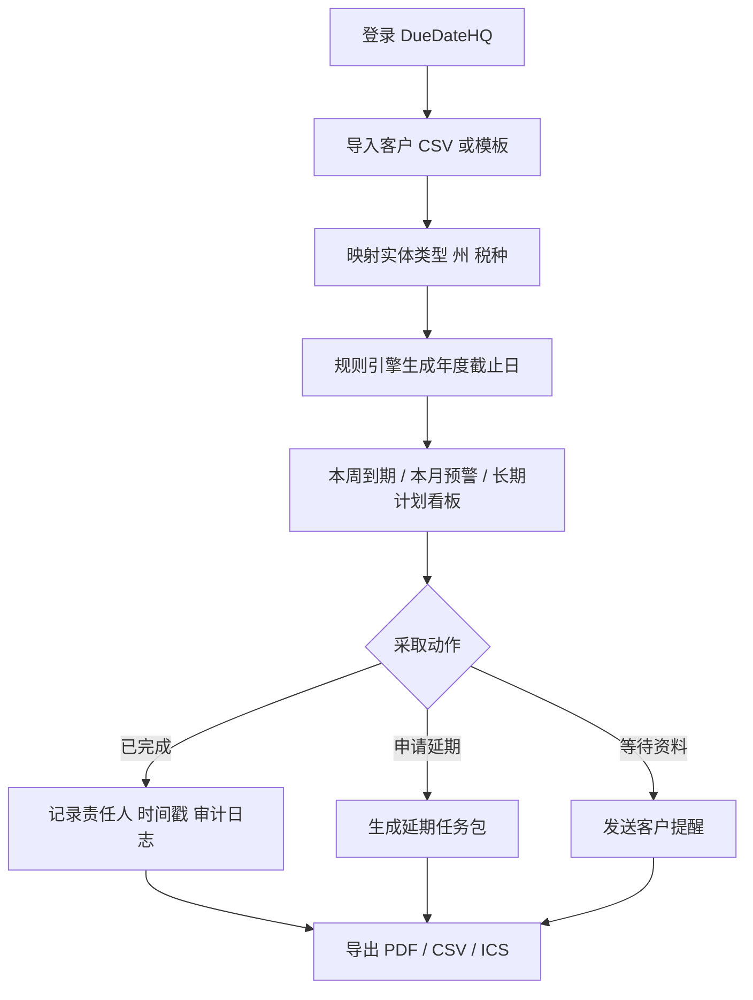
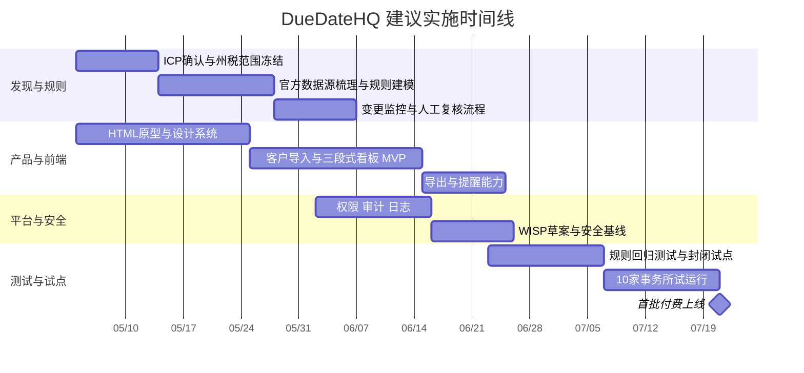

# DueDateHQ 深入调研报告

> 文档状态：长期产品、合规与技术研究输入。当前两周真实用户验证范围以 [DueDateHQ MVP v0.3 单一执行口径](./DueDateHQ%20-%20MVP%20边界声明.md) 为准。本文中的导入、导出、审计、团队、规则监控等建议需进入 Phase 2/3 再评估。

DueDateHQ 最可行的切入点，不是“做一套完整报税软件”，而是先做面向美国独立 CPA 与小型会计所的“税务截止日情报层 + 轻工作流”云端 SaaS：先把官方截止日、灾害延期、州税差异、客户分诊和提醒做深，再把电子申报放到后续合作或受控扩展阶段。这一路径既贴合内部材料中强调的独立 CPA、多州合规与快速可演示前端目标，也更符合 IRS 授权 e-file 的现实门槛。fileciteturn0file0 fileciteturn0file1 fileciteturn0file2 citeturn1view2turn18view1

## 行业背景与法规概览

若未预设目标市场，DueDateHQ 的首发市场应优先锁定 entity["country","美国","north america"]。原因很直接：一方面，税务合规市场足够大，entity["organization","NASBA","us accountancy regulator"] 统计，截至 2025-08-28 全美有 653,408 名活跃持证 CPA；entity["organization","美国中小企业管理局","us small business agency"] 统计显示，美国有 34,752,434 家小企业、占全部企业的 99.9%；entity["organization","美国国税局","us federal tax agency"] 则显示，FY2024 有 219.9 million 份电子提交的报表/申报文件，个人所得税申报中 93.3% 已电子化。另一方面，entity["organization","AICPA","us cpa association"] 的小所资源页明确把“独立执业者到 30 人团队”视作 small firm 范围；其 2025 National MAP Survey 还指出，CPA 服务需求仍强、客户正在要求更多洞察，税务复杂度、监管变化与新技术共同推高了对实践管理工具的需求。citeturn5view0turn5view1turn5view4turn37view0turn5view3turn5view2

对 DueDateHQ 而言，更关键的不是“有没有税务软件”，而是“截止日期是否持续变化、且变化是否跨州”。这正是机会所在。美国税务日历并非单一 4 月 15 日逻辑：例如，entity["state","加利福尼亚州","us state"] 个人所得税可自动延期到 2026-10-15 申报，但税款仍须在 2026-04-15 前缴纳；entity["state","纽约州","us state"] PTET 选择须在 3 月 15 日前在线完成，且预缴款按 3/15、6/15、9/15、12/15 节点推进；entity["state","得克萨斯州","us state"] franchise tax 年报通常在 5 月 15 日到期。与此同时，IRS 的灾害减免页面长期滚动发布“某州或某县的多个截止日延后”公告，州税机关也会同步给出本州是否跟随联邦延期的规则。换言之，真正需要的不是一个静态日历，而是一层“基于官方来源、可持续更新的截止日规则引擎”。citeturn39view2turn39view3turn39view4turn28view0turn28view1turn28view2

从可行性看，这个赛道适合“窄切口、深价值”的产品策略。它不像全量报税引擎那样要求一开始就完全进入税额计算、表单生成、联邦/州传输、签名与回执链路，而是先占据一个所有会计师都真实痛苦、却长期被通用 PM 工具和老旧桌面软件共同忽略的层：动态、跨州、可执行的税务到期管理。citeturn18view1turn1view2turn5view3

## 目标用户画像与需求痛点

内部《用户故事与价值主张画布》与《商业计划书》已经把产品焦点收得很准：核心不是泛化“纳税人平台”，而是服务多客户、多州业务的独立 CPA 与小型事务所，目标是在极短时间内完成本周分诊、发现危险截止日，并把 Excel/Outlook/手写笔记等碎片化流程收敛到一个系统中。该定位与 AICPA 对 small firm 的人群界定高度一致。fileciteturn0file0 fileciteturn0file1 citeturn37view0

| 用户画像                      |                   典型规模 | 核心任务                                 | 主要痛点                                                           | 首发优先级 |
| ----------------------------- | -------------------------: | ---------------------------------------- | ------------------------------------------------------------------ | ---------- |
| 独立 CPA / 1–5 人事务所负责人 |                80–300 客户 | 周度分诊、到期追踪、延期判断、客户沟通   | 过度依赖 Excel、日历碎片化、州税/PTE 规则难维护                    | 最高       |
| 小所税务经理 / 资深税务顾问   |                5–30 人团队 | 团队分派、容量管理、客户状态追踪         | 需要“谁在做、做到哪一步”的可视化，但现有 PM 工具缺少权威截止日数据 | 高         |
| 小微企业主                    |                1–50 名员工 | 了解自己何时要交什么、何时要补资料或签字 | 不懂税务行话、只想收到对自己有用的提醒                             | 中         |
| 复杂个人纳税人                | 有 K-1、多州收入、延期需求 | 配合 CPA 上传资料、确认延期或签署        | 不是主动购买者，更像通过 CPA 被服务的一端                          | 中低       |

最突出的需求并不是“我要更多按钮”，而是“我要更少认知切换”。内部用户故事写得非常具体：一名服务 80 个客户的独立 CPA，希望在周一早上开机后 30 秒内就看到本周需要采取行动的事项，而不是再花 45 分钟在 Excel、日历、笔记之间来回核对；验收标准则强调“本周到期 / 本月预警 / 长期计划”的分组视图、<1 秒筛选、以及一键标记完成/延期/进行中。这个定义非常好，因为它直接把产品价值从“记录信息”转成了“降低分诊时间”。fileciteturn0file0

如果把需求拆成产品语言，DueDateHQ 的痛点可以归纳为四层。第一层是规则权威性缺失：截止日不只按表单分，还按实体类型、州、是否灾害延期、是否涉及 PTE election、是否允许自动延期等维度变化。第二层是工作流断裂：通用 PM 平台能管理任务，但不能保证“这条任务背后的日期本身是对的”。第三层是客户上下文缺失：很多事务所可以提醒“到期了”，但无法把“哪个客户、哪一个州、哪一种税、必须补什么资料、错过后多大风险”串成一个动作单元。第四层是错过时的经济后果真实存在：IRS 对 late filing 与 late payment 均有明确罚则，逾期的财务后果会直接放大对“看见危险并及时行动”的需求。fileciteturn0file0 fileciteturn0file1 citeturn39view0turn39view1

因此，我建议把首发用户的“jobs to be done”定义为三件事，而不是一串 feature list：其一，用最短时间完成本周分诊；其二，在官方规则变化时获得可靠更新；其三，把客户提醒、内部责任分派和延期/完成状态沉淀成可追溯记录。只要这三件事真正解决，DueDateHQ 就已经具备付费价值。fileciteturn0file0 fileciteturn0file1

## 竞品格局与产品功能对比

当前竞品可以分成两类。第一类是“直接问题相邻”的截止日/会计工作流工具；第二类是“从更高层覆盖事务所运营”的 practice management 平台。前者更接近痛点，但常常老旧；后者更现代，却很少把“官方截止日数据库 + 州税变化监控”做到产品核心。对 DueDateHQ 来说，正确策略不是和所有平台比“功能数”，而是清楚地占住“权威截止日层”这个位置。citeturn16search0turn35view1turn35view0turn35view2turn36view0turn35view3

| 竞品                                                                    | 核心定位                         | 关键功能                                                                            | 公开价格                                                                                                          | 目标客户                       | 主要优势                                        | 主要短板                                                               | 依据                                             |
| ----------------------------------------------------------------------- | -------------------------------- | ----------------------------------------------------------------------------------- | ----------------------------------------------------------------------------------------------------------------- | ------------------------------ | ----------------------------------------------- | ---------------------------------------------------------------------- | ------------------------------------------------ |
| entity["company","TimeValue","tax software company"]（File In Time） | 直接型：截止日追踪与任务管理     | due date tracking、task management；Windows 桌面/本地安装痕迹明显                   | 官网摘要显示 File In Time 起始价为 **$199/用户**，首年含维护与支持                                                | 税务从业者、小事务所           | 最接近“日期库 + 到期提醒”原始需求               | 桌面化、云端协作和现代 UX 较弱；扩展能力有限                           | citeturn16search0turn14search0turn15search0 |
| entity["company","TaxDome","accounting pm platform"]                 | 一体化事务所管理                 | 自动化工作流、CRM、文档、签名、计费、QBO/Drake 等集成                               | Essentials/Pro/Business 年席位价约 **$800/$1,000/$1,200**；另有月席位和季节席位                                   | 税务、记账、会计事务所         | 一体化很强，客户端体验完整，集成丰富            | 核心卖点是 firm management，不是权威州税截止日引擎                     | citeturn35view1turn11view1turn11view2       |
| entity["company","Canopy","accounting pm platform"]                  | 税务实践管理 + 税务运营          | CRM、文档、eSign、Portal、Workflow、Payments、Transcripts & Notices、AI             | 官网定价页展示 Standard/Plus/Premium 为 **74/109/149** 的席位价档位；页面文本对单位解析存在歧义，购买前需二次确认 | 会计、税务、记账事务所         | 覆盖税务工作场景更深，含 transcript/notice 能力 | 范围较大，可能对 1–3 人所偏重；定价与模块复杂度略高                    | citeturn35view0turn9view2                    |
| entity["company","Jetpack Workflow","accounting workflow software"]  | 会计工作流与 recurring deadlines | recurring work、deadline visibility、firm-wide tracking、client importer            | **$49/月/席** 或 **$480/年/席**                                                                                   | 会计师、CPA firm、bookkeeper   | “别漏 deadline”这一价值主张很清晰，上手相对快   | 仍偏 workflow system，缺少权威法规数据库与州税规则维护                 | citeturn35view2turn9view3turn34search2      |
| entity["company","Karbon","accounting pm software"]                  | 偏中型所的协作与自动化平台       | workflow、email mgmt、team collaboration、portal、billing、API、enterprise security | Team **$59/月/席（年付）**；Business **$89/月/席（年付）**                                                        | 小所、中所、大所               | 协作、可视化、自动化、API 能力强                | 更像“事务所操作系统”，对独立 CPA 过重且更贵                            | citeturn36view0turn9view4                    |
| entity["company","Financial Cents","accounting pm software"]         | 轻量好上手的事务所管理           | workflow、portal、client tasks、eSign、QBO、billing、reporting                      | Solo **$19/月**；Team **$49/月/席**；Scale **$69/月/席**（年付）                                                  | accountants、bookkeepers、CPAs | 易用性强，适合从 Excel 迁移                     | “知道何时到期”强于“知道官方变更为何而变”，规则 intelligence 不是护城河 | citeturn35view3turn10view1                   |

把这张表压缩成一句话：TimeValue/File In Time 更像“老旧但很对题”的工具；Jetpack、Financial Cents、TaxDome、Canopy、Karbon 更像“更现代但不专做权威截止日层”的工具。由此推导出的产品定位非常明确：DueDateHQ 不应从第一天起就与这些平台比 CRM、计费、文档、聊天是否更全，而应做成“任何 PM/Tax 平台之上都可以叠加的一层 authoritative due-date intelligence”。这也是内部材料里“云端、多州、自动同步税法变更、价格对独立 CPA 友好”的那条主线。fileciteturn0file1 citeturn16search0turn35view1turn35view0turn35view2turn36view0turn35view3

## 合规与安全要求

如果 DueDateHQ 存储或处理纳税人信息，它从第一天起就不能把自己当成普通 SaaS。entity["organization","联邦贸易委员会","us consumer regulator"] 明确把 tax preparation firms 视为 Safeguards Rule 覆盖对象，要求建立书面的信息安全计划；IRS Publication 4557 也明确指出，保护 taxpayer data 是法律要求，税务从业者必须依据 FTC Safeguards Rule 建立并实施安全计划；AICPA 进一步把 WISP 视为 tax preparers 的必要要求。Safeguards Rule 的核心控制项包括指定 Qualified Individual、进行书面风险评估、实施访问控制、加密静态与传输中的客户信息、评估应用安全，以及对访问客户信息的人员实施 MFA。citeturn1view1turn1view0turn1view4

这意味着，DueDateHQ 的 MVP 也必须具备最基本的安全基线，而不是“以后再补”。至少应包括：租户隔离、细粒度角色权限、静态/传输加密、管理员与高风险操作强制 MFA、访问审计日志、数据导出审计、供应商管理、以及一版可交付客户尽调的 WISP 草案。IRS 还提供了 Publication 5708，专门帮助税务与会计实践建立书面信息安全计划，并在 2025 的提醒中再次强调：WISP 是法定义务，不是加分项。citeturn31search0turn31search4turn31search1

第二条高风险红线是 taxpayer information 的使用与披露边界。IRC §7216 规定，税务申报准备者若在“准备申报”之外使用或披露纳税人信息，可能触发刑事或民事责任；法规仅在特定例外与合规同意框架下放行。对产品而言，这直接影响三个设计决策：第一，任何“基于申报数据做营销或交叉销售”的动作都不能默认开启；第二，第三方支持人员、外包标注、AI 供应商是否可接触客户数据必须有明确权限与合同边界；第三，面向客户的“提醒、洞察、建议”必须分清哪些属于 return preparation 目的、哪些属于额外用途。citeturn38view1turn38view0

第三条是电子申报边界。若 DueDateHQ 未来要直接落入“电子申报提交”而非“工作流与数据编排”，就要进入另一套明显更重的监管栈：IRS 授权 e-file provider 需要提交申请、通过 suitability check，审批可长达 45 天；Publication 1345/3112 还要求对在线提供方执行六项 security, privacy and business standards，其中包括更高的 TLS/EV 证书要求、每周第三方漏洞扫描、书面隐私与 safeguard 政策、反 bulk fraudulent filing、域名要求，以及事件确认后不晚于**下一个工作日**向 IRS 报告安全事件。更重要的是，州级提交通常不是“接一个 API 就完事”，例如 entity["organization","加州特许经营税务局","sacramento, ca, us"] 的 FTB 手册就强调，加州不会接受 preparer 或第三方 transmitter 直接提交，而是只接受 approved software provider 传输。结论非常清楚：**MVP 不应直接做 e-file transmission。**citeturn1view2turn18view1turn18view2turn17search5

除此之外，还要把成长阶段的合规要求提前纳入架构。若服务规模触发阈值，entity["organization","加州总检察长办公室","california legal office"] 解释的 CCPA 可能适用；对更大客户，SOC 2 虽非法律强制，却是采购与安全评估中的强信任信号；对于前端，entity["organization","W3C","web standards body"] 的 WCAG 2.2 已是当前网页无障碍推荐标准，entity["organization","美国司法部","us justice department"] 也强调企业与 public-facing service 的 web accessibility 风险；若系统向潜在客户发送营销邮件或短信，还要分别考虑 CAN-SPAM 与 TCPA/短信同意框架。citeturn38view3turn38view4turn32search0turn32search4turn38view2turn25search15

## 产品建议与技术实现

我的核心产品判断只有四条。第一，**首发做 web-first、英文优先、响应式网页，不做原生 App 优先**；第二，**首发 ICP 选独立 CPA 与 1–15 人小所，不直接打个人纳税人付费市场**；第三，**MVP 不做报税计算与直接电子申报，只做截止日 intelligence、客户分诊、提醒与状态追踪**；第四，**真正的护城河不是 UI，而是“官方源 + 规则引擎 + 变更监控 + 人工复核”的内容基础设施**。这些决定同时满足内部材料强调的“可演示前端/快速交付”和外部法规对 e-file 的重要求。fileciteturn0file0 fileciteturn0file1 fileciteturn0file2 citeturn1view2turn18view1

### 核心功能建议与优先级

| 层级     | 建议功能                                                                                                                                                                                        | 为什么必须现在/以后做                                                     |
| -------- | ----------------------------------------------------------------------------------------------------------------------------------------------------------------------------------------------- | ------------------------------------------------------------------------- |
| MVP 必做 | 联邦 + 高频州税截止日库；客户/实体/州/税种模型；本周/本月/长期三段式看板；倒计时与风险排序；手动/批量导入客户；自定义截止日；邮件提醒；完成/延期/进行中状态；CSV/ICS/PDF 导出；官方公告变更日志 | 这是用户愿不愿意付费的最短路径，直接命中“45 分钟分诊压缩到 5 分钟”的 JTBD |
| MVP 可选 | AI 自然语言问答；客户门户只读视图；团队指派；基础 AI 优先级排序                                                                                                                                 | 这些能增强体验，但不应阻塞首版可用性                                      |
| 后续迭代 | 客户资料请求、签字/批准流、团队容量管理、规则推荐、延期包生成、公告摘要、QBO/Xero 双向同步                                                                                                      | 开始从 intelligence 层向轻工作流层扩展                                    |
| 暂缓     | 税额计算、表单生成、直接联邦/州 e-file transmission、全量 notice resolution、支付结算                                                                                                           | 法规、测试、责任和支持成本过高，不适合作为首发                            |

我特别建议把“覆盖范围”设计成**内容分层**而不是“全国 or 不上线”的二元选择。商业上，DueDateHQ 的价值确实来自多州；但工程上，首发可以采用 80/20：联邦 + 8 个高频州（如 CA/NY/TX 等）+ 客户自定义截止日，并在规则模型层面预留 50 州扩展位。这样既保持销售故事成立，也避免一开始把团队拖进全国范围的细枝末节。待首批付费验证通过后，再用 1–2 个季度扩展到 50 州核心税种。fileciteturn0file1 citeturn39view2turn39view3turn39view4turn28view0

### 技术实现要点

就前端而言，最适合 DueDateHQ 的不是重型 SPA，而是 **HTML-first 的服务器渲染 + 渐进增强**。原因很现实：大量核心页面其实是表格、表单、筛选、详情抽屉与状态切换；这类后台工作台非常适合语义化 HTML、稳定 URL、可缓存 SSR 与少量 JS 增强。前端可采用“HTML 模板 + HTMX/Alpine.js 或同类轻量交互 + 设计系统 CSS”的方式，使首屏快、实现简单、易于无障碍、也方便在两周作业与 8–12 周 MVP 里持续推进。若团队偏 TypeScript，也可以在局部复杂组件里引入 islands 模式，而不是一开始把整站做成 SPA。fileciteturn0file2 citeturn32search0turn32search4

后端应围绕“规则引擎 + 作业队列 + 审计日志”来设计，而不是围绕页面来设计。建议采用 TypeScript 服务栈，提供四类核心服务：一是客户与实体模型服务；二是 jurisdiction rule engine；三是 reminder/notification worker；四是 source ingestion & review pipeline。数据层以 PostgreSQL 为主，承载租户、客户、实体、州别规则、截止日实例、状态与审计事件；Redis 负责队列和缓存；对象存储负责导出文件与证据附件。API 层建议优先 REST/JSON + OpenAPI 文档，外部 webhook 留作后续团队版与集成版能力。所有 deadline instance 必须是**可版本化**对象：谁生成、使用了哪个规则版本、是否被后续法规更新影响，都应可审计。citeturn1view1turn1view0turn31search0

集成方面，我建议分成三类。第一类是**账务系统**，优先接入 entity["company","Intuit","financial software company"] 生态中的 QuickBooks Online，因为其官方文档明确提供 REST 架构与开发接入路径；也可预留 entity["company","Xero","accounting software company"] 的 Accounting API 作为国际化后手。第二类是**税务/事务所工具**，优先支持 CSV 导入导出与轻量集成，而不是强依赖私有写接口；例如 Intuit 官方的 ProConnect 集成页本身强调的是 QBOA、Google Drive/Dropbox、Link portal、Karbon、Tax scan、eSignature 等生态协同，而不是公开的报税写回 API。第三类是**电子申报**，首期以“生成延期包 / 导出任务 / 读取状态 / 与合作软件衔接”为主，后期若业务验证足够，再考虑通过授权成为 provider 或对接 approved software partner。citeturn26view0turn24search1turn26view2turn1view2turn18view1

从架构职责角度看，DueDateHQ 应被设计成一个“deadline intelligence platform”，而不是“税表生成器”。前者的价值在于：持续消费官方监管变化、映射为客户可执行动作、并输出到看板、提醒、报告和伙伴系统；后者的价值在于完成税表制作与提交。两者可以相连，但不该在 MVP 阶段被强行塞进同一个产品边界。citeturn18view1turn17search5

### UX 流程示意图

下图对应我建议的首发 UX 主路径：先导入客户，再映射实体与州，再由规则引擎生成当年税务日历，最后把用户每天真正要做的动作收敛到看板与导出物中。其核心不是“浏览所有规则”，而是“每次登录只看到该做的事”。

这一流程与内部用户故事的分诊逻辑一致，也与 IRS/州税现实最匹配：先把“什么时间该做什么”做对，再决定“到哪个伙伴系统里去提交”。fileciteturn0file0 citeturn39view2turn39view3turn39view4turn28view0

## 商业模式与市场进入

定价上，我不建议照搬通用 practice management 的复杂 seat/module 体系，也不建议把价格压到接近桌面时代的永久许可证。原因很简单：DueDateHQ 的持续成本来自规则维护、公告监控、人工复核与提醒服务，它本质上是“持续交付的内容软件”，而不是一次性安装包；但目标客群又明显比大中型事务所更敏感。结合竞品锚点看，文件化桌面工具起点低但形态老；Jetpack、Financial Cents、TaxDome、Karbon 等云产品则普遍按席位月费或年费收费，且广度远超 DueDateHQ。对一个“更专、更轻、更快”的产品来说，最佳定价应落在“明显低于通用 PM 平台，但高于老式桌面工具”的区间。fileciteturn0file1 citeturn14search0turn9view3turn10view1turn11view2turn9view4

我建议首发采用**二层半**定价，而不是一开始就做复杂版控：

| 套餐 |              建议价格 | 适用对象                | 包含内容                                             |
| ---- | --------------------: | ----------------------- | ---------------------------------------------------- |
| Solo |                $39/月 | 独立 CPA / 单人事务所   | 基础规则库、客户导入、看板、提醒、导出、自定义截止日 |
| Firm |                $99/月 | 2–5 席小所              | 多席位、团队指派、共享视图、操作审计、更多导入模板   |
| Pro  |               $199/月 | 6–15 席或高复杂度客户组 | API、SSO、优先支持、SLA、增强导出与规则变更订阅      |
| 试用 | 30 天免费，无需信用卡 | 所有新用户              | 目标是在 10–15 分钟内看到“本季度危险截止日”          |

这个结构有三个好处。第一，它符合内部商业计划书中“低门槛试用 + 快速导入 + 对独立 CPA 友好”的设定。第二，它让销售故事极其简单：**不是买一个大而全系统，而是花更少的钱，把漏 deadline 的风险降下去。**第三，它为后续向团队版、API 版、合作伙伴版过渡留出空间。fileciteturn0file1

市场进入上，我建议遵循“内容驱动获客 + 社区验证 + 伙伴嵌入”的顺序，而不是一开始就做大量付费广告。内部材料提出的“50 州截止日期变更追踪公开页”是非常好的切入口，我建议把它产品化：做成可被搜索引擎收录的公开页面，持续同步 IRS 与州税机关的官方公告，用户可订阅“州税变化摘要”。这类页面天然兼具 SEO、品牌信任与产品演示三重价值。其次，社区渠道要聚焦 tax professional 的职业网络与继续教育场景，而不是大众纳税人渠道；AICPA 小所资源本身就显示，小所经营者在积极寻找 practice management、busy season survival、burnout prevention 和 strategic planning 工具。最后，伙伴战略应优先于“直接替换大平台”：先做 QuickBooks/CSV/导出兼容，让 DueDateHQ 进入现有工作流，而不是强迫用户一次性迁移整个所。fileciteturn0file1 citeturn37view0turn26view2turn26view0

在推广信息上，卖点也必须极度克制。我建议首发只讲三句话：**一，官方来源驱动；二，10 分钟内看到危险截止日；三，不必更换现有报税软件。** 这比“AI 税务助手”“下一代事务所平台”之类大词更有说服力，也更符合目标客群的购买逻辑。fileciteturn0file0 fileciteturn0file1

## 风险、实施时间线与交付物

最大的产品风险，不是做不出网页，而是**把边界做错**。如果一开始想同时做 50 州全税种、客户门户、文件采集、签字流、QBO 深度同步、以及直接联邦/州电子申报，项目会迅速从“高价值窄工具”失控成“低完成度大套件”。考虑到内部训练目标是“理解用户 → 交付可演示产品”，而真正进入 IRS e-file 又涉及申请、审批、持续合规、事件报送与州级供应商链条，最现实的落地方式就是先把 intelligence 层做透。fileciteturn0file2 citeturn1view2turn18view1turn17search5

| 风险                     | 影响                   | 应对方案                                                                                     |
| ------------------------ | ---------------------- | -------------------------------------------------------------------------------------------- |
| 截止日规则错误或更新滞后 | 直接损害品牌与客户信任 | 官方源优先；规则版本化；高风险州/税种人工复核；变更日志可见；客户侧声明“来源与更新时间”      |
| 误触 e-file 合规边界     | 法务与实施成本陡增     | MVP 不直接 transmit；先做延期包、导出、状态同步；后续再评估 partner/authorized provider 路线 |
| 纳税人数据泄露           | 高额声誉与法律风险     | WISP、MFA、加密、最小权限、SOC 2 路线、事件响应预案                                          |
| 过度追求“大而全”         | 上线延期、产出失焦     | 把产品 KPI 锁定为分诊时间、激活率、提醒触达率、规则正确率                                    |
| 依赖外部工具接口变化     | 集成不稳定             | CSV/ICS/PDF 作为最低公共接口；对深度 API 只做加分项，不做依赖项                              |
| B2C 扩张过早             | 支持成本飙升           | 先做 B2B2P（to professionals）；个人纳税人只作为 CPA 服务端口对象                            |

按照这个边界，我认为 **8–12 周可完成一个可收费的 Beta**，前提是把直接申报排除在 MVP 范围外，并把州别覆盖做成分批扩张。下面给出一个建议甘特图；它的逻辑是“先规则、再前端、后安全、再试点”，而不是“先把所有页面画完”。这一排期也与内部集训强调的“先交付可演示产品”方法相吻合。fileciteturn0file2

配套的里程碑验收标准，我建议定义为：第一阶段能让用户导入客户并自动生成至少联邦 + 8 州的年度日历；第二阶段能完成“三段式看板 + 提醒 + 状态 + 导出”；第三阶段能给试点客户提供规则更新时间、审计日志与基础安全文档；第四阶段再验证留存、每周活跃、提醒点击率与“从导入到首次价值”的时间。只有当这些指标证明“deadline intelligence”本身成立时，才有必要继续向客户门户、指派协作、伙伴 e-file 或 API 商业化推进。fileciteturn0file0 fileciteturn0file1

建议的可交付物清单如下：

| 可交付物                  | 说明                                                         |
| ------------------------- | ------------------------------------------------------------ |
| 产品需求文档 PRD          | 明确 ICP、范围边界、成功指标、非目标项                       |
| 税务规则目录与来源矩阵    | 联邦 + 首发州别 + 税种 + 规则版本 + 官方来源                 |
| HTML-first 可交互前端原型 | 登录、导入、看板、筛选、详情、提醒、导出等关键页面           |
| 规则引擎设计文档          | entity/state/tax-type/deadline-instance 的计算逻辑与版本策略 |
| 数据模型与 API 规范       | PostgreSQL schema、REST endpoints、webhook 预留              |
| 导入导出模板              | CSV、ICS、PDF 客户报告样板                                   |
| 安全文档包                | WISP 草案、数据分级、访问控制矩阵、事件响应流程              |
| 试点运营包                | onboarding 手册、支持脚本、反馈问卷、规则勘误流程            |
| 商业化包                  | 定价页、试用策略、公开截止日追踪落地页、销售 FAQ             |

最终决策建议很明确：**建议立项，但必须聚焦。** 做 “DueDateHQ = 美国小所税务截止日 intelligence 层” 是可行且有差异化的；做 “DueDateHQ = 从客户门户到报税提交再到全所运营的一体化大平台” 在首阶段则不可取。最优先级的清单应是：先做官方规则层，再做分诊看板，再做提醒与审计，再做导入与兼容，最后才考虑电子申报与更重的 practice management。只要按这个顺序推进，DueDateHQ 有机会成为一个能被会计师真正买单、也能在 HTML-first 前端条件下快速做出可卖首版的产品。fileciteturn0file0 fileciteturn0file1 fileciteturn0file2 citeturn35view1turn35view2turn36view0turn18view1turn1view2
